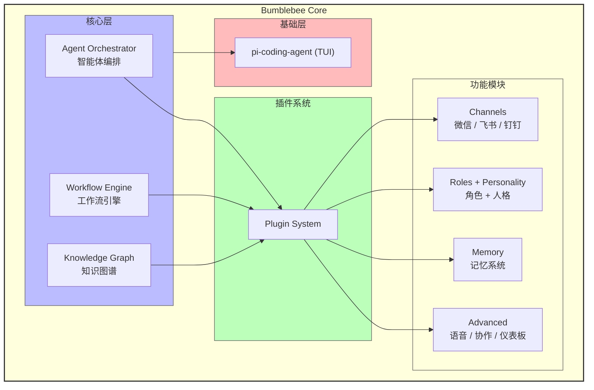

<p align="center">
  
  
  
  
</p>

<h1 align="center">Bumblebee</h1>

<p align="center">
  <strong>多渠道智能编程副官</strong><br>
  <em>不只是 Coding Agent，而是能变形、协作、感知、响应的 AI 编程伙伴</em>
</p>


<p align="center">
  像变形金刚中的大黄蜂一样 —— 忠诚、敏捷、智能，随时适配你的工作方式
</p>

---

## 为什么选择 Bumblebee？

当前的 AI Coding 工具大多以 IDE 或终端为主要入口。Bumblebee 在 TUI 之外提供微信、飞书和钉钉渠道；渠道消息使用独立的 pi AgentSession，并可调用多 Agent 编排和手动工作流工具。

| 核心能力                          | **Bumblebee**                                  | Claude Code                  | Cursor                               | GitHub Copilot         |
| --------------------------------- | ---------------------------------------------- | ---------------------------- | ------------------------------------ | ---------------------- |
| **IM平台覆盖** (微信/飞书/钉钉等) | ✅ 原生支持，一套核心代码无缝对接               | ❌ 无原生支持，依赖第三方桥接 | ❌ 基本不支持国内主流平台             | ❌ 依赖第三方桥接       |
| **开源透明性** (可自托管)         | ✅ 完全开源，无供应商锁定                       | ❌ 闭源商业产品               | ❌ 闭源商业产品                       | ❌ 闭源商业产品         |
| **Agent编排灵活性**               | 4种协作模式，内置8种专业模板                   | 采用主从协调模式             | 运行时并行调度                       | 多任务并行管理         |
| **长期记忆与学习**                | 三位一体架构：知识图谱 + 上下文管理器 + 学习器 | 支持跨会话的自动记忆         | 无公开系统级记忆方案，依赖对话上下文 | 采用验证的记忆系统     |
| **开发可观测性**                  | 内置性能状态看板，提供p50/99等指标             | 无同类内置通用状态面板       | 监控指标公开信息较少                 | 监控指标对第三方不透明 |

---

## 架构总览



---

## 核心能力

### 角色系统

Bumblebee 不是一个固定人格的 Agent。它支持**用户自定义角色**，每个角色拥有独立的专业领域、沟通风格、系统提示词和能力声明。

```typescript
await agent.createRole({
  id: 'security-auditor',
  name: '安全审计专家',
  description: '专注于代码安全审查和漏洞检测',
  personality: {
    traits: ['严谨', '警觉', '细致'],
    communication: '直接、基于证据',
    expertise: ['OWASP', '渗透测试', '加密算法'],
    values: ['安全优先', '最小权限'],
  },
  systemPrompt: '你是一个安全审计专家...',
  greeting: '安全审计模式已就绪。',
  responseStyle: {
    tone: 'professional',
    verbosity: 'detailed',
    humor: 'none',
    language: 'zh-CN',
  },
  capabilities: ['security-audit', 'vulnerability-scan'],
})

agent.switchRole('security-auditor')
```

内置 8 种专业 Agent 模板：`code-reviewer` / `test-writer` / `doc-generator` / `debugger` / `architect` / `refactorer` / `security-auditor` / `optimizer`

### 记忆系统

跨会话用户画像持久化，自动从对话中提取用户偏好、环境信息和关键事实。对话历史由 pi-coding-agent 的 SessionManager 管理，Bumblebee 在此基础上构建长期用户画像层。退出时自动保存对话摘要，新会话启动时注入上次对话要点。

### 渠道系统

统一的 `ChannelAdapter` 接口，一套代码接入所有平台。官方实现 WeChat / Feishu / DingTalk，社区可自行扩展 Slack / Teams / Discord。

### 知识系统

三位一体的知识引擎，启动时自动感知项目环境，在对话中注入上下文和推荐，在交互中学习模式并持久化到磁盘：

- **知识图谱** — 项目级节点关系图谱，支持文本搜索、关系遍历、路径推理和相似节点发现
- **上下文管理器** — 自动检测项目语言、框架、依赖，桥接用户偏好，管理会话变量
- **学习器** — 从对话中学习用户模式（纠正、偏好、反馈），生成智能推荐，置信度随使用增长

### 多 Agent 协作编排

`AgentManager` 管理 Agent 生命周期，`AgentOrchestrator` 提供 4 种协作模式：

| 模式 | 说明 | 适用场景 |
|------|------|----------|
| `independent` | 每个任务独立执行 | 无依赖的批量任务 |
| `sequential` | 前一步输出作为后一步输入 | 流水线处理 |
| `parallel` | 所有任务同时执行 | 独立任务加速 |
| `hierarchical` | 主 Agent 分析 → 子 Agent 并行 → 主 Agent 总结 | 复杂分析任务 |

内置 5 种推荐团队：`code-review` / `testing` / `development` / `quality` / `full`

```typescript
// 通过 TUI 快速启动团队
// /agents run code-review 审查当前项目的代码质量

// 通过 API 编排
const result = await agent.getAgentOrchestrator()!.executeTeamTask(
  ['code-reviewer', 'security-auditor', 'test-writer'],
  '全面审查 src/core/ 目录',
  { focus: 'security' },
  'hierarchical'
)
```

### 工作流引擎

声明式 DAG 工作流，支持上下文条件和受限表达式、fallback、重试策略、超时、取消、补偿以及步骤间数据传递。4 种内置模板：

| 模板 | 步骤 | 用途 |
|------|------|------|
| `pr-review` | 代码分析 → 安全检查 → 测试覆盖 → 汇总 | 分析调用方提供的 PR 文件信息 |
| `issue-triage` | 分析 → 分类 → 负责人建议 | Issue 分流建议 |
| `release` | 版本检查 → 测试 → 构建 → 发布 | 外部 action handler 集成示例 |
| `code-quality` | 风格 → 安全 → 性能 → 报告 | 基于 Agent 的代码质量分析 |

```typescript
// 触发工作流
const result = await agent.getWorkflowEngine()!.trigger('pr-review', {
  payload: { prId: 1, repo: 'current', files: ['src/core/agent.ts'] },
})
```

> 内置模板默认通过 `/workflows run`、API 或 Agent 工具手动触发。仓库暂未提供 webhook/cron 服务。`test`、`build`、`publish` 等外部副作用动作必须先通过 `registerAction()` 接入真实执行器，未配置时会明确失败，不会返回模拟成功。

### 状态仪表板

`DashboardImpl` 提供可配置的 Widget 元数据和状态面板，记录最近 1000 次 Agent 任务，显示任务数、成功率、响应时间 p50/p99 等指标。TUI 使用 `/perf` 或 `/dashboard` 查看文本指标；完整图表渲染留给后续前端集成。

### 协作与语音（实验性）

- **协作协议客户端** — WebSocket 房间、消息、内容变更和光标事件，包含心跳与自动重连
- **语音库接口** — 基于浏览器 Web Speech API 的识别与合成，支持语言和连续识别配置

> 协作功能需要用户自行提供兼容的 WebSocket 服务端和编辑器事件绑定，本仓库尚未提供协作服务器。语音功能只能在集成 Bumblebee 库的浏览器宿主中使用，Node.js TUI 中不可用；`whisper`、`azure`、`google` 引擎尚未实现。

---

## TUI 体验

Bumblebee 通过 [pi-coding-agent](https://github.com/earendil-works/pi-coding-agent) Extension 机制注入 TUI，复用框架的会话管理、上下文压缩（compaction）、工具系统等核心能力，同时注入角色、人格、用户画像等差异化功能。

**复用的框架能力：**
- `SessionManager` — 对话历史持久化、分支管理
- `session_before_compact` — 压缩时自动提取用户画像
- `before_agent_start` — 注入角色 system prompt + 用户画像
- `defineTool` / `registerCommand` — 自定义工具和斜杠命令

<details>
<summary><strong>命令总览</strong> （点击展开）</summary>

| 斜杠命令 | 功能 |
|----------|------|
| `/help` | 显示 Bumblebee 命令和常用 pi 会话命令 |
| `/help <命令>` | 显示命令用法 |
| `/status` | 系统健康状态概览 |
| `/perf` | Agent 任务成功率和响应时间 p50/p99 |
| `/roles` | 列出所有可用角色 |
| `/switch <id>` | 切换角色（支持 Tab 补全，无参数弹出选择窗口） |
| `/role` | 显示当前角色详情 |
| `/personality` | 显示人格状态 |
| `/memory` | 记忆管理（无参数弹出选择窗口） |
| `/knowledge` | 知识图谱统计 |
| `/knowledge search <词>` | 搜索知识节点 |
| `/knowledge cleanup` | 清理重复和无效节点 |
| `/context` | 显示当前项目上下文（语言、框架、依赖） |
| `/learn` | 学习系统管理（无参数弹出选择窗口） |
| `/agents` | Agent 管理（无参数弹出选择窗口） |
| `/agents run <team> [task]` | 运行专业 Agent 团队 |
| `/workflows` | 工作流管理（无参数弹出选择窗口） |
| `/workflows run <id> [payload JSON]` | 触发工作流执行 |
| `/dashboard` | 仪表盘状态 |
| `/channels` | 渠道管理（无参数弹出选择窗口） |
| `/channels setup` | 配置渠道 |
| `/channels connect [name]` | 连接渠道 |
| `/channels disconnect [name]` | 断开渠道 |
| `/collab` | 协作管理（无参数弹出选择窗口） |
| `/voice` | 语音管理（仅浏览器宿主可用） |
| `/resume` | 浏览并选择历史会话 |
| `/new` | 开始新会话 |

</details>

TUI 默认注册 11 个 Bumblebee 自定义工具，包括角色查询与切换、Agent 编排、工作流触发和协作通信；插件可继续动态增加工具。渠道 AgentSession 额外注入工作流和多 Agent 工具。

---

## 快速开始

### 环境要求

- Node.js >= 22.0.0

### 安装与运行

```bash
git clone https://github.com/ReadNULL/Bumblebee.git
cd bumblebee
npm install
npm run build

# 交互式配置向导
node dist/cli.js init        # 或 node dist/cli.js init --preset mini/dev/full

# 环境诊断
node dist/cli.js doctor

# 启动 TUI
node dist/cli.js

# 或全局链接
npm link
bumblebee
```

> 详细用法见 [快速开始指南](docs/quick-start.md)。
>
> 准备项目讲解、架构复盘或技术面试时，可参考 [Bumblebee 面试准备指南](docs/interview-guide.md)。

### 会话管理

Bumblebee 每次对话会自动保存到磁盘（`~/.pi/agent/sessions/`），退出后可恢复。

```bash
# 恢复最近一次会话（推荐）
node dist/cli.js -c

# 交互式选择历史会话
node dist/cli.js -r

# 恢复指定会话（ID 从退出时的提示中获取）
node dist/cli.js --session <session-id>
```

全局安装后：

```bash
bumblebee -c    # 恢复最近会话
bumblebee -r    # 交互式选择
```

TUI 内也可通过 `/resume`、`/new`、`/tree`、`/fork` 管理会话。

> **会话 vs 记忆：** 会话（Session）是完整的对话历史，通过 `-c` / `-r` 恢复；记忆（Memory）是自动提取的用户画像 + 对话摘要，保存在 `~/.bumblebee/memory/profile.json`，启动新会话时自动注入上下文。即使启动新会话而非恢复旧会话，Bumblebee 也能记住你的偏好和上次讨论的要点。

### LLM 配置

建议优先使用环境变量配置 API Key，避免把密钥写入项目文件：

```bash
OPENAI_API_KEY=sk-xxxxxxxxxxxx
ANTHROPIC_API_KEY=sk-ant-xxxxxxxxxxxx
GEMINI_API_KEY=xxxxxxxxxxxx
```

模型认证由 pi-coding-agent SDK 统一管理，只从环境变量读取 API Key。也可以使用 `/model` 命令在 TUI 中切换模型。

> 完整 provider 列表和环境变量名称见 pi-coding-agent 的 `providers.md` 文档。

### 配置文件

在项目根目录创建 `.bumblebee.yaml`，用于配置人格、记忆等行为参数：

<details>
<summary><strong>配置详情</strong> （点击展开）</summary>

```yaml
personality:
  intensity: moderate    # low | moderate | high
  theme: transformers   # transformers | neutral
  roleId: bumblebee

memory:
  enabled: true

llm:
  timeoutMs: 300000      # Bumblebee 内部一次性 LLM 调用超时

# 模型 provider、模型名、API Key 由 pi-coding-agent 管理。
# 启动 TUI 后使用 /model 查看或切换模型。

knowledge:
  enabled: true
  maxRecords: 1000

agents:
  enabled: true
  maxConcurrent: 5

workflows:
  enabled: true
  defaultTimeout: 300000
  maxConcurrentWorkflows: 3

# 工作流步骤支持 DAG 分层并行调度。高级步骤可以配置：
# retry.maxDelayMs / retry.jitter / onFailure / compensateAction。

dashboard:
  enabled: false           # 默认关闭
  refreshInterval: 5000

channels:
  wechat:
    enabled: false
  feishu:
    enabled: false
  dingtalk:
    enabled: false
    mode: webhook

collaboration:
  enabled: false           # 需要 WebSocket 服务器
  serverUrl: ws://localhost:3000
  userId: local-user
  userName: User
  autoReconnect: true
  heartbeatInterval: 30000

voice:
  enabled: false           # 仅浏览器宿主；Node.js TUI 不可用
  engine: browser          # 当前仅 browser 已实现
  language: zh-CN

plugins:
  enabled: false
  modules: []
  # directory: ./plugins
  toolTimeoutMs: 10000       # 单个插件 tool 执行超时
  commandTimeoutMs: 10000    # 单个插件命令执行超时
  eventLoopWarningMs: 250    # 插件阻塞事件循环超过该阈值时记录 warning
```

</details>

### 作为库使用

```typescript
import { BumblebeeAgent, loadConfig } from 'bumblebee'

const config = await loadConfig()
const agent = new BumblebeeAgent(config)
await agent.initialize()

// 基础对话
const response = await agent.processMessage('帮我审查这段代码')

// 角色切换（使用已创建或默认角色）
agent.switchRole('bumblebee')

// 多 Agent 编排
const orch = agent.getAgentOrchestrator()!
const result = await orch.executeTeamTask(
  ['code-reviewer', 'security-auditor'],
  '审查 src/core/ 目录',
  { focus: 'security' },
  'hierarchical'
)

// 触发工作流
const workflow = await agent.getWorkflowEngine()!.trigger('pr-review', {
  payload: { prId: 1, repo: 'current', files: ['src/core/'] },
})

// 查询知识图谱
const nodes = agent.getKnowledge().query({ text: 'authentication', limit: 5 })

// 释放资源
await agent.dispose()
```

---

## 项目结构

```
src/
├── core/           # 核心模块（Agent 主类、配置加载、LLM 调用工厂）
├── tui/            # TUI 集成（pi-coding-agent Extension，25+ 命令/工具）
├── roles/          # 角色系统（存储、管理、创建向导、默认角色）
├── personality/    # 人格系统（情绪分析、人格注入）
├── memory/         # 记忆系统（用户画像持久化、对话画像提取、跨会话摘要）
├── channels/       # 渠道系统（微信 / 飞书 / 钉钉适配器）
├── agents/         # Agent 编排（AgentManager + Orchestrator，4 种协作模式）
├── workflows/      # 工作流引擎（DAG 调度、重试/超时/条件，4 种内置模板）
├── knowledge/      # 知识系统（图谱 + 上下文 + 学习器，三合一智能引擎）
├── dashboard/      # 状态仪表板（Widget 系统、指标卡片元数据）
├── collaboration/  # 协作协议客户端（WebSocket 房间、光标/内容事件）
├── voice/          # 浏览器语音库接口（Web Speech API）
├── cli.ts          # CLI 入口
└── index.ts        # 库 barrel export
```

---

## 技术栈

| 层级 | 技术 | 用途 |
|------|------|------|
| AI 引擎 | pi-coding-agent | Agent 会话管理、TUI 框架、Extension API |
| TUI 渲染 | pi-tui | 终端 UI 差分渲染、Markdown 渲染、交互组件 |
| 类型校验 | Zod + TypeBox | 配置校验、工具参数 Schema |
| 渠道 SDK | @larksuiteoapi / ilink API 内置 | 平台接入（钉钉使用 Node 内置 fetch/http） |
| 构建 | tsup | ESM 打包、Tree-shaking |
| 测试 | vitest | 内部开发测试，按需在本地添加 |

---

## 开发

```bash
# 类型检查
npm run typecheck

# 开发构建（监听文件变更）
npm run dev

# 如本地添加了开发测试，可运行
npx vitest run
```

---

## 参与贡献

欢迎提交 Issue 和 Pull Request！

1. Fork 本仓库
2. 创建特性分支：`git checkout -b feature/my-feature`
3. 提交更改：`git commit -m "feat: add my feature"`
4. 推送分支：`git push origin feature/my-feature`
5. 提交 Pull Request

请确保：
- 代码通过 `npm run typecheck` 类型检查
- 涉及复杂逻辑时，在本地补充开发测试或提供可复现验证步骤

---

## License

[MIT](./LICENSE)

---

<p align="center">
  <em>"汽车人，出发！" —— Bumblebee</em>
</p>
