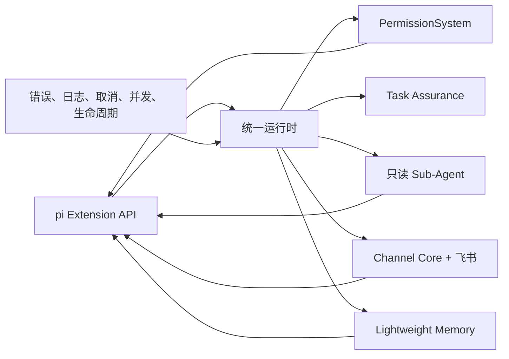

# Bumblebee

Bumblebee 是基于 [pi coding agent](https://pi.dev) Extension
机制构建的轻量 Agent 工程。项目不重新实现模型、会话、TUI、Skills 或 `/model`，
而是在 pi 之上提供权限、运行时、只读 Sub-Agent、飞书渠道和显式长期记忆。

当前版本：`2.0.0-alpha.3`

## 快速开始

环境要求：

- Node.js 22.19 或更高版本；
- pi（`@earendil-works/pi-coding-agent`）；
- 飞书渠道依赖会随 `npm install` 安装；
- Lightweight Memory 只使用 Node.js 标准库，不需要数据库。

```powershell
npm install
pi -e ./src/extension.ts
```

模型和供应商完全由 pi 管理，请在 pi 中使用 `/model` 选择。Bumblebee 不保存另一份
模型配置，也不实现与 pi 重复的历史、恢复或 Skills 命令。

## 当前能力



- 运行时统一管理 trace、会话串行、全局并发、取消和资源释放；
- PermissionSystem 在模型工具执行前完成路径、权限位和会话授权检查；
- Task Assurance 维护外部契约、验证失败和恢复证据账本，证据不足时最多补充一轮；
- `delegate_task` 将独立代码调查放入工作区内只读的隔离 Pi 子会话；
- Channel Core 统一平台消息、去重、会话映射和生命周期，当前接入飞书官方 SDK；
- `bumblebee_memory` 显式保存全局或项目长期记忆，并按本轮问题有界检索；
- 飞书会话自动恢复 Pi 历史，只开放工作区内只读工具和项目记忆。

扩展注册 `delegate_task` 和 `bumblebee_memory` 两个自定义工具，没有注册自定义斜杠
命令。当前也没有角色、团队、知识图谱、工作流、插件市场或 Dashboard；这些旧版
概念没有明确用户价值，因此未进入 V2。

默认使用 `full` profile。开发和 benchmark 消融还可设置
`BUMBLEBEE_FEATURE_PROFILE=permission-only` 或 `pi-baseline`；后者不注册任何
Bumblebee 能力，正常使用无需加载。

## 积木文档

| 层级 | 积木 | 文档 |
| --- | --- | --- |
| Foundation | 基础层总览与依赖方向 | [Foundation](./src/foundation/README.md) |
| Foundation | 统一错误模型 | [Errors](./src/foundation/errors/README.md) |
| Foundation | 结构化日志与脱敏 | [Logging](./src/foundation/logging/README.md) |
| Foundation | 取消与超时 | [Cancellation](./src/foundation/cancellation/README.md) |
| Foundation | 并发控制 | [Concurrency](./src/foundation/concurrency/README.md) |
| Foundation | 生命周期与回滚 | [Lifecycle](./src/foundation/lifecycle/README.md) |
| Runtime | 扩展运行时 | [Runtime](./src/runtime/README.md) |
| Config | 功能 Profile 与消融边界 | [Feature Profiles](./src/config/README.md) |
| Security | 权限系统 | [PermissionSystem](./src/security/permissions/README.md) |
| Agent | 契约、验证与恢复证据保障 | [Task Assurance](./src/agents/assurance/README.md) |
| Agent | 只读 Sub-Agent | [Sub-Agent](./src/agents/subagent/README.md) |
| Channel | 平台无关渠道内核 | [Channel Core](./src/channels/core/README.md) |
| Integration | Pi 事件、工具与渠道会话桥接 | [Pi Integration](./src/integrations/pi/README.md) |
| Channel | 飞书官方 SDK 适配器 | [FeishuAdapter](./src/channels/feishu/README.md) |
| Memory | 显式轻量长期记忆 | [Lightweight Memory](./src/memory/core/README.md) |
| Evaluation | 测试方案与结果总览 | [Benchmark](./benchmark/README.md) |

各 README 说明对应积木解决的问题、触发时机、处理流程、安全边界和当前限制。源码
目录中的 `index.ts` 是模块公共出口，架构测试负责约束依赖方向。

## 测试结果摘要

截至 2026-07-24 已记录的结果：

| 分项 | 已观测结果 | 可发布分数与资格 |
| --- | --- | --- |
| BumblebeeBench | 360/360 确定性 trial 通过 | `BB = 100.00`，qualified |
| Terminal-Bench 2.1 Lite | baseline 32/45；candidate 原始 30/45，追加证据审计后为 30 passed、10 failed、5 invalid | 有效率 95.56%/88.89%，均未达到 98%；`TB = N/A`，invalid |
| AgentDojo Workspace | Utility 90.00、攻击下 Utility 91.61、Targeted ASR 0.18% | `AD = 94.39`，qualified |
| LongMemEval-Bumblebee | 36/36 trial 有效；QA 100、Recall@5 100、Precision@5 85 | `LM = 98.50`，qualified |
| BCS-v1 | 已有 BB/AD/LM，TB 没有合格输入 | `N/A`，not-qualified |

当前只复验 Terminal-Bench 首轮失败的 4 类任务，已成功任务不重复运行。完整指标、
成本、失败分类、资格边界和各套件入口见 [Benchmark 结果总览](./benchmark/README.md)；
Terminal-Bench 的失败经验见[首轮真实评测复盘](./benchmark/benchmark_2_terminal_bench_2_1/POSTMORTEM_2026-07-24.md)。

`N/A` 只表示结果不能作为正式分数发布，不表示删除或隐藏本轮数据。未通过门槛、
执行失败、取消和基础设施无效的结果都会保留原始指标与原因。

## 飞书渠道

飞书默认关闭，不读取凭据，也不会建立网络连接。需要使用时按[FeishuAdapter 启用步骤](./src/channels/feishu/README.md#启用步骤)配置企业自建应用、发送者白名单和环境变量。远程会话当前只读，不能写文件或执行 Shell。

## 开发

```powershell
npm run typecheck
npm test
```

测试和 benchmark 只用于开发，不进入 npm 发布包。原始模型轨迹与外部数据集保存在被 Git 忽略的运行目录或外部 artifact storage。
