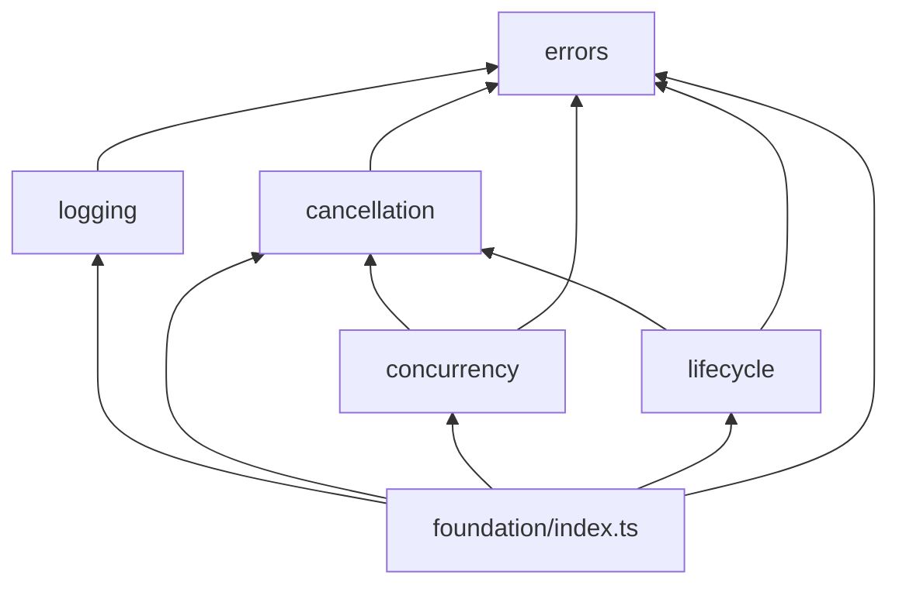
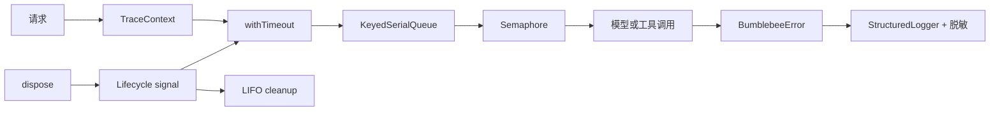
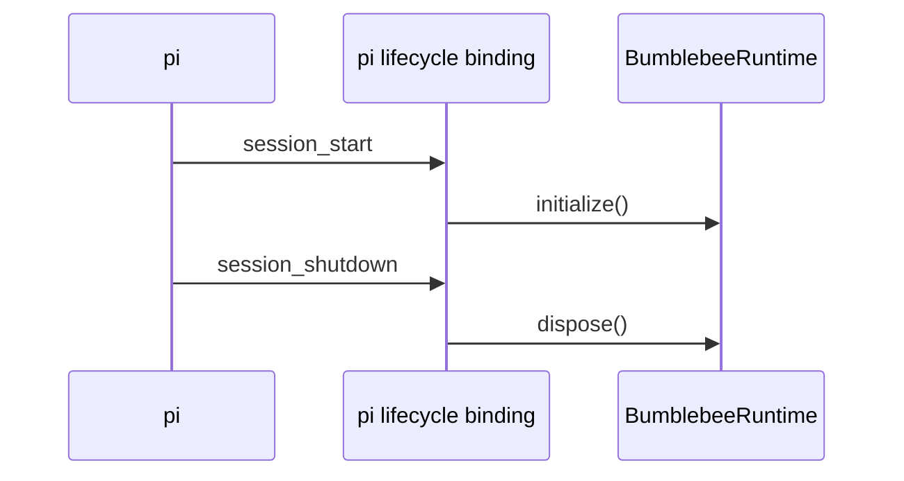
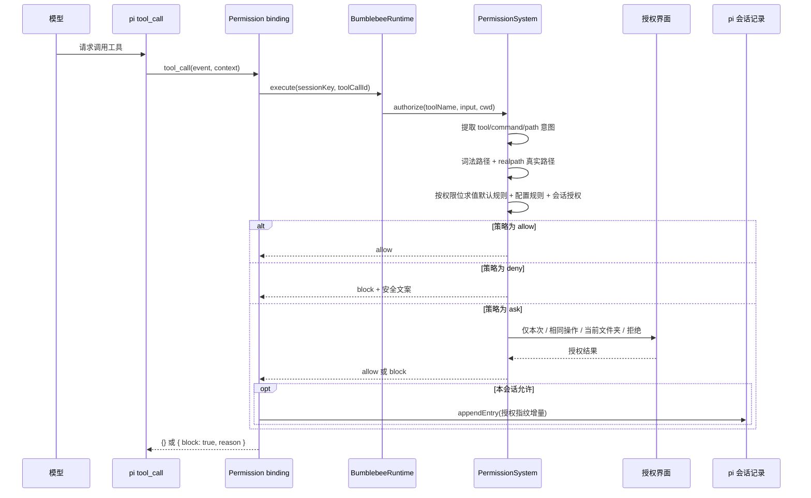
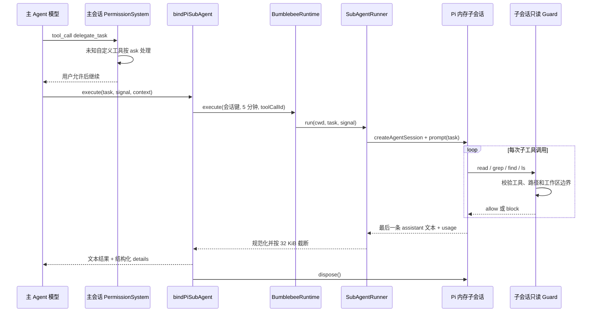

# Bumblebee

Bumblebee V2 正在基于 pi Extension 机制从零重建。项目采用逐积木开发方式：每个组件都必须先明确契约、通过聚焦测试并完成人工验收，才能开始下一个组件。

## 积木搭建计划

### 基础层

| 轮次 | 积木 | 解决的问题 |
| --- | --- | --- |
| 1 | 错误模型 | 统一错误代码、cause 保留和边界归一化 |
| 2 | 结构化日志 | 安全序列化、敏感信息脱敏和 traceId |
| 3 | 取消与超时 | AbortSignal 传播、超时区分和可中断等待 |
| 4 | 并发控制 | 公平 Semaphore、会话串行队列和等待取消 |
| 5 | 生命周期 | 初始化失败回滚、LIFO 清理和幂等 dispose |
| 6 | 基础层总复盘 | 组合演示、依赖方向和故障注入 |

### 运行时层

| 轮次 | 积木 | 解决的问题 |
| --- | --- | --- |
| 7 | 扩展运行时 | 组合基础积木、统一任务入口并接入 pi 生命周期 |

### 安全层

| 轮次 | 积木 | 解决的问题 |
| --- | --- | --- |
| 8 | PermissionSystem | 在模型工具执行前完成按位规则求值、用户确认及可恢复的会话授权 |

### Agent 层

| 轮次 | 积木 | 解决的问题 |
| --- | --- | --- |
| 9 | 只读 Sub-Agent | 把独立的代码库调查委派给隔离子会话，减少主对话上下文噪声并限制副作用 |

## 当前范围

当前分支已完成最小项目骨架、6 轮基础层建设、第 7 轮扩展运行时、第 8 轮权限系统和第 9 轮只读 Sub-Agent：

- pi 包清单；
- 最小 TypeScript 扩展入口；
- 严格的 TypeScript 配置；
- 独立且按功能分类的测试目录；
- 统一错误模型与错误边界归一化；
- 结构化日志、安全序列化、敏感信息脱敏和异步 trace 上下文；
- 基于 AbortSignal 的取消、超时与可中断等待；
- 公平并发限制与按会话键串行执行；
- 初始化失败回滚、逆序资源清理与幂等释放；
- 统一基础层出口、依赖方向约束与跨积木故障注入测试；
- pi 无关的统一任务执行器和运行时组合根；
- `session_start`、`session_shutdown` 与运行时生命周期接线；
- pi 无关的权限内核、三位能力掩码、路径真实化、可恢复的精确/文件夹级会话授权和 `tool_call` 执行前拦截；
- 单任务、只读、内存隔离的 Sub-Agent，以及 `delegate_task` Pi 工具适配器。

目前注册了 `session_start`、`session_shutdown`、`session_tree` 和 `tool_call` 事件，以及一个自定义工具 `delegate_task`；没有注册自定义斜杠命令，也没有角色、团队、记忆、知识、工作流、Dashboard 或渠道等业务功能。Skills 的发现、加载和发布由 pi 官方机制负责，Bumblebee 不实现 `SkillPublisher` 或另一套 Skills 系统。

## 目录约定

```text
src/
├── agents/
│   ├── index.ts
│   └── subagent/
│       ├── index.ts
│       ├── subagent-runner.ts
│       └── types.ts
├── extension.ts
├── integrations/
│   └── pi/
│       ├── index.ts
│       ├── lifecycle-binding.ts
│       ├── permission-binding.ts
│       ├── pi-subagent-executor.ts
│       └── subagent-binding.ts
├── runtime/
│   ├── bumblebee-runtime.ts
│   ├── index.ts
│   ├── task-executor.ts
│   └── types.ts
├── security/
│   ├── index.ts
│   └── permissions/
│       ├── default-policy.ts
│       ├── index.ts
│       ├── intent-extractor.ts
│       ├── path-normalizer.ts
│       ├── permission-fingerprint.ts
│       ├── permission-mode.ts
│       ├── permission-system.ts
│       ├── policy-evaluator.ts
│       ├── session-grant-store.ts
│       ├── types.ts
│       └── wildcard-matcher.ts
└── foundation/
    ├── index.ts
    ├── cancellation/
    │   ├── abort.ts
    │   ├── duration.ts
    │   ├── index.ts
    │   ├── sleep.ts
    │   └── with-timeout.ts
    ├── concurrency/
    │   ├── fifo-queue.ts
    │   ├── index.ts
    │   ├── keyed-serial-queue.ts
    │   ├── semaphore.ts
    │   └── types.ts
    ├── errors/
    │   ├── bumblebee-error.ts
    │   └── index.ts
    ├── lifecycle/
    │   ├── cleanup-stack.ts
    │   ├── index.ts
    │   ├── lifecycle.ts
    │   └── types.ts
    └── logging/
        ├── index.ts
        ├── sanitizer.ts
        ├── structured-logger.ts
        ├── trace-context.ts
        └── types.ts
test/
├── agents/
│   ├── architecture.spec.ts
│   └── subagent/
│       └── subagent-runner.spec.ts
├── extension.spec.ts
├── integrations/
│   └── pi/
│       ├── lifecycle-binding.spec.ts
│       ├── permission-binding.spec.ts
│       ├── pi-subagent-executor.spec.ts
│       └── subagent-binding.spec.ts
├── runtime/
│   ├── architecture.spec.ts
│   ├── bumblebee-runtime.spec.ts
│   └── task-executor.spec.ts
├── security/
│   ├── architecture.spec.ts
│   └── permissions/
│       ├── intent-extractor.spec.ts
│       ├── path-normalizer.spec.ts
│       ├── permission-mode.spec.ts
│       ├── permission-system.spec.ts
│       ├── policy-evaluator.spec.ts
│       └── wildcard-matcher.spec.ts
└── foundation/
    ├── architecture/
    │   └── dependency-direction.spec.ts
    ├── cancellation/
    │   ├── abort.spec.ts
    │   ├── sleep.spec.ts
    │   └── with-timeout.spec.ts
    ├── concurrency/
    │   ├── keyed-serial-queue.spec.ts
    │   └── semaphore.spec.ts
    ├── errors/
    │   └── bumblebee-error.spec.ts
    ├── integration/
    │   └── foundation-integration.spec.ts
    ├── lifecycle/
    │   └── lifecycle.spec.ts
    └── logging/
        ├── sanitizer.spec.ts
        ├── structured-logger.spec.ts
        └── trace-context.spec.ts
```

每个积木拥有独立功能目录，`test/` 按照 `src/` 的功能层级组织对应测试。功能目录中的 `index.ts` 是唯一公共出口，基础层不依赖 pi 或上层业务模块。测试代码保留在 Git 中供开发和 CI 使用，但不会进入 npm 发布包。

## 统一错误处理

业务代码使用 `BumblebeeError` 表达可识别错误，在外部 SDK、插件和其他不可信边界使用 `normalizeError()` 处理捕获到的 `unknown`：

```typescript
import {
  ERROR_CODES,
  getUserMessage,
  normalizeError,
} from "./src/foundation/errors/index.js";

try {
  await callExternalService();
} catch (cause: unknown) {
  const error = normalizeError(cause, {
    code: ERROR_CODES.UNAVAILABLE,
    retryable: true,
    userMessage: "服务暂时不可用，请稍后重试。",
  });

  showToUser(getUserMessage(error, "操作失败。"));
  throw error;
}
```

`message`、`cause` 和 `context` 用于内部诊断。只有显式设置的 `userMessage` 才能展示给用户，避免泄露内部路径、令牌或第三方错误详情。

## 结构化日志

`StructuredLogger` 只负责生成稳定的日志记录，不默认写入控制台。组合根必须注入时钟、`TraceContext` 和输出 sink：

```typescript
import {
  StructuredLogger,
  TraceContext,
} from "./src/foundation/logging/index.js";

const traceContext = new TraceContext();
const logger = new StructuredLogger({
  clock: () => new Date(),
  scope: "bumblebee",
  sink: (record) => writeLogRecord(record),
  traceContext,
});

await traceContext.run(async () => {
  logger.info("channel message received", {
    fields: { channel: "feishu", conversationId: "example" },
  });

  await handleMessage();
});
```

固定日志字段包括 `timestamp`、`level`、`message`、`scope`、`traceId`、`fields` 和 `error`。`TraceContext` 使用 `AsyncLocalStorage` 跨 `await` 传播 traceId，并隔离并发任务。

每个 Bumblebee 实例持有自己的 `TraceContext`。实例生命周期结束时应调用 `traceContext.dispose()`，释放 `AsyncLocalStorage` 关联的上下文；释放后再次调用 `run()` 会返回 `CONFLICT`。

日志参数会经过有界序列化，循环引用、异常 getter、BigInt、错误 cause 和 `AggregateError.errors` 不会破坏 JSON 输出。默认规则会脱敏常见令牌、密码、Cookie、Authorization 和私钥字段，也可配置额外敏感键。脱敏属于防御措施，调用方仍不应主动把完整凭证写入日志。

## 取消与超时

所有耗时操作都由调用场景显式提供超时时间，不使用统一的固定值：

```typescript
import {
  abortableSleep,
  withTimeout,
} from "./src/foundation/cancellation/index.js";

const response = await withTimeout(
  (signal) => callModel({ prompt, signal }),
  {
    operationName: "model request",
    signal: parentSignal,
    timeoutMs: modelTimeoutMs,
  },
);

await abortableSleep(backoffMs, parentSignal);
```

`withTimeout()` 会创建子 signal，并把父级取消向下传播。截止时间到达时抛出 `TIMEOUT`，父级或用户主动取消时抛出 `CANCELLED`，任务自身的异常保持原样。等待结束后会清理 timer 和事件监听器。

AbortSignal 是协作式取消：底层 SDK 必须接收并响应 signal 才能真正停止工作。如果任务忽略 signal，`withTimeout()` 只能让调用方停止等待，无法撤销已经发生的副作用；同步 CPU 阻塞也无法被 timer 强制中断。

## 并发控制

`Semaphore` 限制共享资源的同时运行数量，`KeyedSerialQueue` 保证同一个键内的任务按 FIFO 串行执行，不同键之间仍可并行：

```typescript
import {
  KeyedSerialQueue,
  Semaphore,
} from "./src/foundation/concurrency/index.js";

const modelSlots = new Semaphore(3);
const sessions = new KeyedSerialQueue<string>();

await sessions.enqueue(
  sessionId,
  (sessionSignal) => modelSlots.runExclusive(
    (limitedSignal) => callModel({ signal: limitedSignal }),
    { signal: sessionSignal },
  ),
  { signal: requestSignal },
);
```

信号量按照等待顺序发放许可，`runExclusive()` 会在成功或失败后自动释放；手动取得的 permit 也支持幂等 `release()`。串行队列会在键空闲后删除内部状态，避免历史会话长期驻留。

等待中的许可或任务可以立即取消，并从 O(1) 双向队列中移除。任务开始运行后，取消仍会通过 signal 传给任务，但并发许可和会话键必须等任务真正结束后才释放，防止忽略取消的底层操作与后续任务发生重叠。超时策略不在并发模块中重复实现，调用方可以组合 `withTimeout()`。

## 生命周期

`Lifecycle` 管理一次初始化作用域。每成功获得一个资源，就立即登记对应清理动作：

```typescript
import { Lifecycle } from "./src/foundation/lifecycle/index.js";

const lifecycle = new Lifecycle();

await lifecycle.initialize(async ({ defer, signal }) => {
  const store = await openStore({ signal });
  defer("store", () => store.close());

  const channel = await connectChannel({ signal });
  defer("channel", () => channel.disconnect());
});

await lifecycle.dispose();
```

正常释放和初始化失败回滚都按 LIFO 执行，上例会先断开 channel，再关闭它依赖的 store。初始化 setup 抛错或收到取消时，已经登记的资源会自动回滚；回滚成功时保留原始初始化错误。

`context.signal` 覆盖整个生命周期：初始化失败或调用 `dispose()` 时会先取消该 signal，让后台任务停止接收新工作，再开始资源清理。`dispose()` 可以重复或并发调用，清理栈只执行一次；初始化期间调用它会等待 setup 退出并完成回滚。单个清理失败不会阻止其他清理，所有失败最终通过 `INTERNAL` 错误和 `AggregateError` 一并报告。

清理回调不会接收已经取消的 lifecycle signal，也没有固定超时时间，避免关键资源释放到一半被统一截止时间打断。清理逻辑不应复用 `context.signal`；确实需要截止时间时，应在自己的回调中显式组合 `withTimeout()`。清理回调不得反向等待同一个 Lifecycle 的 `dispose()`，否则会形成自等待。

## 基础层总复盘

未来业务层统一从 `src/foundation/index.ts` 导入基础能力。基础模块内部仍通过各功能目录的 `index.ts` 跨模块访问，禁止依赖 pi、第三方包或未来的 Agent、渠道和插件代码。



`test/foundation/architecture` 会解析 TypeScript import/export，阻止反向依赖、跨功能目录绕过公共出口，以及基础层引入第三方或业务模块；同时确保每个基础层源码都进入 npm 发布清单，`test/` 不会被发布。

一条请求进入未来业务层后的标准组合顺序是：



队列在 `enqueue()` 时捕获提交者的 AsyncLocalStorage 上下文，因此同一会话中后一任务由前一任务唤醒时，仍保留自己的 traceId。集成测试还会注入初始化超时，验证 `TIMEOUT` 原样进入回滚和结构化日志，而不是被误写为普通内部错误。

当前基础层有明确边界：取消是协作式的，无法中断同步 CPU 阻塞；并发控制仅在当前 Node.js 进程内生效，等待队列暂未设置容量上限；日志 sink 是同步注入边界，生产实现不应抛错或执行长时间阻塞 I/O；Lifecycle 是一次性状态机，不负责重试、健康检查或依赖注入。这些策略应由后续真实业务需求驱动，而不是提前加入基础层。

## 扩展运行时

`TaskExecutor` 是未来所有业务请求的统一执行入口。调用方必须提供任务名称和 `sessionKey`，可以按场景选择传入超时时间、traceId 和上层 `AbortSignal`：

```typescript
const result = await runtime.execute(
  {
    operationName: "channel message",
    sessionKey: "feishu:conversation-id",
    signal: requestSignal,
    timeoutMs: 120_000,
  },
  async ({ logger, signal, traceId }) => {
    logger.info("handling request", { fields: { traceId } });
    return await handleRequest({ signal });
  },
);
```

请求按固定顺序经过 trace 上下文、可选超时、会话串行队列和全局信号量。相同 `sessionKey` 的请求严格保持顺序，不同会话可以并行，但总量不会超过运行时的并发上限。


运行时没有统一的任务超时时间。短请求、外部 SDK 调用和未来的模型长任务应分别决定截止时间；不传 `timeoutMs` 时只响应上层取消和运行时关闭。

`BumblebeeRuntime` 是资源组合根，不是业务 Agent。它通过显式 `initialize()` 创建 trace、logger 和任务执行器，通过 `dispose()` 先停止接收任务、取消在途任务，再等待底层操作退出并逆序释放资源。即使调用方已经因超时返回，只要底层操作仍在运行，运行时仍会追踪它，避免退出时遗留未管理的副作用。

pi 适配器只完成以下映射，不包含业务判断：



运行时类本身不依赖 pi，`test/runtime/architecture.spec.ts` 会阻止 pi 或未来业务模块进入运行时层。默认扩展也不直接向 stdout 写日志，避免破坏 pi TUI；错误仍会返回给 pi。持久日志 sink 要等真实的诊断需求明确后再实现。

这一层仍采用协作式取消。如果业务操作忽略 `AbortSignal` 或永久阻塞，`dispose()` 会等待它真正结束；需要隔离同步 CPU 阻塞时，应在未来对应功能中使用 Worker，而不是让运行时假装已经终止任务。

## PermissionSystem

PermissionSystem 解决的是“模型提出工具调用后，谁有权决定它能否真正执行”。权限内核位于 `src/security/permissions`，只认识访问意图、规则和授权结果，不依赖 pi、TUI 或运行时；`permission-binding.ts` 是唯一的 pi 适配边界。

一次工具调用按以下顺序处理：



### 触发时机

| 时机 | 行为 |
| --- | --- |
| 扩展加载 | 创建一个 `PermissionSystem`，注册生命周期和 `tool_call` 处理器，不弹窗 |
| `session_start` | 运行时先初始化；清空内存缓存，再从当前活动分支恢复同一 `sessionId` 的授权 |
| 每次模型 `tool_call` | 在工具执行前提取意图并求值；这是实际的安全拦截点 |
| 求值结果为 `ask` | 有 UI 时显示选择器；60 秒无选择、Esc、取消都按拒绝处理 |
| 选择“本会话允许相同操作” | 为精确资源合并缺失权限位，并用 `appendEntry()` 将授权增量写入 pi 会话 |
| 选择“对此文件夹下均允许该操作” | 为工具精确资源及“目录本身 + `目录/**`”路径资源合并权限位，并持久化增量 |
| `session_tree` | 按新的活动分支重新构建授权；导航到授权之前会自动撤销该授权 |
| `session_shutdown` | 只清空内存缓存；会话记录保留，运行时停止接收任务并释放资源 |

直接由用户在 pi 中主动执行的 shell 操作不经过模型 `tool_call`，不在本积木的拦截范围内。

### 默认策略

| 操作 | 默认结果 | 原因 |
| --- | --- | --- |
| 工作区内 `read/grep/find/ls` | `allow` | 无副作用的常规读取保持流畅 |
| `write/edit` | `ask` | 文件修改必须由用户知情确认 |
| `bash` | `ask` | 展示完整命令后再决定；不猜测 shell 语义 |
| 工作区外读取或写入 | `ask` | 防止路径越界被静默执行 |
| 未知自定义工具 | `ask` | 无法理解参数语义时不默认信任 |
| 显式 `deny` 规则 | `deny` | 不弹窗，直接阻止 |

权限值采用一个类 Unix 的三位能力掩码：读取 `r-- = 4`、写入 `-w- = 2`、执行 `--x = 1`，组合权限通过按位 OR 得到，例如读写为 `rw- = 6`。这不是完整的 Linux `0755` owner/group/other 模型，也不会修改文件系统权限；它只描述 Agent 对一个逻辑资源拥有的能力。检查公式为 `(granted & required) === required`。

| 工具意图 | 资源意图 |
| --- | --- |
| `read/grep/find/ls` 需要工具执行 `--x` | 目标路径需要读取 `r--` |
| `write` 需要工具执行 `--x` | 目标路径需要写入 `-w-` |
| `edit` 需要工具执行 `--x` | 目标路径需要读写 `rw-` |
| `bash` 需要工具执行 `--x` | 完整命令资源需要执行 `--x` |

工具和它操作的资源分别授权，因此允许 `write` 工具不等于允许它写任意路径。规则按声明顺序、按权限位独立求值，每一位由最后一个匹配规则决定；例如编辑需要 `rw-`，已有读取规则时只会询问缺失的写入位。一次调用的最终结果仍采用最严格顺序：`deny > ask > allow`。

路径判断同时保留词法绝对路径与 `realpath` 后的真实路径。即使工作区内的符号链接指向外部目录，也会按工作区外访问处理；尚不存在的写入目标会从最近的已存在父目录开始真实化。Windows 路径匹配不区分大小写，并统一使用 `/` 参与规则匹配。

授权界面按风险提供四种选择：

| 选择 | 生效范围 |
| --- | --- |
| 仅允许本次 | 当前工具调用，不写入会话规则 |
| 本会话允许相同操作 | 完全相同的工具、命令或词法/真实路径，只合并本次缺失的权限位 |
| 对此文件夹下均允许该操作 | 当前文件工具及该目录本身和所有后代路径，只合并本次缺失的权限位 |
| 拒绝 | 阻止当前工具调用 |

Bash 和未知工具没有可验证的文件夹意图，因此不会显示文件夹选项。对 `read/write/edit`，文件夹范围取目标文件的父目录；对 `ls/grep/find`，范围取目标目录本身。路径会同时生成词法目录和 `realpath` 真实目录规则，并继续绑定能力掩码、`workspace/external` 范围和工具规则。工作区目录授权不会放行通过内部符号链接逃逸到外部的目标；不同写工具、兄弟目录仍会重新询问。

精确值先按对应的大小写规则计算 SHA-256 指纹，会话记录不重复保存完整命令或目标文件原文。文件夹授权必须进行前缀匹配，因此保存规范化绝对目录的 `目录/**` 通配模式；目录本身另存精确指纹。真实目录名包含 `*`、`?` 或控制字符时不显示文件夹选项，避免未转义字符扩大授权范围。

同一资源由 `surface + scope + case mode + match + fingerprint/pattern` 唯一标识，权限值不参与资源键。再次授权会执行 `current | added`：同一文件夹先有 `r--`、后有 `-w-`，最终只保留一条有效的 `rw-` 记录。`exportSessionGrants()` 可查询当前有效记录，`formatPermissionMode(grant.mode)` 可将数值显示成 `rwx`；当前还没有面向用户的查询命令。

授权增量使用 `bumblebee.permission-grant.v1` custom entry 写入 pi 自己的会话 JSONL，数据直接采用数值能力掩码。每个 entry 只保存本次新增的权限位，恢复时按活动分支顺序 OR 重放。Pi 不会把 custom entry 放入 LLM 上下文。`/resume`、进程重启或扩展 reload 后，只要 `sessionId` 相同且授权 entry 位于当前活动分支，就会恢复授权；`new` 没有旧记录，`fork` 产生新的 `sessionId`，即使复制了历史 entry 也不会继承。树导航会通过 `session_tree` 按当前分支重新计算。

内存默认最多保留 256 个授权资源，恢复时也应用同一上限，超出后淘汰最早资源，最坏结果只是再次询问。持久化采用小型授权增量而不是重复写完整快照；会话写入失败时会把内存回滚到授权前状态并阻止当前工具调用。版本、会话 ID、批次数量、权限掩码或规则结构无效时，整组持久化授权按无授权处理，并在有 UI 时显示警告。

未知工具只有工具名而没有可验证的资源意图，因此界面只提供“仅允许本次”和“拒绝”，避免把一次确认扩大为该工具任意参数都可执行。当前还没有主动撤销授权的交互入口；可以导航到授权 entry 之前或开始新会话，后续出现真实需求时再增加会话授权管理界面。

无 UI 的 print/headless 模式无法询问用户，所有 `ask` 都转为 `block`。路径解析、输入校验、运行时或授权界面只要抛出异常，pi 边界都会返回固定安全文案并阻止工具调用，不会因权限组件故障而放行。

### 复用的基础积木

| 积木 | PermissionSystem 中的作用 |
| --- | --- |
| 错误模型 | 非法工具输入和路径真实化失败转换为稳定错误；SDK 边界归一化 `unknown` |
| 结构化日志 | 记录工具名、规则 ID、最终动作和授权类型；不记录原始命令或完整输入 |
| 取消与超时 | pi/运行时 signal 贯穿排队、求值和弹窗；60 秒只限制授权弹窗，不限制模型响应 |
| 并发控制 | 通过 `BumblebeeRuntime.execute()` 让同一会话的授权弹窗串行，不同会话共享并发上限 |
| 生命周期 | 会话开始/树导航时重建授权缓存，会话结束时清内存，退出时取消仍在等待的权限任务 |
| TraceContext | 使用 `toolCallId` 作为 traceId，关联权限求值与运行时日志 |

当前版本刻意不解析 Bash AST，也不根据命令文本猜测文件范围；用户确认的是完整原始命令。授权指纹用于减少原文暴露，不是加密或防篡改签名，记录完整性依赖 pi 会话文件的本地访问权限。自定义规则目前只能通过 `PermissionSystem` 构造参数注入，尚未开放配置文件或斜杠命令。远程渠道还没有实现自己的 `PermissionAuthority`，因此接入渠道前不能复用本地 TUI 授权。pi 中其他扩展可以修改 `tool_call.input`，加载顺序需要保证参数转换发生在权限检查之前。这些限制会在出现真实调用场景后逐项演进。

## 只读 Sub-Agent

Sub-Agent 解决的是主 Agent 在完成复杂任务前，需要先进行一项相对独立的代码库调查时，检索过程会占用主对话上下文的问题。例如“找出权限规则的持久化入口并总结调用链”可以委派出去，主 Agent 最终只接收整理后的调查结果，而不是接收子任务中的每一次搜索和文件读取。

这一轮只实现一个 Pi 工具：

```text
delegate_task({ task: "需要独立调查的单一只读任务" })
```

工具由模型按需调用，不是用户斜杠命令。任务必须是 `1..8000` 个字符的非空字符串，并且参数中不能出现额外字段。Bumblebee 不增加自己的模型配置；子 Agent 继承当前 Pi 会话通过 `/model` 选择的模型、模型注册表和 thinking level。

### 模块边界

| 模块 | 职责 |
| --- | --- |
| `SubAgentRunner` | 校验领域输入、调用抽象执行端口、规范化用量并限制最终输出大小 |
| `SubAgentExecutor` | Pi 无关端口，使 Agent 层不依赖具体 SDK，也便于注入故障和替身测试 |
| `PiSubAgentExecutor` | 使用 Pi `createAgentSession()` 创建、运行、中止和释放内存子会话 |
| `createReadOnlyWorkspaceGuard()` | 在子会话每次工具调用前复用 PermissionSystem，阻止工作区外访问 |
| `bindPiSubAgent()` | 注册 `delegate_task`，把 Pi 上下文、运行时、模型和结果格式映射到领域层 |

依赖方向固定为 `Pi binding -> Agent port <- Pi executor`。`src/agents` 只允许依赖 Node.js 和 `foundation`，架构测试会阻止 Agent 领域层反向导入 Pi、运行时、安全实现或其他上层模块。

### 一次委派的完整流程



具体触发时机和行为如下：

| 时机 | 行为 |
| --- | --- |
| 扩展加载 | 只注册 `delegate_task` 的参数模式和执行函数，不创建模型会话 |
| 主模型发起 `delegate_task` | 先经过现有 `tool_call` 权限拦截；当前按未知工具显示“仅允许本次/拒绝” |
| 用户允许执行 | 进入 `BumblebeeRuntime`；同一主会话的子任务串行，不同会话受全局并发上限约束 |
| 子任务真正开始 | 创建新的 Pi 内存会话，只传入当前工作目录、任务、模型和 thinking level |
| 子 Agent 调用工具 | 每一次都经过内联只读 Guard；只允许工作区内的 `read/grep/find/ls` |
| 主任务取消或达到截止时间 | `AbortSignal` 向下传播，调用子会话 `abort()`，随后统一释放会话 |
| 子任务完成 | 只取最后一条非空 assistant 文本，附带模型、token、成本和截断信息 |
| 执行失败 | 对用户只返回稳定文案；内部 SDK 错误通过统一错误模型归一化 |

### 隔离策略

子会话使用 `SessionManager.inMemory(cwd)`，不会生成可 `/resume` 的子会话记录。它不继承主对话消息，也不会把中间检索过程写回主上下文；只把最终文本作为一次工具结果返回。Pi 的项目上下文文件仍会按当前工作目录加载，使子 Agent 能遵守仓库约定。

`DefaultResourceLoader` 显式关闭外部 extensions、Skills、prompt templates 和 themes，只加载 Bumblebee 内联的只读 Guard。创建完成后还会检查实际工具集合必须恰好等于 `read/grep/find/ls`，缺少工具或出现额外工具都会在执行任务前失败关闭。这是能力收缩，不是操作系统沙箱：子 Agent 与主进程仍运行在同一 Node.js 事件循环中，无法隔离同步 CPU 阻塞或 SDK 本身的进程权限。

工作区内常规读取由 PermissionSystem 默认允许；工作区外读取会得到 `ask`，但子会话没有授权 UI，因此转换为 `block`。写入、编辑、Shell、自定义工具和递归 `delegate_task` 都没有注册，内联 Guard 也会再次拒绝非只读工具。路径真实化仍会检查符号链接，工作区内链接到外部目录不会绕过边界。

### 超时、取消和结果边界

默认截止时间是 5 分钟，不复用短请求的固定 60 秒。Pi 工具取消、运行时关闭和截止时间都会汇合为一个向下传播的 `AbortSignal`；`PiSubAgentExecutor` 收到后调用 `session.abort()`，等待中止结果并始终执行 `dispose()`。取消会重新抛给 Pi，超时和普通失败则返回可辨识的结构化状态。

最终结果默认最多保留 32 KiB，并按 UTF-8 字节边界截断，避免切断非 BMP 字符。`details` 使用 `completed / failed / timed_out / cancelled` 判别联合类型；成功结果还包含模型、token、成本、原始输出字节数和省略字节数。日志只记录这些元数据，不记录委派任务正文或子 Agent 输出。

### 复用的已有积木

| 积木 | Sub-Agent 中的作用 |
| --- | --- |
| 错误模型 | 区分输入错误、不可用、冲突、超时和取消，并控制用户可见文案 |
| 结构化日志 | 以 `toolCallId` 关联任务，只记录模型和结果大小等非正文元数据 |
| 取消与超时 | 把 Pi 取消和 5 分钟截止时间传播到子会话及其工具调用 |
| 并发控制 | 同一主会话串行委派，不同会话共享运行时并发配额 |
| 生命周期 | 扩展关闭时停止接收新任务，取消并等待仍在运行的子任务 |
| PermissionSystem | 主会话确认是否发起委派，子会话限制为工作区内只读访问 |

当前版本刻意没有复制社区扩展中的角色配置、Agent 团队、并行 fan-out、链式委派、持久化子会话或子任务 DAG。进程内 Pi SDK 方案可以直接复用当前模型和鉴权，避免子进程协议与临时文件，但它不适合执行不可信插件或 CPU 密集任务；真实需求出现后再评估 Worker/子进程隔离。当前也不流式回传子 Agent 的中间进度，长任务执行期间只响应取消，后续应先通过用户使用反馈确认是否值得增加进度事件。

## 环境要求

- Node.js 22.19 或更高版本
- pi（`@earendil-works/pi-coding-agent`）

## 开发验证

```bash
npm install
npm run typecheck
npm test
```

开发期间可让 pi 直接加载当前扩展：

```bash
pi -e ./src/extension.ts
```
