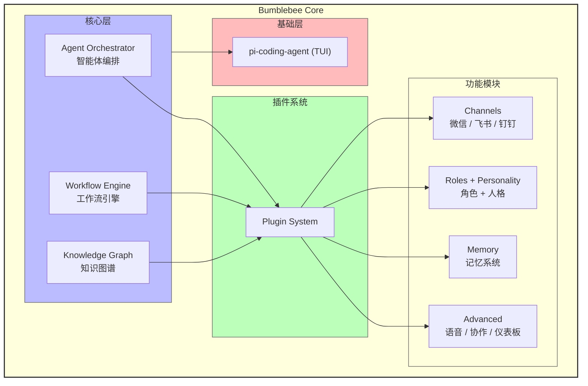

<p align="center">
  
  
  
  
  
</p>

<h1 align="center">Bumblebee</h1>

<p align="center">
  <strong>全渠道智能编程副官</strong><br>
  <em>不只是 Coding Agent，而是能变形、协作、感知、响应的 AI 编程伙伴</em>
</p>

<p align="center">
  像变形金刚中的大黄蜂一样 —— 忠诚、敏捷、智能，随时适配你的工作方式
</p>

---

## 为什么选择 Bumblebee？

当前的 AI Coding 工具（Claude Code、Cursor、Copilot）都局限于单一 IDE 或终端。Bumblebee 的愿景不同：**让 AI 编程助手无处不在** —— 微信群里 @一下就能审查 PR，飞书群里一句话就能触发自动化工作流，终端里用 TUI 获得沉浸式编码体验。

| 能力 | Bumblebee | Claude Code | Cursor | Copilot |
|------|:---------:|:-----------:|:------:|:-------:|
| TUI 终端界面 | ✅ | ✅ | ✅ | ❌ |
| 微信/飞书/钉钉接入 | ✅ | ❌ | ❌ | ❌ |
| 多 Agent 协作编排 | ✅ | ❌ | ❌ | ❌ |
| 自动化工作流引擎 | ✅ | ❌ | ❌ | ❌ |
| 知识图谱 + 学习 | ✅ | ❌ | ❌ | ❌ |
| 角色系统 + 人格 | ✅ | ❌ | ❌ | ❌ |
| 插件化架构 | ✅ | ❌ | ❌ | ❌ |
| 开源 | ✅ | ❌ | ❌ | ❌ |

---

## 架构总览



---

## 核心能力

### 角色系统

Bumblebee 不是一个固定人格的 Agent。它支持**用户自定义角色**，每个角色拥有独立的专业领域、沟通风格、系统提示词和能力声明。

```typescript
await agent.createRole({
  name: '安全审计专家',
  description: '专注于代码安全审查和漏洞检测',
  personality: {
    traits: ['严谨', '警觉', '细致'],
    expertise: ['OWASP', '渗透测试', '加密算法'],
  },
  systemPrompt: '你是一个安全审计专家...',
  capabilities: ['security-audit', 'vulnerability-scan']
})

agent.switchRole('security-auditor')
```

内置 8 种专业 Agent 模板：`code-reviewer` / `test-writer` / `doc-generator` / `debugger` / `architect` / `refactorer` / `security-auditor` / `optimizer`

### 记忆系统

跨会话用户画像持久化，自动从对话中提取用户偏好、环境信息和关键事实。对话历史由 pi-coding-agent 的 SessionManager 管理，Bumblebee 在此基础上构建长期用户画像层。

### 渠道系统

统一的 `ChannelAdapter` 接口，一套代码接入所有平台。官方实现 WeChat / Feishu / DingTalk，社区可自行扩展 Slack / Teams / Discord。

### 多 Agent 协作

支持 4 种协作模式（独立 / 顺序 / 并行 / 层级），根据任务复杂度自动调度多个专业 Agent 协同工作。

### 工作流引擎

声明式工作流定义，支持条件分支、重试策略、超时控制、步骤间数据传递。内置 PR 审查 / Issue 分类 / 版本发布 / 代码质量检查模板。

### 知识图谱

构建项目级知识图谱，支持节点关系推理、上下文感知、模式学习和智能推荐。

---

## TUI 体验

Bumblebee 通过 [pi-coding-agent](https://github.com/earendil-works/pi-coding-agent) Extension 机制注入 TUI，复用框架的会话管理、上下文压缩（compaction）、工具系统等核心能力，同时注入角色、人格、用户画像等差异化功能。

**复用的框架能力：**
- `SessionManager` — 对话历史持久化、分支管理
- `session_before_compact` — 压缩时自动提取用户画像
- `before_agent_start` — 注入角色 system prompt + 用户画像
- `defineTool` / `registerCommand` — 自定义工具和斜杠命令

| 斜杠命令 | 功能 |
|----------|------|
| `/roles` | 列出所有可用角色 |
| `/switch <id>` | 切换角色（支持 Tab 补全） |
| `/role` | 显示当前角色详情 |
| `/personality` | 显示人格状态 |
| `/memory` | 显示记忆统计 |
| `/memory clear` | 清空记忆 |

AI 在对话中可主动调用 `switch_role` / `list_roles` / `get_role_info` 工具。

---

## 快速开始

### 环境要求

- Node.js >= 22.0.0

### 安装与运行

```bash
git clone https://github.com/your-org/bumblebee.git
cd bumblebee
npm install
npm run build

# 启动 TUI
node dist/cli.js

# 或全局链接
npm link
bumblebee
```

### LLM 配置

Bumblebee 通过环境变量配置 LLM 连接。在项目根目录创建 `.env` 文件：

```bash
# Anthropic 直连
ANTHROPIC_API_KEY=sk-ant-xxxxxxxxxxxx
ANTHROPIC_BASE_URL=https://api.anthropic.com

# 或 OpenAI 兼容接口
OPENAI_API_KEY=sk-xxxxxxxxxxxx
OPENAI_BASE_URL=https://your-proxy.com/v1
```

> **说明：** 也可以直接设置系统环境变量，无需 `.env` 文件。如使用第三方 API 代理，将 `BASE_URL` 指向代理地址即可。

### 配置文件

在项目根目录创建 `.bumblebee.yaml`，用于配置人格、记忆等行为参数：

```yaml
personality:
  intensity: moderate    # low | moderate | high
  theme: transformers   # transformers | neutral
  roleId: bumblebee

memory:
  enabled: true
  maxHistory: 100

ai:
  provider: openai       # anthropic | openai | gemini | bedrock
  model: gpt-4o
  temperature: 0.7
  maxTokens: 4096
```

### 作为库使用

```typescript
import { BumblebeeAgent, loadConfig } from 'bumblebee'

const config = await loadConfig()
const agent = new BumblebeeAgent(config)
await agent.initialize()

const response = await agent.processMessage('帮我审查这段代码')
agent.switchRole('code-reviewer')

// 释放资源
agent.dispose()
```

---

## 项目结构

```
src/
├── core/           # 核心模块（Agent 主类、配置加载、LLM 调用工厂）
├── tui/            # TUI 集成（pi-coding-agent Extension）
├── roles/          # 角色系统（存储、管理、创建向导）
├── personality/    # 人格系统（情绪分析、人格注入）
├── memory/         # 记忆系统（用户画像持久化、对话画像提取）
├── channels/       # 渠道系统（微信 / 飞书 / 钉钉适配器）
├── agents/         # Agent 编排（生命周期管理、多 Agent 编排器）
├── workflows/      # 工作流引擎（DAG 调度、内置模板）
├── knowledge/      # 知识系统（图谱、上下文感知、学习机制）
├── voice/          # 语音交互
├── collaboration/  # 实时协作
├── dashboard/      # 可视化仪表板
├── performance/    # 性能优化器
├── cli.ts          # CLI 入口
└── index.ts        # 库 barrel export
```

---

## 技术栈

| 层级 | 技术 | 用途 |
|------|------|------|
| AI 引擎 | pi-coding-agent | Agent 会话管理、TUI 框架、Extension API |
| TUI 渲染 | pi-tui | 终端 UI 差分渲染、Markdown 渲染、交互组件 |
| 类型校验 | Zod + TypeBox | 配置校验、工具参数 Schema |
| 渠道 SDK | wechaty / @larksuiteoapi | 平台接入（懒加载） |
| 构建 | tsup | ESM 打包、Tree-shaking |
| 测试 | vitest | 单元测试、集成测试 |

---

## 开发

```bash
# 运行测试
npx vitest run

# 监听模式
npx vitest

# 类型检查
npm run typecheck

# 开发构建（监听文件变更）
npm run dev
```

---

## 参与贡献

欢迎提交 Issue 和 Pull Request！

1. Fork 本仓库
2. 创建特性分支：`git checkout -b feature/my-feature`
3. 提交更改：`git commit -m "feat: add my feature"`
4. 推送分支：`git push origin feature/my-feature`
5. 提交 Pull Request

请确保：
- 代码通过 `npm run typecheck` 类型检查
- 所有测试通过 `npx vitest run`
- 新功能附带相应测试用例

---

## 开发路线

- [x] **Phase 1** — 核心架构 + TUI 集成
- [x] **Phase 2** — 渠道系统（微信/飞书/钉钉）
- [x] **Phase 3** — 多 Agent 协作编排
- [x] **Phase 4** — 工作流引擎 + 模板
- [x] **Phase 5** — 知识图谱 + 学习机制
- [x] **Phase 6** — 语音/协作/仪表板/性能优化
- [x] **Phase 6.5** — 消除与 pi 框架的重复造轮子，深度复用框架能力
- [ ] **Phase 7** — 生产级渠道对接 + WebSocket 实时通信
- [ ] **Phase 8** — 插件市场 + 社区生态

---

## License

[MIT](./LICENSE)

---

<p align="center">
  <em>"汽车人，出发！" —— Bumblebee</em>
</p>
