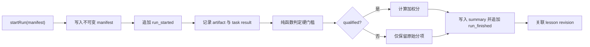

# Benchmark 0: Evaluation Core

Benchmark 0 是评估基础积木，本身不调用模型、不下载数据集，也不执行测试任务。
它为后续 BumblebeeBench、Terminal-Bench、AgentDojo 和长期记忆评估提供同一套
可审计结果格式。

## 解决的问题

- **结果可比较**：manifest 固定代码、环境、模型、预算、数据版本和 score spec。
- **失败不丢失**：run 开始时立即追加 `run_started`；结束时追加 `run_finished`。
- **证据不可偷换**：每个 artifact 记录 SHA-256、字节数和相对位置，写入后禁止覆盖。
- **状态不混淆**：任务状态、运行状态、有效性和发布资格分别建模。
- **安全后计分**：先判定 validity/qualification gate，通过后才计算加权分。
- **改进可追溯**：lesson 以追加 revision 保存，并关联证据 run、修改 commit 和复验 run。

## 目录

```text
benchmark_0_evaluation_core/
├── manifests/
│   └── bcs-v1.json
├── src/
│   ├── artifacts/
│   ├── contracts/
│   ├── recording/
│   └── scoring/
└── test/
    ├── architecture/
    ├── artifacts/
    ├── contracts/
    ├── recording/
    └── scoring/
```

## 一次运行的触发流程



`EvaluationRunStore` 是写入入口。调用方必须长期复用同一个实例，使同一历史账本的
并发追加通过 `KeyedSerialQueue` 串行化。跨进程同时写同一个输出目录当前不受支持。

## 存储约定

调用方传入一个输出根目录，实际生成：

```text
<output>/
├── artifacts/<run-id>/
│   ├── manifest.json
│   ├── task-results/
│   ├── evidence/
│   └── summary.json
└── history/
    ├── runs.jsonl
    └── lessons/<lesson-id>.jsonl
```

`runs.jsonl` 和 lesson revision 只追加、不覆盖。artifact 先完整写入临时文件并
`fsync`，再通过排他硬链接发布；已存在的目标路径会返回冲突错误。

JSON artifact、ledger 和 lesson 会先经过 Bumblebee 的结构化日志脱敏器。二进制或
原始轨迹通过 `recordRawArtifact()` 保存时不会自动脱敏，因此只能放在本地受限目录或
CI artifact 中，不能直接提交 Git。

## 状态语义

| 层级 | 状态 | 含义 |
| --- | --- | --- |
| task | `passed/failed/cancelled/invalid` | 单次任务 trial 的结果 |
| run | `completed/failed/cancelled/invalid` | 评估执行过程是否完整结束 |
| gate | `qualified/not-qualified/invalid` | 是否可发布加权总分 |

`completed` 不代表所有 task 都成功；它只表示评估流程完整结束。`not-qualified`
表示证据有效但违反安全或工程硬门槛，`invalid` 表示缺失指标或有效任务比例不足，
两者都不会生成加权总分。

## 验证

```bash
npm run benchmark:0
```

该命令只执行 Benchmark 0 的确定性测试；根目录的 `npm test` 也会覆盖这些测试。
