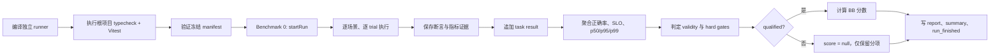

# Benchmark 1: BumblebeeBench

BumblebeeBench 是 Bumblebee 自有工程积木的确定性基准。它直接调用产品公开接口，
不连接模型、不访问网络，也不把普通单元测试数量当作 Agent 能力。

## 评估对象

```text
BB = 0.20 * Runtime
   + 0.15 * Cancellation
   + 0.20 * Permission
   + 0.15 * SubAgent
   + 0.15 * Channel
   + 0.15 * MemoryCore
```

每个域使用：

```text
DomainScore = 100 * (0.80 * Correctness + 0.20 * SLOCompliance)
```

同域场景等权，避免通过给某个简单场景增加断言数量来放大权重。延迟分采用
`min(1, target / measured)`，超过目标会平滑扣分，低于目标不会获得超过 100 的分数。

## 固定场景

| 域 | 场景 | 真实检查 |
| --- | --- | --- |
| Runtime | `runtime-session-order` | 同会话严格串行、顺序不倒置、队列排空 |
| Runtime | `runtime-global-concurrency` | 跨会话并行、全局并发上限、等待任务最终执行 |
| Cancellation | `cancellation-queued-request` | 排队取消不进入用户操作、及时移出队列 |
| Cancellation | `cancellation-timeout-dispose` | 超时信号、错误码区分、dispose 取消和清理等待 |
| Permission | `permission-folder-boundary` | 文件夹授权复用、规范路径逃逸重新确认并阻止 |
| Permission | `permission-resume-merge` | 读写位合并、导出与 resume 恢复后不重复询问 |
| SubAgent | `subagent-output-boundary` | 输入规范化、UTF-8 安全截断、usage 缺省值 |
| SubAgent | `subagent-cancellation-errors` | 预取消不调用 executor、超时/失败分类、内部错误不泄漏 |
| Channel | `channel-deduplication` | 处理中和完成后的重复消息都只产生一次副作用 |
| Channel | `channel-sender-authorization` | 飞书回调先确认、白名单外发送者不进入 Agent、远程 `write` 被 Pi 只读守卫阻止 |
| MemoryCore | `memory-update-persistence` | 稳定 key 更新、重启恢复、全局共享与项目隔离 |
| MemoryCore | `memory-secret-scope` | 凭据拒绝、磁盘不落密、失败写回滚内存快照 |

场景只记录断言 ID、数值指标和分类后的失败，不记录测试输入原文。文件系统场景为每个
trial 创建独立临时目录并在结束时删除；清理失败会标记为 `invalid/infrastructure`，
不会伪装成产品失败。

## 执行流程



启动脚本先用 `noCheck` 仅生成独立 runner，CLI 随后真实执行根目录
`tsc --noEmit` 与完整 Vitest。`deterministic_test_pass_rate` 取“项目测试预检”和
“12 个场景通过率”的较小值，因此任一侧失败都不能发布分数；聚合器不会自行假定预检
通过。任一确定性场景失败或安全违规会得到 `not-qualified`；有效任务不足 98% 会得到
`invalid`。

## Profile

| Profile | 每场景次数 | 用途 |
| --- | ---: | --- |
| `smoke` | 1 | 开发期间快速发现功能与边界回归 |
| `full` | 30 | 形成可报告的延迟分布和稳定性结果 |

`smoke` 的单次 p95/p99 只用于快速诊断，不具备统计意义。正式比较必须使用 `full`，
并保持 Node.js、操作系统和硬件 profile 一致。

## 正式基线

2026-07-23 在干净工作树上执行了首个 `full` profile：

| 项目 | 结果 |
| --- | --- |
| Bumblebee commit | `7b09b99f7c5bcd949913029df33a2634cfa6ac53` |
| Run ID | `run_mrx9pxd8_8d3880f9-65df-4afe-a330-60e948dc0e02` |
| 环境 | Node.js 22.20.0、Windows x64、32 CPU、23 GiB |
| 执行规模 | 12 个场景，每个场景 30 次，共 360 个 trial |
| 任务结果 | 360 passed、0 failed、0 cancelled、0 invalid |
| 资格判定 | `qualified`，9 个 validity/qualification gate 全部通过 |
| BB 分数 | `100.00` |

| 域 | 正确率 | SLO 达标率 | 得分 | p50 | p95 | p99 |
| --- | ---: | ---: | ---: | ---: | ---: | ---: |
| Runtime | 100% | 100% | 100.00 | 0.499 ms | 0.918 ms | 3.641 ms |
| Cancellation | 100% | 100% | 100.00 | 1.108 ms | 47.639 ms | 51.532 ms |
| Permission | 100% | 100% | 100.00 | 1.001 ms | 1.657 ms | 4.029 ms |
| SubAgent | 100% | 100% | 100.00 | 0.229 ms | 0.433 ms | 1.241 ms |
| Channel | 100% | 100% | 100.00 | 1.181 ms | 13.503 ms | 15.938 ms |
| MemoryCore | 100% | 100% | 100.00 | 3.936 ms | 28.478 ms | 43.815 ms |

该结果是离线确定性工程基线，只能与相同 manifest、Node.js、操作系统和硬件 profile
下的运行直接比较，不代表模型推理、代码生成或真实 IM 网络链路的综合能力。

## 运行

```bash
npm run benchmark:1
npm run benchmark:1:full
```

附加参数：

```bash
npm run benchmark:1 -- --output D:\benchmark-results
npm run benchmark:1 -- --parent-run-id run_previous
```

默认输出到：

```text
benchmark/benchmark_1_bumblebee_bench/.runtime/evaluation/
├── artifacts/<run-id>/
│   ├── manifest.json
│   ├── evidence/scenarios/
│   ├── evidence/report.json
│   ├── task-results/
│   └── summary.json
└── history/runs.jsonl
```

`.runtime/` 不提交 Git，但每次成功、失败、取消或无效 trial 都会在本地留存。需要将
一次修复与旧结果关联时使用 `--parent-run-id`；确定根因后再通过 Benchmark 0 的
`LessonStore` 创建可提交 lesson。

## 当前边界

- 该基准只衡量 Bumblebee 自有工程语义，不衡量模型推理、代码生成或真实终端任务能力；
- Sub-Agent 使用确定性 executor 端口，不产生模型成本，也不能替代外部端到端评估；
- Channel 使用真实 Dispatcher/FeishuAdapter，但 Gateway 是离线替身，不连接飞书；
- Permission 的路径逃逸通过可控 `realpath` 边界复现，不依赖 Windows 创建符号链接权限；
- 当前 SLO 是 `v1` 初始工程目标，调整场景、权重或阈值必须发布新 manifest 版本；
- `BB=100` 只表示冻结场景全部正确且在 SLO 内，不能解释为 Bumblebee 整体能力满分；
- 远程写只覆盖当前只读 Pi 会话守卫的确定性拒绝；提示注入和真实 Coding Agent 成功率由外部 benchmark 负责。

上述 2026-07-23 基线生成时尚未记录
`remote_write_success_count`。BB 分数本身仍是历史有效结果，但该 run 缺少 BCS-v1
全局门槛证据，不能交给 Benchmark 5 发布正式总分；正式组合前需要重新运行 full。
