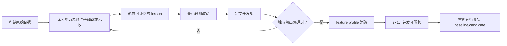

# Terminal-Bench 首轮真实评测复盘

日期：2026-07-24

状态：探索性结果，不能发布为正式 TB 分数

## 1. 复盘范围

本复盘使用以下两轮真实运行：

| 项目 | Baseline | Bumblebee candidate |
| --- | --- | --- |
| Job | `tb21-lite-pi-1-20260724-r3` | `tb21-lite-bumblebee-1-20260724-r1` |
| Commit | `b37dd285be7f2d510b2f6d838d86c9eb2e1fffdf` | `c8aebb8279dfec819102cc12b4c349b89e483c75` |
| Agent | PinnedPi | BumblebeePi |
| 模型 | `deepseek/deepseek-v4-flash`，thinking `high` | 相同 |
| 环境 | Harbor 0.20.0、Pi 0.78.1、Docker、并发 2 | 相同 |

candidate 的 45 个 trial 全部结束，但 3 个 verifier 在下载依赖时超时，有效率只有
`93.33%`，低于冻结的 `98%` 硬门槛。因此本文只分析问题，不计算或发布“修正后的
官方成绩”。

## 2. 结果摘要

| 指标 | Baseline | Candidate | 可以得出的结论 |
| --- | ---: | ---: | --- |
| 原始 reward | 32/45 | 30/45 | 两轮都受 verifier 基础设施故障污染 |
| 审计后有效样本 | 43/45 | 42/45 | 两轮都未达到 98% 有效率门槛 |
| 有效样本通过率 | 74.42% | 71.43% | 仅用于诊断，差值为 -2.99 个百分点 |
| Wilson 95% 区间 | 59.76%-85.07% | 56.43%-82.83% | 区间高度重叠，不能证明回归或收益 |
| 模型成本 | `$0.354801` | `$0.374389` | candidate 高 5.52%，只有一轮，不能归因 |
| Agent p50 | 46.4s | 83.2s | candidate 高 79.31%，不能直接归因于权限系统 |

本轮最重要的结论不是“Bumblebee 比 baseline 低 2 分”，而是：

1. 评测基础设施尚不满足正式比较条件。
2. 失败轨迹暴露了四类可泛化的 Agent 工程问题。
3. Terminal-Bench 没有实际调用记忆和子 Agent 工具，不能证明这些积木的用户价值。
4. 在完成定向修复和消融实验前，不应直接发起下一轮 45-trial 付费评测。

## 3. 证据边界

### 可以确认

- Harbor 原始结果、trial 日志和上游 verifier 输出是本轮根因分类的主要证据。
- 12 个有效失败计入能力失败；3 个 verifier 依赖下载超时计入基础设施无效。
- candidate 的 `delegate_task` 和 `bumblebee_memory` 在 45 个 trial 中均未被调用。
- candidate wrapper 只为无交互评测环境注入 `allow_once` authority；生产扩展仍然
  保持无 UI 时 fail-closed。
- BumblebeeBench 中权限判定的 p50/p95/p99 是毫秒级，无法解释 Terminal-Bench
  中几十秒量级的 Agent 时延差异。

### 不能确认

- 不能用单轮、无效的 candidate 证明 Bumblebee 相对 Pi 回归或提升。
- 不能把 token、成本或时延差异全部归因于扩展；不同推理轨迹的方差更大。
- 不能用本轮结果评价记忆、子 Agent 或渠道积木，因为这些能力没有被任务触发。
- 不能把 verifier 下载失败算作模型失败，也不能删除无效 trial 后发布新成绩。

## 4. 有效失败根因

### 4.1 显式验证失败后仍结束任务

`build-cython-ext` 的 5 个样本全部失败：

| Trial | 现象 |
| --- | --- |
| `57kSyCM` | Agent 运行 900 秒后超时 |
| `7ndafYZ`、`8W4aie4` | 仍存在 `np.int` 等 NumPy 兼容问题 |
| `ofhEzXF`、`ueTvUjF` | 仓库测试仍有 1 项失败，但最终回复声称工作完成 |

其中部分轨迹已经执行出 `1 failed, 17 passed` 或非零退出码，随后又用较窄的手工
smoke test 得到成功结果，并把后者误当成完整验收。问题不只是“没有多跑一次测试”，
而是 Agent 没有维护尚未解决的验证失败。

**经验：** 最后一个命令成功不等于任务成功；仓库原有测试、用户指定验收命令和
手工 smoke test 必须分级记录，较弱证据不能覆盖仍未解决的强失败证据。

### 4.2 恢复任务先破坏原始证据

`db-wal-recovery` 的 4 个有效失败 trial 为 `8t7ktte`、`aGrDsen`、`gQwnqxE` 和
`q43yY4Q`。它们都保留了基础库中的 `id=1, value=100`，没有恢复 WAL 中的更新值
`150`。

代表性轨迹先使用 SQLite 打开数据库，导致 WAL 状态发生变化，随后根据可见数据规律
“重建”记录。产物看起来合理，但不是从原始 WAL 恢复出的精确数据。

**经验：** 对数据库、二进制文件、日志和事故现场执行恢复前，必须先复制只读证据并
记录哈希。证据已丢失时应明确报告不确定性，不能用推测值伪装成恢复结果。

### 4.3 自测复用了同一个错误假设

`kv-store-grpc` 的失败 trial `JG4gkR2` 和 `t5xxH94` 把用户要求的
`SetValRequest.value` 实现成了 `SetValRequest.val`。Agent 又使用自己编写的客户端
验证服务端，因此客户端和服务端共享同一个错误，内部测试通过，上游契约测试失败。

**经验：** 自测只能证明实现内部一致，不能证明满足外部契约。协议字段、函数签名、
文件名和错误语义应先形成独立需求清单，再由不复用实现假设的验收步骤检查。

### 4.4 内容正确但产物格式不完整

`large-scale-text-editing` 的失败 trial `FUDSrot` 已生成正确的文本转换操作，但遗漏
了题目明确要求的最终 `:wq` 或 `:x`，因此 verifier 判定失败。

**经验：** 内容正确性和交付格式是两个独立验收门。脚本结尾、文件路径、输出协议、
退出方式等低复杂度要求也必须进入完成清单。

## 5. 基础设施无效样本

| 任务 | Trial | 原因 |
| --- | --- | --- |
| `multi-source-data-merger` | `BcAAQZ2`、`Rrz4ZAs` | verifier 下载数据依赖超时 |
| `db-wal-recovery` | `AeXpZ3G` | verifier 下载 Python 运行环境超时 |

这 3 个 trial 的 Agent 已完成工作，但 verifier 没有进入有效验收。改进目标是稳定
评测环境，不是修改 reward、放宽有效率门槛或增加模型重试。

## 6. 改进清单

截至 2026-07-24，P0/P1 的代码改进均已完成，状态仍分为“实现完成”和“真实复验
通过”两层。确定性 `dev/holdout` 已通过；9-task 无模型预检与首轮失败任务的真实
candidate 复验结果将在本文件末尾追加，不能用本地测试替代。

第一次 9-task 预检 `tb21-verifier-preflight-20260724-r2` 在模型调用前失败并主动
停止：2 个任务在默认 600 秒环境启动阶段超时，1 个任务因 Docker Desktop 首选
registry mirror DNS 失败而无法拉取镜像，其余为取消或未调度，模型成本为 0。该
结果保留在 `.runtime/jobs/`。修复措施是分别放宽 environment build 与 agent setup
超时，并在预检前按上游 tag 缓存 9 个任务镜像；这类故障不能靠 verifier 包预热
解决。

### P0：下一轮正式评测前必须完成

| ID | 类型 | 改进 | 验收条件 |
| --- | --- | --- | --- |
| `TB-INF-01` | 评测工程 | 增加覆盖 GitHub/astral、Python、PyPI、apt 和 npm 的无模型网络预检 | 9 个任务各 1 trial、并发 4 的预检全部通过；失败时在调用模型前终止 |
| `TB-INF-02` | 评测工程 | 使用稳定出口、透明缓存或预热机制减少 verifier 重复下载 | 不修改任务/verifier 语义和包校验；正式 job 有效率至少 98% |
| `AG-VER-01` | Agent | 建立“验证证据账本”，区分用户验收、仓库测试和手工 smoke test | 存在未解决的非零验收结果时不得宣称全部完成；最多触发一次补充验证，避免循环 |
| `AG-CON-01` | Agent | 在执行前提取外部契约，结束前逐项核对 | 协议字段、文件路径、产物结尾等确定性契约在定向集上 100% 保留 |
| `AG-REC-01` | Agent | 为恢复/取证类操作增加 preserve-before-mutate 约束 | 第一次打开或写入原件前完成副本和哈希；无法恢复时不生成推测数据 |

`AG-VER-01` 不能只实现为“最后一个工具调用失败就重试”。WAL、gRPC 和文本编辑失败
轨迹中的最后一次自测都可能成功，真正缺失的是对用户契约和未解决强证据的管理。

### P1：完成 P0 定向验证后实施

| ID | 类型 | 改进 | 验收条件 |
| --- | --- | --- | --- |
| `AG-PROFILE-01` | 架构 | 为权限、记忆、子 Agent、渠道增加显式 feature profile | 可复现 Pi、permission-only、full 三组消融，生产默认行为不变 |
| `MEM-LAZY-01` | 记忆 | 空记忆时避免注入完整 memory policy，按需加载上下文 | LongMemEval 和安全用例不回归，同时降低无记忆任务固定 prompt 开销 |
| `AG-CRITIC-01` | Agent | 对高风险或已修改工作区的任务试验一次只读独立复核 | 只在风险门槛命中时触发；记录额外成本，并显著降低契约遗漏率 |
| `TB-LESSON-01` | 评测工程 | 从 trial/verifier 证据生成失败矩阵和 lesson 草稿 | 保存 source job、trial、假设、预期指标、修复 commit 和复验 run；结论仍需人工确认 |
| `TB-DEV-01` | 测试工程 | 建立不复制隐藏答案的定向开发集 | 覆盖未解决测试、契约保持、证据保护和产物格式四类通用问题 |

实现后的主要代码边界：

- `benchmark/benchmark_0_evaluation_core/src/recording/lesson-store.ts: LessonStore`
- `src/extension.ts: registerBumblebeeExtension`
- `src/memory/core/context-builder.ts: formatMemoryPromptContext`
- `src/agents/assurance/task-assurance.ts: TaskAssurance`
- `src/integrations/pi/subagent-binding.ts: bindPiSubAgent`
- `benchmark/benchmark_2_terminal_bench_2_1/src/runner/lesson-drafts.ts: recordTerminalBenchLessonDrafts`
- `benchmark/benchmark_2_terminal_bench_2_1/src/dev/assurance-suite.ts: runAssuranceDevelopmentSuite`
- `benchmark/benchmark_2_terminal_bench_2_1/candidate-extension.ts: bumblebeeCandidateExtension`

### P2：形成稳定能力后再做

| ID | 类型 | 改进 | 验收条件 |
| --- | --- | --- | --- |
| `TB-STAT-01` | 统计 | 对有效 baseline/candidate 做多轮或配对运行 | 报告 Wilson 区间和任务级方差，不用单次百分点差值做因果结论 |
| `TB-ABLATE-01` | 归因 | 分别测 Pi、permission-only 和 full Bumblebee | 明确各积木带来的质量、成本和时延变化 |
| `TB-GATE-01` | 发布 | 将 TB-Lite 定位为通用任务“不回归门” | 有效率达标后再冻结非劣界值，未达标继续显示 `N/A` |

## 7. 明确不做

- 不添加 NumPy、SQLite WAL、gRPC 或 Vim 的题目专用提示和工具。
- 不通过盲目增加 900 秒超时掩盖无法收敛的执行过程。
- 不降低 98% 有效率门槛，不把基础设施失败计入模型能力失败。
- 不为 benchmark 放宽生产权限策略；无 UI 时 fail-closed 保持不变。
- 不因为本轮工具调用次数为 0 就直接删除记忆或子 Agent；应先用对应专项 benchmark
  和 feature profile 验证价值。

## 8. 下一轮执行顺序

具体顺序：

1. 先完成 verifier 网络预检，在不调用模型的情况下验证并发 4 环境。
2. 为四类能力问题建立小型确定性开发集，再设计通用修复。
3. 使用独立留出场景确认修复不是对本轮任务答案的硬编码。
4. 增加 feature profile，区分权限系统和完整扩展的实际成本。
5. 只有预检和定向验收均通过后，才重新运行 45-trial 真实评测。

本轮原始 job 和导入结果继续保留为历史证据。后续修复必须关联 commit 和复验 run，
成功与失败都追加记录，不覆盖本文件中的首轮结论。
