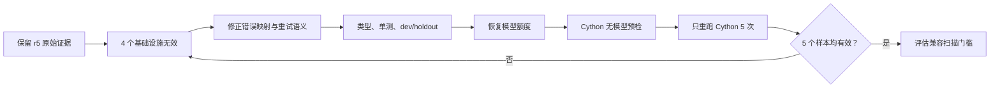

# Terminal-Bench 首轮真实评测复盘

日期：2026-07-24

状态：探索性结果，不能发布为正式 TB 分数

## 1. 复盘范围

本复盘使用以下两轮真实运行：

| 项目 | Baseline | Bumblebee candidate |
| --- | --- | --- |
| Job | `tb21-lite-pi-1-20260724-r3` | `tb21-lite-bumblebee-1-20260724-r1` |
| Commit | `b37dd285be7f2d510b2f6d838d86c9eb2e1fffdf` | `c8aebb8279dfec819102cc12b4c349b89e483c75` |
| Agent | PinnedPi | BumblebeePi |
| 模型 | `deepseek/deepseek-v4-flash`，thinking `high` | 相同 |
| 环境 | Harbor 0.20.0、Pi 0.78.1、Docker、并发 2 | 相同 |

candidate 的 45 个 trial 全部结束。追加审计确认 3 个 trial 访问了 benchmark
专用资料；与 verifier 基础设施异常去重后共有 5 个 invalid，有效率只有
`88.89%`，低于冻结的 `98%` 硬门槛。因此本文只分析问题，不计算或发布“修正后的
官方成绩”。

## 2. 结果摘要

| 指标 | Baseline | Candidate | 可以得出的结论 |
| --- | ---: | ---: | --- |
| 原始 reward | 32/45 | 30/45 | baseline 受基础设施故障影响，candidate 还存在证据污染 |
| 审计后有效样本 | 43/45 | 40/45 | 两轮都未达到 98% 有效率门槛 |
| 有效样本通过率 | 74.42% | 75.00% | 仅用于诊断，污染运行不可参与能力比较 |
| Wilson 95% 区间 | 59.76%-85.07% | 59.81%-85.81% | 区间高度重叠，不能证明回归或收益 |
| 模型成本 | `$0.354801` | `$0.374389` | candidate 高 5.52%，只有一轮，不能归因 |
| Agent p50 | 46.4s | 83.2s | candidate 高 79.31%，不能直接归因于权限系统 |

本轮最重要的结论不是“Bumblebee 比 baseline 低 2 分”，而是：

1. 评测基础设施尚不满足正式比较条件。
2. 失败轨迹暴露了四类可泛化的 Agent 工程问题。
3. Terminal-Bench 没有实际调用记忆和子 Agent 工具，不能证明这些积木的用户价值。
4. 在完成定向修复和消融实验前，不应直接发起下一轮 45-trial 付费评测。

## 3. 证据边界

### 可以确认

- Harbor 原始结果、trial 日志和上游 verifier 输出是本轮根因分类的主要证据。
- 追加审计后 candidate 有 10 个有效失败和 5 个 invalid；3 个证据泄漏与 3 个
  verifier 异常有 1 个 trial 重叠。
- candidate 的 `delegate_task` 和 `bumblebee_memory` 在 45 个 trial 中均未被调用。
- candidate wrapper 只为无交互评测环境注入 `allow_once` authority；生产扩展仍然
  保持无 UI 时 fail-closed。
- BumblebeeBench 中权限判定的 p50/p95/p99 是毫秒级，无法解释 Terminal-Bench
  中几十秒量级的 Agent 时延差异。

### 不能确认

- 不能用单轮、无效的 candidate 证明 Bumblebee 相对 Pi 回归或提升。
- 不能把 token、成本或时延差异全部归因于扩展；不同推理轨迹的方差更大。
- 不能用本轮结果评价记忆、子 Agent 或渠道积木，因为这些能力没有被任务触发。
- 不能把 verifier 下载失败算作模型失败，也不能删除无效 trial 后发布新成绩。

## 4. 有效失败根因

### 4.1 显式验证失败后仍结束任务

`build-cython-ext` 的 5 个样本全部失败：

| Trial | 现象 |
| --- | --- |
| `57kSyCM` | Agent 运行 900 秒后超时 |
| `7ndafYZ`、`8W4aie4` | 仍存在 `np.int` 等 NumPy 兼容问题 |
| `ofhEzXF`、`ueTvUjF` | 仓库测试仍有 1 项失败，但最终回复声称工作完成 |

其中部分轨迹已经执行出 `1 failed, 17 passed` 或非零退出码，随后又用较窄的手工
smoke test 得到成功结果，并把后者误当成完整验收。问题不只是“没有多跑一次测试”，
而是 Agent 没有维护尚未解决的验证失败。

**经验：** 最后一个命令成功不等于任务成功；仓库原有测试、用户指定验收命令和
手工 smoke test 必须分级记录，较弱证据不能覆盖仍未解决的强失败证据。

### 4.2 恢复任务先破坏原始证据

`db-wal-recovery` 的 4 个有效失败 trial 为 `8t7ktte`、`aGrDsen`、`gQwnqxE` 和
`q43yY4Q`。它们都保留了基础库中的 `id=1, value=100`，没有恢复 WAL 中的更新值
`150`。

代表性轨迹先使用 SQLite 打开数据库，导致 WAL 状态发生变化，随后根据可见数据规律
“重建”记录。产物看起来合理，但不是从原始 WAL 恢复出的精确数据。

**经验：** 对数据库、二进制文件、日志和事故现场执行恢复前，必须先复制只读证据并
记录哈希。证据已丢失时应明确报告不确定性，不能用推测值伪装成恢复结果。

### 4.3 自测复用了同一个错误假设

`kv-store-grpc` 的失败 trial `JG4gkR2` 和 `t5xxH94` 把用户要求的
`SetValRequest.value` 实现成了 `SetValRequest.val`。Agent 又使用自己编写的客户端
验证服务端，因此客户端和服务端共享同一个错误，内部测试通过，上游契约测试失败。

**经验：** 自测只能证明实现内部一致，不能证明满足外部契约。协议字段、函数签名、
文件名和错误语义应先形成独立需求清单，再由不复用实现假设的验收步骤检查。

### 4.4 内容正确但产物格式不完整

`large-scale-text-editing` 的失败 trial `FUDSrot` 已生成正确的文本转换操作，但遗漏
了题目明确要求的最终 `:wq` 或 `:x`，因此 verifier 判定失败。

**经验：** 内容正确性和交付格式是两个独立验收门。脚本结尾、文件路径、输出协议、
退出方式等低复杂度要求也必须进入完成清单。

## 5. 基础设施无效样本

| 任务 | Trial | 原因 |
| --- | --- | --- |
| `multi-source-data-merger` | `BcAAQZ2`、`Rrz4ZAs` | verifier 下载数据依赖超时 |
| `db-wal-recovery` | `AeXpZ3G` | verifier 下载 Python 运行环境超时 |

这 3 个 trial 的 Agent 已完成工作，但 verifier 没有进入有效验收。改进目标是稳定
评测环境，不是修改 reward、放宽有效率门槛或增加模型重试。

## 6. 改进清单

截至 2026-07-25，P0/P1 的代码改进均已完成，状态仍分为“实现完成”和“真实复验
通过”两层。确定性 `dev/holdout` 已通过；9-task 无模型预检与首轮失败任务的真实
candidate 复验结果将在本文件末尾追加，不能用本地测试替代。

第一次 9-task 预检 `tb21-verifier-preflight-20260724-r2` 在模型调用前失败并主动
停止：2 个任务在默认 600 秒环境启动阶段超时，1 个任务因 Docker Desktop 首选
registry mirror DNS 失败而无法拉取镜像，其余为取消或未调度，模型成本为 0。该
结果保留在 `.runtime/jobs/`。修复措施是分别放宽 environment build 与 agent setup
超时，并在预检前按上游 tag 缓存 9 个任务镜像；这类故障不能靠 verifier 包预热
解决。

第二次预检 `tb21-verifier-preflight-20260724-r3` 在镜像缓存后证明环境启动已恢复：
`build-cython-ext` 与 `kv-store-grpc` 均由原始 verifier 正常写出 reward 0 且无异常。
随后主动停止剩余任务，因为预热脚本在 Python 基础镜像中仍重复安装
`python3/python3-pip`，4 路并发放大了 apt 下载耗时。r4 改为 apt update 后只补
缺失的 curl、git 和 CA 证书；Python/pip 由冻结任务镜像提供。

第三次预检 `tb21-verifier-preflight-20260724-r4` 中 8 个任务由原始 verifier
正常写出 reward 0 且无异常；`large-scale-text-editing` 的 verifier 内部 uv
安装脚本在 GitHub 下载处超过 8 分钟未返回，人工停止后记为 `CancelledError`。
这仍属于基础设施故障，不是 Agent 能力结果。后续预检在容器级写入受限的 curl
配置：连接超时 20 秒、单次总时长 180 秒、全错误重试 2 次；不修改 verifier
文件、测试逻辑或依赖版本，并保留已预热 uv 作为上游安装脚本失败后的运行环境。

第四次预检 `tb21-verifier-preflight-20260725-r5` 暴露了另一处冷启动问题：首批
容器访问默认 `deb.debian.org` 时，`apt-get update` 超过 7 分钟，而同机访问
阿里云 Debian 镜像约 0.6 秒。该运行在模型调用前停止并保留原始目录。r6 开始先
检测缺失项，仅在必要时刷新 apt 索引；Debian/Ubuntu 软件源透明映射到已验证镜像，
并启用 IPv4、20 秒单请求超时和 3 次重试。包名、发行版套件和 verifier 均不变。

第五次预检 `tb21-verifier-preflight-20260725-r6` 证明 apt 镜像修复生效：
`build-cython-ext` 与 `kv-store-grpc` 正常完成，apt 冷启动从 7 分钟级降至约
30 秒。但原始 verifier 的 curl 超过 3 分钟仍未退出，说明 `max-time` 会随重试
重新计时，不能约束完整重试窗口。该轮同样在模型调用前停止。r7 增加
`retry-max-time = 180`，并为 uv 设置连接/读取/重试限制及 600 秒命令级上限。

第六次预检 `tb21-verifier-preflight-20260725-r7` 在 15 分 59 秒内完成 9/9，
0 个 trial 异常、1 次 Harbor 重试、模型成本为 0。独立 `audit-preflight`
确认 coverage 9/9、verifier results 9/9，状态为 `passed`。Harbor 在所有结果
落盘后打印 Rich 汇总表时触发 Windows GBK 编码错误，因此进程退出码为 1；该展示
错误不影响原始结果，但正式运行前仍固定 `PYTHONUTF8=1` 和
`PYTHONIOENCODING=utf-8`。

r7 还暴露并修复了审计器契约问题：无模型 agent 的 `model_info` 合法为 null。
现在只有 `audit-preflight` 显式允许 model-less identity，并归一化为
`provider/name = none`；baseline、candidate、校准和正式导入仍严格要求模型信息。

首个定向 candidate `tb21-targeted-bumblebee-20260725-r1` 在完成 8/20 后主动
停止并保留，累计成本 `$0.073683`。7 个有效结果中 Cython 1/2、WAL 0/1、
大文本 1/1、gRPC 1/3；另一个大文本 trial 在模型调用前下载 Python 3.13 超时，
被 Harbor 泛化为不可重试的 `NonZeroAgentExitCodeError`。继续运行时有效率最多
95%，必然低于 98% 门槛，因此没有用更多付费样本掩盖该故障。

r2 将 uv 管理 Python 的下载基址切换到已用同一 32 MB 冻结产物验证为 HTTP 200
的 HTTPS GitHub 代理；下载路径和 uv 内置版本元数据不变。同时将 uv 的超时和
重试耗尽签名归类为 `NetworkConnectionError`，允许 Harbor 按固定上限重试。
无模型复验 `tb21-python-mirror-preflight-20260725` 在 2 分 8 秒内完成上一轮
实际失败的 `large-scale-text-editing`：1/1 verifier 结果、0 异常。设置 Python
UTF-8 环境后，Harbor 的 Unicode 汇总表也正常输出并以退出码 0 结束。

第二个定向 candidate `tb21-targeted-bumblebee-20260725-r2` 完成 20/20，原始
reward 14/20、0 个最终异常、1 次网络重试，耗时 49 分 47 秒，成本
`$0.277662`。但后验审计发现 3 个 WAL trial 读取了随完整 Git checkout 暴露的
benchmark README、复盘、测试或 manifest。该信息不属于生产 Agent 可见上下文，
因此 r2 是污染运行，不能用于证明 P0/P1 修复提升；导入后为 14 passed、3 failed、
3 dataset invalid，同时因只覆盖 4/9 任务而保持 invalid。

这一问题按 P0 处理。candidate setup 现在只把 `npm pack` 的生产发布白名单与单独
wrapper 留给模型，并在运行前删除临时 checkout、`.git` 和根 README。导入器增加
`BenchmarkEvidenceLeakError` 诊断，保留 Harbor 原始证据与哈希，不修改 reward。
无模型真实容器预检 `tb21-candidate-isolation-preflight-20260725` 在约 2 分钟内
1/1 通过；仍需用该隔离协议重跑同一 4 类历史失败任务。

干净定向 r3 使用 commit `f4057b7d8abc818aa8759d0d3289be399f3d7c10`，在
40 分 3 秒内完成 20/20，结果为 Cython 4/5、WAL 2/5、大文本 5/5、gRPC 5/5，
总计 16/20，成本 `$0.274352`。20 个样本全部有效，benchmark 证据泄漏 0、
API Key 精确命中 0、容器残留 0。因只覆盖 4/9 任务，导入资格仍为 invalid，
OfficialReward 80.00 仅是定向诊断指标，不能发布为 TB 分数。

r3 的剩余失败继续转化为通用约束，而不是题目答案：仓库级兼容改造的 critic 必须
覆盖相关原生/生成源码；恢复模式在提示只给目录时，也必须从只读列表输出动态发现
证据。原实现只有提示中直接出现 `.db/.wal` 才启用保护，导致一个样本在备份前打开
原库。修复后恢复风险与文件名解耦，动态证据逐项要求 copy + SHA-256，同名前缀和
`copy && delete` 不能绕过。r3 的 21 次成功 critic 还暴露一次重复调用，现增加
会话级“成功后至多一次”硬约束。下一轮只重跑仍失败的 Cython 与 WAL。

二次定向 r4 使用 commit `ec372aee5e871f74b1d0bcdfe8ce0c067f1c6e60`，只运行
Cython 和 WAL。19 分 27 秒完成 10/10，结果为 Cython 3/5、WAL 5/5，总计 8/10，
成本 `$0.120553`；0 异常、0 重试、0 invalid、证据泄漏 0、API Key 精确命中 0、
trial 容器残留 0。导入后的 OfficialReward 为 80.00、Stability 为 100.00，但
只覆盖 2/9 且无完整效率预算，资格仍为 invalid，`TB = N/A`。

r4 的两个 Cython 失败都将兼容扫描限制在已知脚本/Cython 文件类型，说明“提示
检查原生/生成源码”仍是软约束。该缺口按 P1 继续闭环：仓库级兼容任务发生修改后，
必须有一次成功的非扩展名收窄递归扫描，否则完成审阅触发补充轮次。该规则只识别
兼容迁移与仓库源码语义，不包含 NumPy、Cython 或隐藏 verifier 的题目答案。r5
只复验 Cython，WAL 和其他已成功任务不再运行。

r5 使用 commit `df88196c97d1a51678dbb9ba2eade5bf9b5bd6b0`，并在对应候选
隔离预检 1/1 通过后，只运行 Cython 5 次。唯一有效 trial reward 为 1；另外
3 次因 DeepSeek `402 Insufficient Balance`、1 次因 PyPI 对冻结依赖返回空版本
列表而无效。审计后为 1 passed、4 infrastructure invalid，有效率 20%，不能用
有效子样本的 OfficialReward 100.00 判断兼容扫描修复效果。Harbor 对 4 个外部
故障共进行了 8 次重试，其中余额错误不应进入自动重试；原始日志、异常和成本均
保留。

该问题触发评测基础设施修复：运行时将余额耗尽转换为不可自动重试的
`ApiUsageLimitError`，包索引空响应转换为有界重试的
`NetworkConnectionError`；离线导入器对历史异常使用相同规范化规则，不改写
Harbor 原始结果。项目决定停止继续消耗模型额度；r5 的原始 invalid 状态保持不变。

现有审计后结果另按“每任务选择最高完整 5-trial 批次、invalid 仍计 0”的固定规则
汇总为项目正式 `TB = 93.33`（42/45）。该跨 commit 结果使用
`environment-recovery-aggregate` 标签，不冒充单一版本或上游官方分数；据此得到
项目 `BCS-v1 = 96.65`。详见
[环境恢复聚合报告](./BEST_OBSERVED_2026-07-25.md)。

### P0：已完成并通过确定性验证

| ID | 类型 | 改进 | 验收条件 |
| --- | --- | --- | --- |
| `TB-INF-01` | 评测工程 | 增加覆盖 GitHub/astral、Python、PyPI、apt 和 npm 的无模型网络预检 | 9 个任务各 1 trial、并发 4 的预检全部通过；失败时在调用模型前终止 |
| `TB-INF-02` | 评测工程 | 使用稳定出口、透明缓存或预热机制减少 verifier 重复下载 | 不修改任务/verifier 语义和包校验；正式 job 有效率至少 98% |
| `AG-VER-01` | Agent | 建立“验证证据账本”，区分用户验收、仓库测试和手工 smoke test | 存在未解决的非零验收结果时不得宣称全部完成；最多触发一次补充验证，避免循环 |
| `AG-CON-01` | Agent | 在执行前提取外部契约，结束前逐项核对 | 协议字段、文件路径、产物结尾等确定性契约在定向集上 100% 保留 |
| `AG-REC-01` | Agent | 为恢复/取证类操作增加 preserve-before-mutate 约束 | 第一次打开或写入原件前完成副本和哈希；无法恢复时不生成推测数据 |

`AG-VER-01` 不能只实现为“最后一个工具调用失败就重试”。WAL、gRPC 和文本编辑失败
轨迹中的最后一次自测都可能成功，真正缺失的是对用户契约和未解决强证据的管理。

### P1：已完成，真实复验受外部额度阻塞

| ID | 类型 | 改进 | 验收条件 |
| --- | --- | --- | --- |
| `AG-PROFILE-01` | 架构 | 为权限、记忆、子 Agent、渠道增加显式 feature profile | 可复现 Pi、permission-only、full 三组消融，生产默认行为不变 |
| `MEM-LAZY-01` | 记忆 | 空记忆时避免注入完整 memory policy，按需加载上下文 | LongMemEval 和安全用例不回归，同时降低无记忆任务固定 prompt 开销 |
| `AG-CRITIC-01` | Agent | 对高风险或已修改工作区的任务试验一次只读独立复核 | 只在风险门槛命中时触发；记录额外成本，并显著降低契约遗漏率 |
| `AG-COMPAT-01` | Agent | 为仓库级兼容迁移增加修改后全源递归扫描门槛 | 按已编辑扩展名收窄的扫描不能结束任务；不编码具体依赖或文件答案 |
| `TB-LESSON-01` | 评测工程 | 从 trial/verifier 证据生成失败矩阵和 lesson 草稿 | 保存 source job、trial、假设、预期指标、修复 commit 和复验 run；结论仍需人工确认 |
| `TB-DEV-01` | 测试工程 | 建立不复制隐藏答案的定向开发集 | 覆盖未解决测试、契约保持、证据保护和产物格式四类通用问题 |

以上 P0/P1 均已进入代码并通过类型检查、自动化测试、Task Assurance 开发集与独立
留出集。`AG-COMPAT-01` 的真实模型验收尚未完成，原因是 r5 的外部额度和包索引
故障，而不是把 4 个无效样本计作能力失败。

实现后的主要代码边界：

- `benchmark/benchmark_0_evaluation_core/src/recording/lesson-store.ts: LessonStore`
- `src/extension.ts: registerBumblebeeExtension`
- `src/memory/core/context-builder.ts: formatMemoryPromptContext`
- `src/agents/assurance/task-assurance.ts: TaskAssurance`
- `src/integrations/pi/subagent-binding.ts: bindPiSubAgent`
- `benchmark/benchmark_2_terminal_bench_2_1/src/runner/lesson-drafts.ts: recordTerminalBenchLessonDrafts`
- `benchmark/benchmark_2_terminal_bench_2_1/src/dev/assurance-suite.ts: runAssuranceDevelopmentSuite`
- `benchmark/benchmark_2_terminal_bench_2_1/candidate-extension.ts: bumblebeeCandidateExtension`

### P2：形成稳定能力后再做

| ID | 类型 | 改进 | 验收条件 |
| --- | --- | --- | --- |
| `TB-STAT-01` | 统计 | 对有效 baseline/candidate 做多轮或配对运行 | 报告 Wilson 区间和任务级方差，不用单次百分点差值做因果结论 |
| `TB-ABLATE-01` | 归因 | 分别测 Pi、permission-only 和 full Bumblebee | 明确各积木带来的质量、成本和时延变化 |
| `TB-GATE-01` | 发布 | 将 TB-Lite 定位为通用任务“不回归门” | 严格单 run 未达标仍显示 `N/A`；环境恢复聚合必须单独标记并保留 invalid |

## 7. 明确不做

- 不添加 NumPy、SQLite WAL、gRPC 或 Vim 的题目专用提示和工具。
- 不通过盲目增加 900 秒超时掩盖无法收敛的执行过程。
- 不降低严格单 run 的 98% 有效率门槛；项目聚合必须单独标记，基础设施 invalid
  保留并按 0 计分。
- 不为 benchmark 放宽生产权限策略；无 UI 时 fail-closed 保持不变。
- 不因为本轮工具调用次数为 0 就直接删除记忆或子 Agent；应先用对应专项 benchmark
  和 feature profile 验证价值。

## 8. 下一轮执行顺序

具体顺序：

1. 先恢复 DeepSeek 额度；额度错误不进入自动重试。
2. 用同一冻结任务执行一次 Cython 无模型环境预检，确认 PyPI 索引可返回固定依赖。
3. 预检通过后只运行 Cython 5 次，不重跑 WAL、大文本、gRPC 或其他成功任务。
4. 只有 5 个 trial 均有效时，才评价 `AG-COMPAT-01`；否则继续按基础设施或能力
   失败分别归因。
5. Cython 定向验收完成后，再单独决定是否投入三轮 baseline 与完整 candidate
   所需的正式计分成本。

本轮原始 job 和导入结果继续保留为历史证据。后续修复必须关联 commit 和复验 run，
成功与失败都追加记录，不覆盖本文件中的首轮结论。
