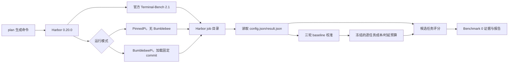

# Benchmark 2: Terminal-Bench 2.1 Lite

该积木通过 Harbor 接入官方
[Terminal-Bench 2.1](https://github.com/harbor-framework/terminal-bench-2-1)，
并从 89 个上游任务中冻结 9 个分层代表任务，衡量 Bumblebee 在真实、可执行验证的
终端任务中的端到端价值。它不复制或修改上游任务、容器和 verifier，也不进入
Bumblebee 的 npm 发布包。

评估工程已经实现。2026-07-24 完成了第一轮 45-trial 真实 `pi-baseline`
原始运行，但审计发现 2 个 trial 是 verifier 启动时下载依赖失败，并非模型失败；
有效率为 95.56%，低于冻结的 98% 门槛，因此该 job 只保留为证据，不能进入
baseline 校准。当前仍没有可发布的 TB 分数。

这是 Bumblebee 的项目级 `TB-Lite` 分项，不是完整 Terminal-Bench 2.1 成绩，也
不具备官方排行榜提交资格。这样将原计划的
`89 × 5 ×（3 baseline + 1 candidate）= 1780` 个 trial 降为
`9 × 5 × 4 = 180` 个 trial，同时保留相同模型、重复次数、官方 verifier 和三轮
baseline 校准。

## 模块边界



| 目录 | 职责 |
| --- | --- |
| `harbor_agent/` | 复用 Harbor 的 Pi 集成，只替换 Pi 安装版本并增加 Bumblebee extension 参数 |
| `manifests/` | 冻结数据集身份、9 个代表任务、每任务至少 5 次、Pi 版本、评分权重和硬门槛 |
| `src/harbor/` | 生成可审阅的 Harbor 命令，不自动执行付费评估 |
| `src/importer/` | 将 Harbor `JobResult/TrialResult` 归一化为 Benchmark 0 契约 |
| `src/scoring/` | 三轮 `pi-baseline` 中位数校准及 TB 分数计算 |
| `src/runner/` | 保存每次 trial、来源哈希、报告和无效/NQ 状态 |
| `test/` | 不联网、不调用模型的确定性开发测试 |

## 运行边界

- Harbor 固定为 `0.20.0`，只记录在本目录的 `requirements.txt`；
- Pi 固定为项目使用的
  `@earendil-works/pi-coding-agent@0.78.1`；
- baseline 使用 `PinnedPi` 且强制 `--no-extensions`；
- candidate 使用 `BumblebeePi`，在 Agent setup 阶段将指定 commit 安装到固定本地
  目录，执行阶段通过 `--no-extensions --extension <local-path>` 只加载该 commit
  内的 benchmark wrapper；
- Harbor 没有交互式授权 UI，candidate wrapper 固定注入 `allow-once` authority；
  它仍注册同一组 Bumblebee 生产模块，只替换授权决策来源；
- `main`、tag、短 SHA 或未推送的本地目录不能作为正式 candidate 身份；
- 模型必须显式使用 `provider/model`，API Key 只通过进程环境传给 Harbor；
- 默认不包含 `--upload` 或 `--public`，不会意外公开轨迹。

Manifest 中的上游 reference 是 `latest`，但评分身份不依赖这个移动名称。导入时会
按排序后的 `task_name + task_checksum` 计算数据集 SHA-256；三轮 baseline 必须
使用相同哈希，candidate 的哈希必须和预算文件一致。上游内容一旦变化，旧预算
覆盖率会变为 0，本轮只能得到 `NQ`，必须重新校准。

## 固定代表任务

任务不是运行时随机抽取，而是在看到 TB 模型成绩前按能力类别、难度和工程通用性
一次性冻结。命令生成器会为每个任务添加精确的 `--include-task-name`，导入器还会
校验实际任务 ID 集合；仅仅“数量也是 9 个”不能通过。

| 任务 | 难度 | 主要覆盖点 |
| --- | --- | --- |
| `fix-git` | easy | Git 状态诊断与提交恢复 |
| `build-cython-ext` | medium | 依赖修复、NumPy 兼容与原生扩展构建 |
| `cancel-async-tasks` | hard | 异步并发、取消与资源清理 |
| `fix-code-vulnerability` | hard | 漏洞定位、输入校验与安全修复 |
| `nginx-request-logging` | medium | 服务安装、配置与运行验证 |
| `db-wal-recovery` | medium | 数据库文件分析与 WAL 恢复 |
| `multi-source-data-merger` | medium | 多格式 ETL、字段映射与冲突处理 |
| `large-scale-text-editing` | medium | 大文件变换与受限工具使用 |
| `kv-store-grpc` | medium | gRPC 服务、代码生成与进程管理 |

## 首轮真实运行（2026-07-24）

运行身份固定为 commit
`b37dd285be7f2d510b2f6d838d86c9eb2e1fffdf`、Harbor `0.20.0`、Pi
`0.78.1`、`deepseek/deepseek-v4-flash`、thinking `high`、Docker 和 2 路
并发。所有 job 目录均保留在被 Git 忽略的 `.runtime/jobs/` 中。

### 执行记录

| Job | 完成情况 | 结论与处理 |
| --- | ---: | --- |
| `tb21-lite-smoke-baseline-20260724-1250` | 0/1 | 自定义 adapter 无法导入，且 Windows GBK 无法渲染错误输出；改为 `python -m harbor.cli.main` |
| `tb21-lite-smoke-baseline-20260724-1253` | 1/1 | `fix-git` reward 1，真实模型、Docker、Pi 和 verifier 链路打通，成本约 `$0.001566` |
| `tb21-lite-pi-1-20260724` | 2/45 | Pi 冷安装超过 Harbor 默认 setup 时限，主动停止；增加 3 倍 setup timeout |
| `tb21-lite-pi-1-20260724-r1` | 0/45 | `nodejs.org` 下载 Node 长时间停滞，主动停止；固定 Node `22.20.0` 和国内镜像 |
| `tb21-node-mirror-install-preflight-20260724` | 1/1 | 无模型 install-only 预检通过，Pi 安装约 83 秒，总耗时 1 分 35 秒 |
| `tb21-lite-pi-1-20260724-r2` | 26/45 | DeepSeek 503 被 Pi 以退出码 0 吞掉，主动停止；adapter 改为识别最终 API 状态并只重试瞬态错误 |
| `tb21-lite-pi-1-20260724-r3` | 45/45 | Harbor 原始运行完整，但 2 条 verifier 网络故障污染 reward 0，审计后不具备校准资格 |
| `tb21-lite-bumblebee-smoke-20260724` | 1/1 | reward 0；默认 PermissionSystem 在无 UI 时正确拒绝写入和 Shell，证明不能直接把生产交互模式用于 Harbor |

中断不是删除记录。前三次正式尝试和 smoke/preflight 的原始结果均继续保留，用于说明
环境问题、修复依据和成本；只有通过完整性与有效率门槛的 job 才能进入校准。

### r3 原始结果

| 指标 | 结果 |
| --- | ---: |
| Harbor 原始 reward | 32/45，均值 `0.7111` |
| 审计后状态 | 32 passed、11 failed、2 infrastructure invalid |
| 有效率 | 43/45，`95.56%`，低于 `98%` 硬门槛 |
| 异常 | 1 个 `AgentTimeoutError`，无 API 瞬态错误重试 |
| 总运行时间 | 2 小时 4 分 46 秒 |
| Agent 时延 | p50 `46.4s`、p95 `562.0s`、p99 `1200.0s` |
| Token | input `37,098,210`、cache read `36,214,784`、output `463,287` |
| 模型成本 | `$0.354801` |
| 凭据审计 | 458 个证据文件中 API Key 精确值命中 0 次 |
| 资源清理 | Harbor trial 容器残留 0 个 |

| 任务 | 原始通过 | 审计结论 |
| --- | ---: | --- |
| `fix-git` | 5/5 | 稳定通过 |
| `build-cython-ext` | 1/5 | 依赖安装、NumPy 兼容和仓库回归验证不稳定 |
| `cancel-async-tasks` | 4/5 | 失败样本只清理了一个并发任务 |
| `fix-code-vulnerability` | 4/5 | 失败样本遗漏非法 header 的拒绝逻辑 |
| `nginx-request-logging` | 5/5 | 稳定通过 |
| `db-wal-recovery` | 0/5 | 3 次未正确应用 WAL，另 2 次是 verifier 下载依赖失败 |
| `multi-source-data-merger` | 5/5 | 稳定通过 |
| `large-scale-text-editing` | 4/5 | 1 次执行达到 1200 秒正式超时 |
| `kv-store-grpc` | 4/5 | 失败样本生成了错误的 protobuf 字段 |

`32/43 = 74.42%` 只能作为排除已确认基础设施污染后的诊断值，不能替代官方
reward，也不是 TB 分数。`db-wal-recovery` 消耗约 `$0.190064`，占本 job
总成本约 53.6%，但没有产生模型通过结果；这是后续分析成本和能力边界时的重点。

### 本轮经验

- 仅检查 Harbor 根 `result.json` 不足以区分模型失败和 verifier 启动失败；上游
  `test.sh` 即使下载依赖失败也可能写入 reward 0。
- job reader 现在只对已观察到的 verifier `uv` 下载超时、`astral.sh` 连接失败和
  `uvx` 缺失签名附加 `VerifierInfrastructureError`。原始 JSON 和证据哈希不改写，
  普通 reward 0 仍按模型失败处理。
- r3 的 2 个 infrastructure invalid 使有效率低于 98%，校准器必须拒绝该 job；
  不能通过手工删除失败 trial、改 reward 或计算“修正版官方成绩”绕过。
- 下一步应先重跑一轮可通过审计的 baseline 1，再执行 baseline 2/3。三轮有效
  baseline 和一轮 candidate 全部完成前，`TB = N/A`。

### Candidate 授权边界

Terminal-Bench 的每个任务都在一次性 Docker 容器中运行，并且必须修改文件或执行
命令。Bumblebee 生产扩展在 `context.hasUI = false` 时按设计拒绝需要确认的操作；
第一次 candidate smoke 因而无法执行 `bash/write/edit`，`fix-git` 得分为 0。

正式 candidate 改为加载同一冻结 commit 中的
`benchmark/benchmark_2_terminal_bench_2_1/candidate-extension.ts`。该 wrapper
调用生产 `registerBumblebeeExtension()`，仅注入固定返回 `allow_once` 的
`PermissionAuthority`。策略写入 manifest，并由测试固定；wrapper 不在 npm
发布文件中，生产默认扩展没有环境变量开关，headless 模式仍然 fail-closed。

因此 candidate 衡量的是“用户已逐次授权后 Bumblebee 的端到端任务价值”，不是
默认拒绝策略的安全分。权限位、路径范围、持久化和无 UI 拒绝行为继续由
BumblebeeBench 的独立场景衡量，不能用本分项替代。

## 环境准备

真实运行额外需要 Python 3.12、Docker 或 Harbor 支持的云沙箱、`uv` 和相应模型
凭据。不要把这些依赖安装到 Bumblebee 的生产 npm 依赖中。

```powershell
# 在 Bumblebee 仓库根目录执行
uv venv benchmark\benchmark_2_terminal_bench_2_1\.venv --python 3.12
uv pip install `
  --python benchmark\benchmark_2_terminal_bench_2_1\.venv\Scripts\python.exe `
  -r benchmark\benchmark_2_terminal_bench_2_1\requirements.txt
```

激活虚拟环境，然后从 Bumblebee 仓库根目录检查
`python -m harbor.cli.main --version` 和 `docker version`。必须使用
`python -m harbor.cli.main`，这样仓库根目录会进入 Python 模块搜索路径，
Harbor 才能加载仓库内的自定义 Pi adapter。模型供应商凭据沿用 Harbor/Pi
官方环境变量，不写入 manifest、命令参数或仓库文件。

Benchmark adapter 固定使用 NVM `v0.40.2`、Node `22.20.0` 和
`https://npmmirror.com/mirrors/node` 下载镜像。Pi 0.78.1 要求
Node `>=22.19.0`；固定版本避免每个 trial 解析到不同的 Node 补丁版本，镜像则
避免受限网络下直连 `nodejs.org` 长时间挂起。

若本机无法直连 Docker Hub，可以先从可用镜像源缓存 `ubuntu:24.04`，再给打印出的
Harbor 命令追加 `--force-build`，由每个任务自带的 Dockerfile 本地构建。2026-07-24
已使用无模型 `nop` agent 验证本机 Docker 构建、容器启动、verifier 和自动清理链路。

## 1. 生成运行命令

`plan` 只打印命令，不运行 Harbor；打印结果以
`python -m harbor.cli.main run` 开头。Windows 上 npm 10.9.3 会剥掉部分
`--name` 参数，因此 README 使用稳定的 positional 形式。

```powershell
# 三轮 baseline 分别使用不同 job 名称
npm run benchmark:2 -- plan baseline openai/<model> docker 1 tb21-pi-1 - high
npm run benchmark:2 -- plan baseline openai/<model> docker 1 tb21-pi-2 - high
npm run benchmark:2 -- plan baseline openai/<model> docker 1 tb21-pi-3 - high

# candidate 必须引用已经推送、容器可访问的精确 commit
$commit = git rev-parse HEAD
$extension = "git:github.com/ReadNULL/Bumblebee@$commit"
npm run benchmark:2 -- plan candidate openai/<model> docker 1 tb21-full $extension high
```

检查打印出的命令后再手工执行。生成的命令固定包含 9 个任务过滤器和 `-k 5`，
同时用 `--agent-setup-timeout-multiplier 3` 将容器内 Pi 冷安装时限从默认 6 分钟
放宽到 18 分钟。所以每个 job 为 45 个 trial；三轮 baseline 加一轮 candidate
共 180 个 trial。并发数只影响吞吐，不得改变模型、thinking、任务集或预算。

adapter 会解析 Pi JSONL 的最终 API 状态。Pi 内部重试耗尽后的 503、429、500、
网络错误等会转换为 Harbor 异常，并由计划中固定的 `--max-retries 2` 重新执行
该 trial；只允许瞬态 API/网络异常进入重试。Agent timeout、认证、配额、模型拒绝
和 verifier 给出的真实 reward 0 均不重试，避免用重复采样粉饰能力失败。

## 2. 冻结 baseline 预算

三轮 baseline 全部完成后，将三个 Harbor job 目录交给校准器：

```powershell
npm run benchmark:2 -- calibrate `
  jobs\tb21-pi-1 `
  jobs\tb21-pi-2 `
  jobs\tb21-pi-3 `
  benchmark\benchmark_2_terminal_bench_2_1\.runtime\baselines\pi-baseline-lite-v1.json
```

校准器要求三个不同 job 均完整覆盖同一数据集、同一 Pi 版本和同一模型。candidate
也必须使用该模型；提供其他数据集、Pi 或模型生成的预算会判为 `invalid`。它按任务
汇总所有有效 trial，分别取成本和 Agent 执行时长的中位数。缺失成本、任务哈希
冲突、任务数不足或样本不足都会拒绝生成预算，不能用手填默认值绕过。

## 3. 导入 candidate

```powershell
npm run benchmark:2 -- import `
  jobs\tb21-full `
  benchmark\benchmark_2_terminal_bench_2_1\.runtime\baselines\pi-baseline-lite-v1.json `
  benchmark\benchmark_2_terminal_bench_2_1\.runtime\evaluation
```

也可以把第二个参数写成 `-`，先导入尚未校准的 job。此时官方 reward、稳定性和
所有 trial 仍会保存，但 `efficiency_budget_coverage = 0`，结果明确为
`not-qualified` 且 `TB score = N/A`。

## 评分与失败语义

```text
TB = 0.80 * OfficialReward
   + 0.10 * CostEfficiency
   + 0.05 * LatencyEfficiency
   + 0.05 * Stability
```

- `OfficialReward`：所有有效 trial 的官方 `reward` 均值；
- `CostEfficiency`：成功 trial 使用
  `min(1, baselineCost / actualCost)`，失败 trial 为 0；
- `LatencyEfficiency`：成功 trial 使用
  `min(1, baselineAgentTime / actualAgentTime)`，失败 trial 为 0；
- `Stability`：没有 Harbor/Agent 异常的 trial 比例。

Agent 非零退出、上下文超限等在 verifier 仍提供 reward 时属于可计分失败，不能
通过标记为基础设施问题逃避扣分。API 限流、网络、认证、Docker、verifier 和
reward 文件错误会分类为 `infrastructure`、`adapter` 或 `dataset`；有效 trial
比例或 reward/成本/时延覆盖率低于 98% 时整轮结果为 `invalid`。预算缺失属于
`not-qualified`，不是数据损坏。

Harbor 进程异常中断后，也可以在确认它不再写入 job 目录时执行 `import`。导入器
会保留已完成的子 trial，并用 `updated_at` 记录结束边界；任务未完成会触发
`job_completion` 硬门槛，因此结果为 `invalid`，但证据不会丢失。不要在仍运行的
Harbor job 上导入，否则根文件与子目录可能不是同一时刻的快照。

## 证据与隐私

完整指令、轨迹、容器日志和 verifier 文件继续保留在 Harbor job 目录。导入器
不会把它们复制进 Git，只在 Benchmark 0 artifact 中保存：

- Harbor job ID、解析后的数据集 reference 和任务哈希；
- `config.json`、根 `result.json` 和聚合 trial 结果的 SHA-256；
- 每个 trial 的 reward、状态、时长、token、成本及脱敏异常分类；
- 硬门槛、四项分数和最终 qualification。

`.runtime/` 已被 Git 忽略。公开结果前应另外审阅 Harbor 轨迹，并始终标注为
`Terminal-Bench 2.1 Lite (Bumblebee fixed subset)`。官方排行榜要求完整任务集，
不得上传或展示本子集为官方 Terminal-Bench 2.1 成绩。

## 开发验证

```powershell
npm run typecheck
npm test -- benchmark/benchmark_2_terminal_bench_2_1/test
npm run benchmark:2
```

最后一个命令只显示帮助。当前 8 个测试文件、29 项确定性测试全部通过；首轮真实
baseline 原始运行已经完成，但因上述 verifier 基础设施污染被判为不可校准，不能
作为正式 Terminal-Bench Lite 成绩。
