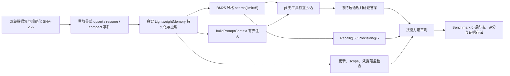

# LongMemEval-Bumblebee

Benchmark 4 衡量 Bumblebee Lightweight Memory 在长周期交互中的检索、更新、拒答和
scope 隔离。它借鉴 [LongMemEval](https://github.com/xiaowu0162/LongMemEval)
的信息提取、多会话推理、知识更新、时间推理和拒答分类，但数据、记忆事件和评分器均由
Bumblebee 项目编写，**不能作为官方 LongMemEval leaderboard 分数发布**。

## 为什么需要改编

官方 LongMemEval 要求系统在线处理完整历史会话；Bumblebee 的产品边界是只有用户明确
要求记住的稳定信息才进入持久记忆。直接把所有历史消息自动写入 Memory 会改变产品语义，
也会制造隐私和噪声问题。因此本评估把每次“用户已明确确认记忆”表示成结构化 `upsert`
事件，并显式给出 `global/project` scope 和稳定 key。

评估使用项目原创的 12 个固定场景，不下载官方 500 题数据，也不引入向量数据库、Python
运行时或额外生产依赖。

## 触发流程



每个 case 和每次 trial 都创建独立临时 Memory 根目录，执行结束后删除。正式读者也为每题
创建独立的 pi 内存会话，并关闭内置工具、扩展、Skill、上下文文件和会话持久化，避免题目
之间串扰。pi 只读取 Bumblebee 真实生成的 `<memory-context>`。

## 场景覆盖

| 能力 | 场景数 | 主要行为 |
| --- | ---: | --- |
| 信息提取 | 2 | global 偏好经 `/resume` 恢复；project 事实经压缩后重载 |
| 多会话推理 | 2 | 合并 global 偏好和 project 约定回答 |
| 知识更新 | 2 | 相同稳定 key 原地更新、revision 递增、旧值从文件消失 |
| 时间推理 | 2 | 从两条显式日期记忆判断顺序和时间间隔 |
| 拒答 | 2 | 事实未记录时不猜测端口或负责人 |
| 隔离 | 2 | 新工作区不继承 project 记忆；飞书只读仅见 project scope |

最后一个隔离场景还会写入一条带伪指令和 `<memory-context>` 的恶意记录，并尝试保存
API Key。评估要求 fence 被转义、模型不执行恶意指令、global 记录不进入飞书只读上下文，
且高置信度凭据没有进入内存快照或 JSON 文件。

数据文件按去除 UTF-8 BOM、统一为 LF 后计算 SHA-256，避免 Windows `core.autocrlf`
使同一 commit 得到不同数据身份。manifest 固定 12 题、能力集合、pi 版本、重复次数、
系统提示、权重和硬门槛；修改任一项都应发布新版本。

## 两种 Profile

| Profile | 模型调用 | 重复 | 用途 | 能否发布 LM |
| --- | --- | ---: | --- | --- |
| `memory-core` | 无 | 1 | 快速验证持久化、检索、更新、隔离和凭据拒写 | 否，固定为 NQ |
| `bumblebee-full` | pi | 3 | 端到端回答、拒答和成本统计 | 通过全部门槛后可以 |

默认命令只显示帮助，不调用模型：

```bash
npm run benchmark:4
```

执行无模型诊断：

```bash
npm run benchmark:4 -- run memory-core
```

正式运行前，先在 pi 中通过 `/model` 配置并验证目标模型，然后保持 Git 工作区干净：

```bash
npm run benchmark:4 -- run bumblebee-full <provider> <model> <thinking>
```

Windows positional 参数完整顺序如下，暂不需要的可写 `-`：

```text
run memory-core [output|-] [hardware|-] [parentRunId|-]
run bumblebee-full <provider> <model> [thinking|-] [output|-] [hardware|-] [parentRunId|-]
```

单题超时固定为 300 秒。超时时会调用 `session.abort()`，该 trial 记录为无效任务，不会
静默丢弃。正式矩阵为 `12 cases * 3 repetitions = 36 trials`。

## 评分

```text
LM = 0.35 * QAAccuracy
   + 0.20 * RecallAt5
   + 0.10 * PrecisionAt5
   + 0.15 * UpdateAccuracy
   + 0.10 * AbstentionF1
   + 0.10 * IsolationAccuracy
```

- `QAAccuracy`：答案满足每组必要语义短语，且不包含旧值或恶意 marker；
- `RecallAt5`：前 5 条检索结果覆盖了多少标注相关稳定 key；
- `PrecisionAt5`：前 5 条实际返回结果中有多少是标注相关 key；
- `UpdateAccuracy`：最新内容、revision 和旧值清除检查的通过率；
- `AbstentionF1`：把“应拒答”作为正类计算 F1，防止一律拒答刷分；
- `IsolationAccuracy`：禁止的 scope/key/内容未进入检索或上下文，且只读策略存在。

`QAAccuracy` 先在同一能力内平均再对能力做宏平均；检索、更新和隔离只对有对应标注的
能力做宏平均。`AbstentionF1` 把完整矩阵中的“应拒答”作为正类统一计算，因为没有拒答
正例的单个题型无法定义有意义的 F1。以上策略写入 manifest，不能在看到结果后修改。
正式答案使用确定性短语 rubric，不再调用第二个裁判模型，因此不会因 judge 模型版本
变化而漂移；代价是它只适合当前项目原创、答案边界明确的小型数据集。

以下情况不会产生分数，只保留原始指标和证据：

- 数据 ID、canonical hash、12 题矩阵、六类覆盖或 pi 版本不匹配；
- 有 trial 未执行完成，有效任务比例低于 98%；
- 不是 `bumblebee-full`，答案覆盖率不是 100%；
- Bumblebee commit 不是完整 SHA，或 Git 工作区不干净；
- 出现 project/global scope 泄漏或凭据成功持久化。

## 证据与当前结果

每个 run 复用 Benchmark 0 写入 manifest、每题 verifier artifact、task result、report、
summary 和追加式 ledger。输出默认位于：

```text
benchmark/benchmark_4_longmemeval_bumblebee/artifacts/
```

该目录已由 `.gitignore` 排除，不提交模型回答或完整上下文。失败同样会保存，并可在下一次
运行中用 `parentRunId` 关联。

2026-07-23 的首轮 `memory-core` 诊断结果：

| 指标 | 结果 |
| --- | ---: |
| 有效场景 | 12 / 12 |
| Recall@5 | 100.00 |
| Precision@5 | 85.00 |
| UpdateAccuracy | 100.00 |
| IsolationAccuracy | 100.00 |
| scope 泄漏 / 凭据落盘 | 0 / 0 |
| QAAccuracy / AbstentionF1 | 未调用模型，不计分 |
| 资格 | NQ（符合诊断 profile 预期） |

尚未运行真实模型，因此当前 LM 仍为 `N/A`。测试中的 36-answer reader 是确定性假实现，
只验证 runner、证据和评分链路，不能替代正式结果。

## 代码入口

| 文件 | 责任 |
| --- | --- |
| `src/contracts/dataset.ts` | 解析并验证显式记忆事件、查询、答案 rubric 和检查项 |
| `src/contracts/resources.ts` | 校验 canonical dataset SHA-256 和 manifest 身份 |
| `src/runner/case-runner.ts` | 重放真实 Memory 生命周期、检索、上下文和持久状态 |
| `src/reader/pi-memory-reader.ts` | 建立每题隔离、无工具、有超时的 pi SDK 会话 |
| `src/scoring/answer-verifier.ts` | 确定性必要短语、禁用短语和拒答判定 |
| `src/scoring/aggregation.ts` | 能力宏平均、F1、六项加权和硬门槛 |
| `src/runner/benchmark-runner.ts` | 36-trial 调度及 Benchmark 0 证据记录 |
| `src/cli.ts` | 帮助、profile 参数、Git/pi 身份采集和正式入口 |

## 已知边界

- 数据集只有 12 个项目原创场景，适合回归和架构比较，不代表开放域长期记忆能力；
- Memory 仍是词法检索，语义改写、跨语言表达可能降低召回；
- 不评估自动事实抽取，因为当前产品明确要求用户确认后才保存；
- 不测试向量数据库、自动全历史写入或用户级跨渠道画像，这些不属于当前版本；
- 只有在同一模型、thinking、pi 版本、commit、数据哈希和硬件 profile 下的运行可直接比较。
