# Bumblebee 面试准备指南

本文用于整理 Bumblebee 项目中容易被面试官追问的架构、实现、取舍和演进点。内容以当前代码为准，并明确区分已经实现的能力、需要外部系统配合的能力和后续计划。

## 1. 一分钟项目介绍

Bumblebee 是一个基于 `pi-coding-agent` 的多渠道 AI Coding Agent。它复用 pi 的模型、会话、TUI 和工具调用能力，在其上增加角色与人格、跨会话记忆、知识学习、多 Agent 编排、DAG 工作流、插件加载，以及微信、飞书、钉钉渠道。

可以用下面四句话概括：

1. **交互层**：终端使用 pi TUI，远程入口使用 IM 渠道适配器。
2. **能力层**：角色、记忆、知识、多 Agent、工作流和插件都围绕统一的 `BumblebeeAgent` 组织。
3. **运行时边界**：模型和认证完全交给 pi 的 `/model` 与环境变量；Bumblebee 不重复维护模型配置。
4. **工程重点**：并发控制、超时取消、失败语义、插件隔离、资源释放和能力声明与真实实现保持一致。

## 2. 总体架构

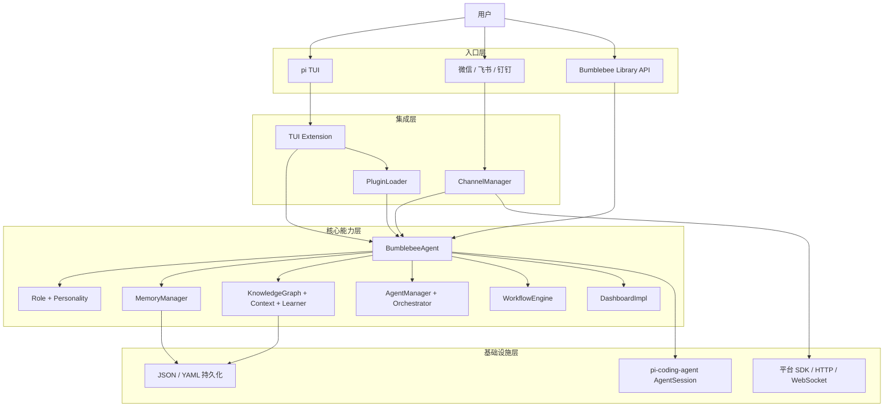

### 为什么以 `BumblebeeAgent` 为聚合根

- 对外提供稳定的 Library API，调用者不需要了解每个子系统的构造顺序。
- 统一管理初始化和释放，避免 Dashboard timer、WebSocket、渠道连接遗留。
- 子系统仍通过明确 getter 和接口协作，没有依赖全局单例。
- 代价是该类承担较多装配职责，未来可以继续拆成 `AgentRuntimeContext` 和模块生命周期容器。

## 3. 启动与资源生命周期

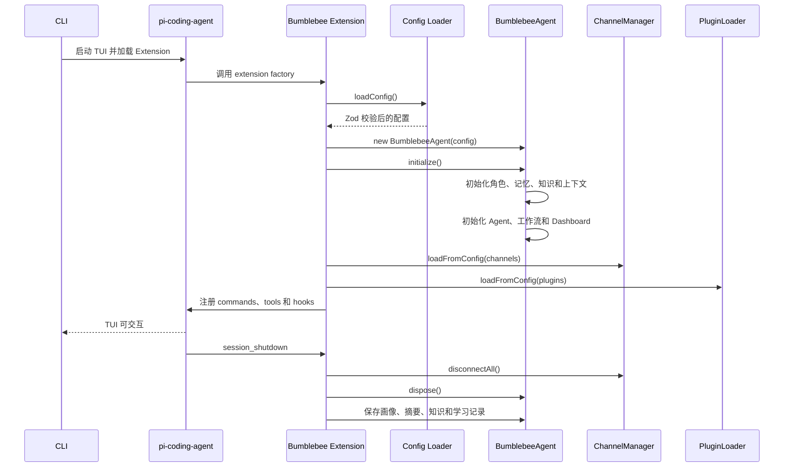

### 面试追问：为什么初始化是异步的

角色、画像、知识图谱和学习记录需要从磁盘加载；飞书、协作和部分渠道还涉及动态 import 或网络连接。将这些操作放进显式 `initialize()`，可以让构造函数只负责建立对象不变量，错误也能在统一位置转换成用户可理解的信息。

## 4. 两条消息处理链路

### 4.1 TUI 链路

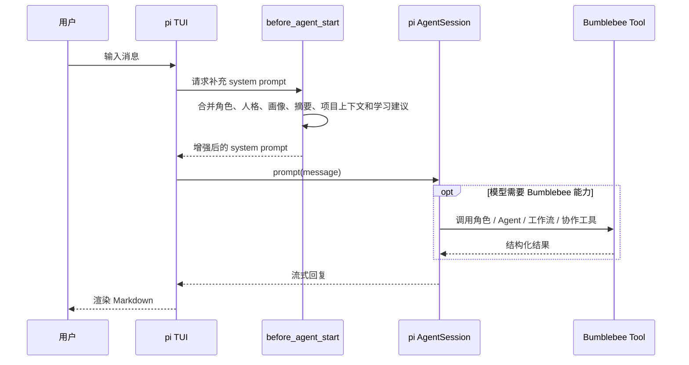

### 4.2 IM 渠道链路

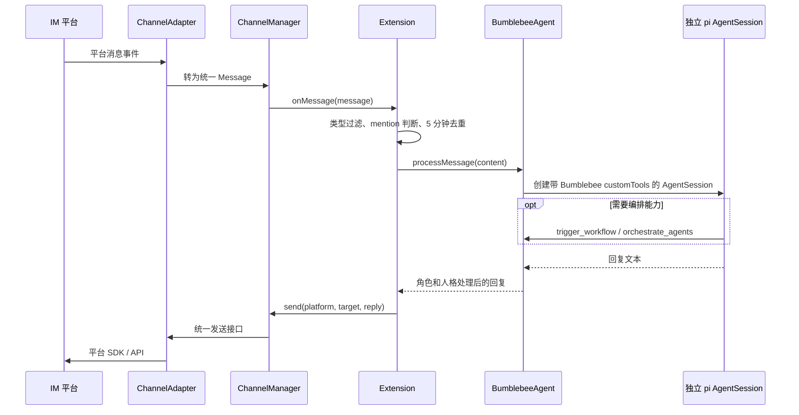

### 两条链路为什么不直接共享同一个 TUI Session

- IM 消息可能在 TUI 未聚焦时到达，不能依赖 TUI 编辑器状态。
- 渠道处理需要独立错误隔离，不能打乱终端当前流式响应。
- 当前实现复用了 BumblebeeAgent 的 SessionManager，不同 IM 用户的完全会话隔离尚未完成；可演进为按 `platform + sender + room` 建立 SessionManager 分片。

## 5. 配置与模型职责边界

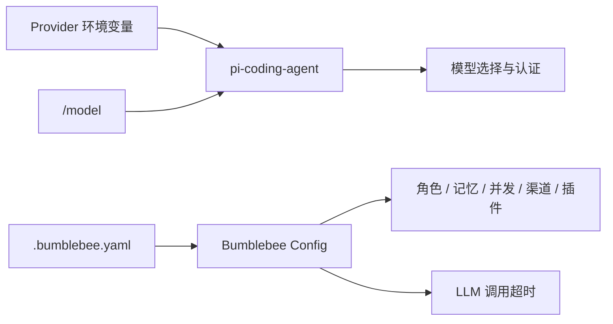

关键设计：

- provider、model 和 API Key 不进入 Bumblebee 配置。
- API Key 使用环境变量或 pi 自身认证存储，避免写入仓库配置。
- Bumblebee 只保留内部 LLM 调用的 `llm.timeoutMs`。
- 老版本 `ai.timeoutMs` 会迁移到 `llm.timeoutMs`，其余旧模型字段被丢弃。
- YAML 解析和 Zod 校验错误会向上抛出，而不是静默回退默认配置。

## 6. 角色、人格、记忆和知识

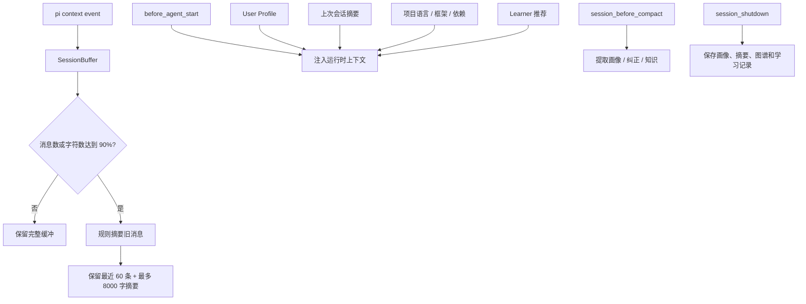

### 三种“记忆”不要混淆

| 层次 | 管理者 | 内容 | 生命周期 |
| --- | --- | --- | --- |
| 会话历史 | pi SessionManager | 完整用户/助手消息和分支 | 可通过 `/resume` 恢复 |
| 用户画像 | MemoryManager | 偏好、环境、事实、上次摘要 | 跨会话持久化 |
| 项目知识 | KnowledgeGraph + Learner | 文件、错误、解决方案、概念、行为模式 | 项目使用过程中增长 |

### 面试追问：自动学习是不是又调用一次 LLM

当前主要使用规则提取，优点是便宜、确定、退出时不依赖网络；缺点是召回和准确率有限。适合先建立可靠的数据闭环，后续可以在规则结果上增加异步 LLM 提取和人工确认。

## 7. 多 Agent 编排

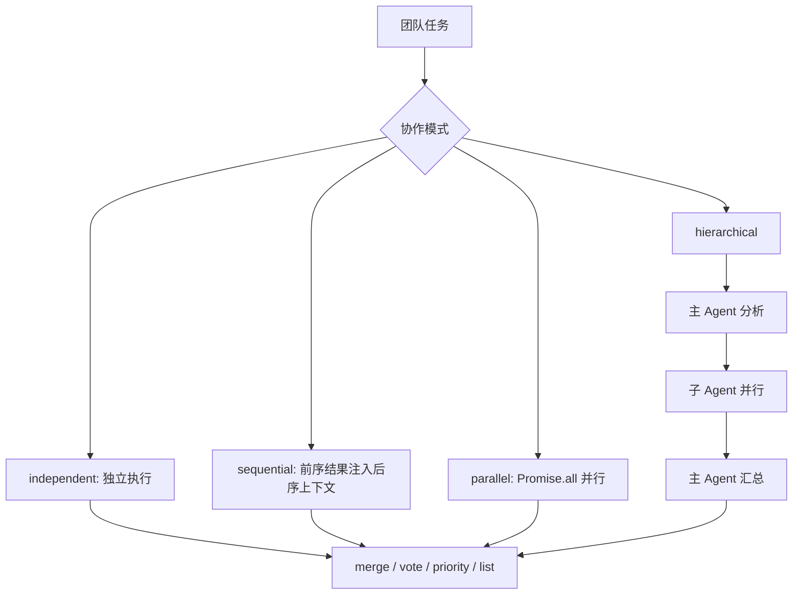

### 并发控制

`AgentManager` 使用有界等待队列控制任务并发：

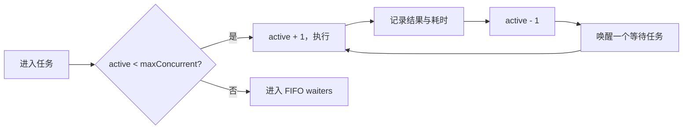

最近 1000 次任务用于计算任务数、成功率、最大耗时和 p50/p99。Dashboard 通过任务完成监听器实时更新 Widget 与时间序列。

### 面试追问：为什么降级结果不能算成功

当模型不可用时，AgentManager 会返回带 `mode: degraded` 的诊断结果。旧实现容易把模拟文本当作成功，导致工作流继续发布。当前实现将 degraded 映射为失败，使失败语义保持可信。

## 8. DAG 工作流引擎

### 8.1 拓扑分层调度

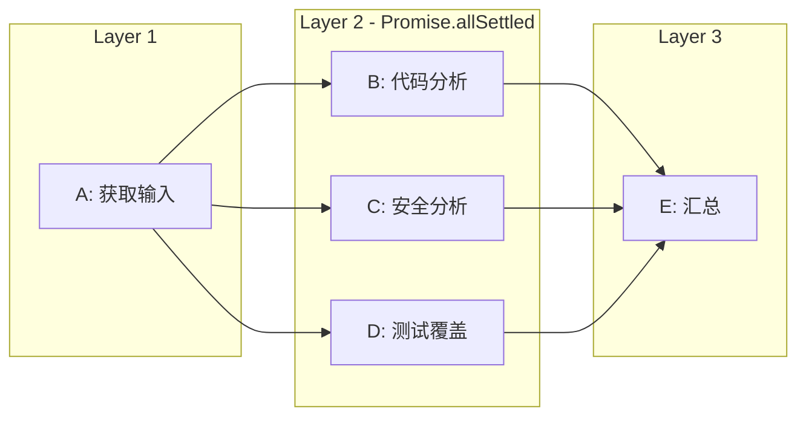

注册工作流时先校验重复 ID、缺失依赖、fallback 目标和循环依赖。运行时按拓扑层执行，同层步骤并行，下层只在依赖成功时进入 runnable 集合。

### 8.2 重试、超时与取消

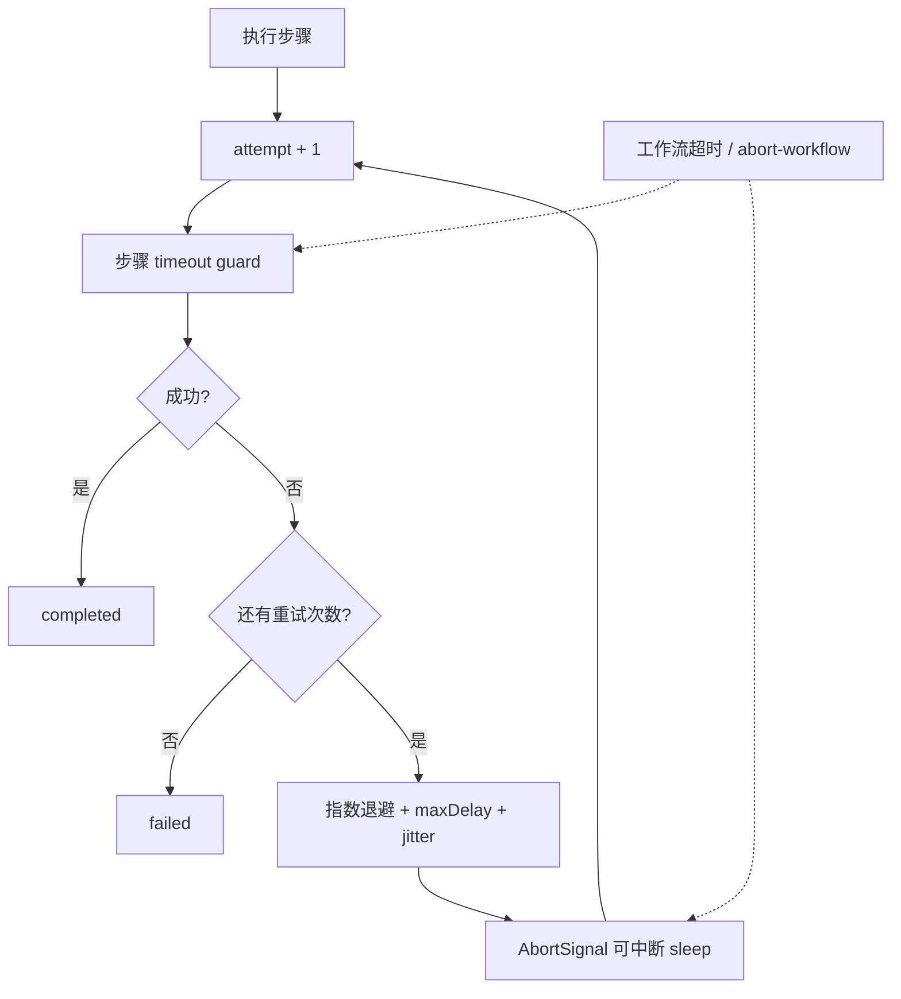

工程细节：

- 超时 timer 必须在 `finally` 中清理，否则 Library 模式会延迟进程退出。
- 正在等待的 retry sleep 监听 AbortSignal，取消时立即清除 timer。
- 工作流整体 timeout 和步骤 timeout 分开处理。
- `maxConcurrentWorkflows` 通过当前 executions 数量强制限制。

### 8.3 失败语义

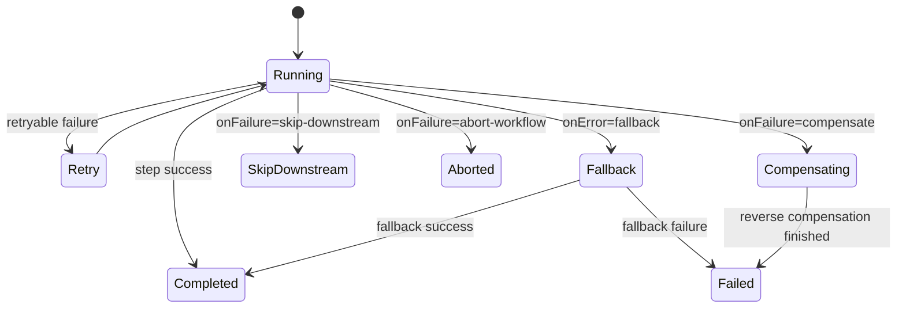

补偿采用栈记录已完成步骤，失败后按完成顺序的逆序调用 `compensateAction`。这符合“后执行的副作用先回滚”的常见事务补偿原则。

### 8.4 为什么发布模板不会默认执行真实发布

`test`、`build`、`publish` 属于外部副作用，仓库无法假设用户使用 npm、Maven、Docker 还是云发布平台。因此默认 handler 会明确报错，调用者必须使用 `registerAction()` 注入真实执行器。这样比返回模拟成功更安全。

## 9. 插件系统与隔离

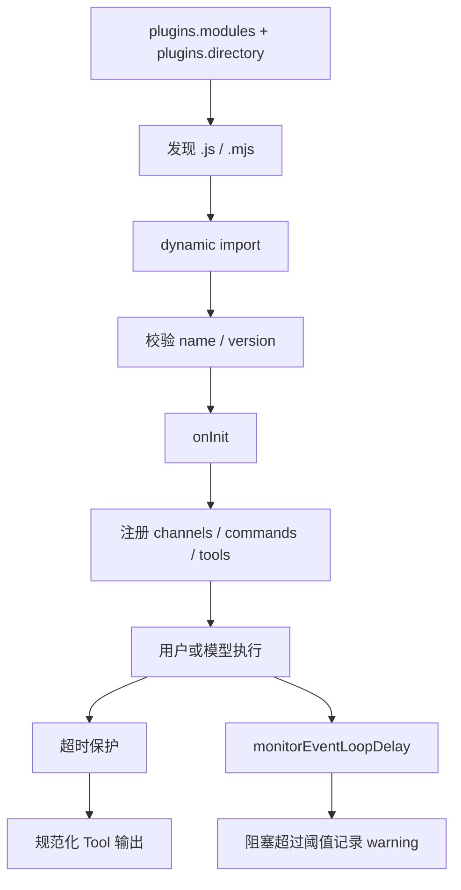

默认参数：

- tool timeout：10 秒
- command timeout：10 秒
- event-loop warning：250ms

### Promise.race 的局限

`Promise.race` 能限制异步等待，但无法抢占同步 CPU 密集代码，因为 timer 也需要事件循环调度。当前实现会监控事件循环延迟，并在同步调用返回后再次检查实际耗时；它能发现和报告阻塞，但不能中途终止。

真正隔离不可信第三方插件需要 Worker Thread 或子进程：

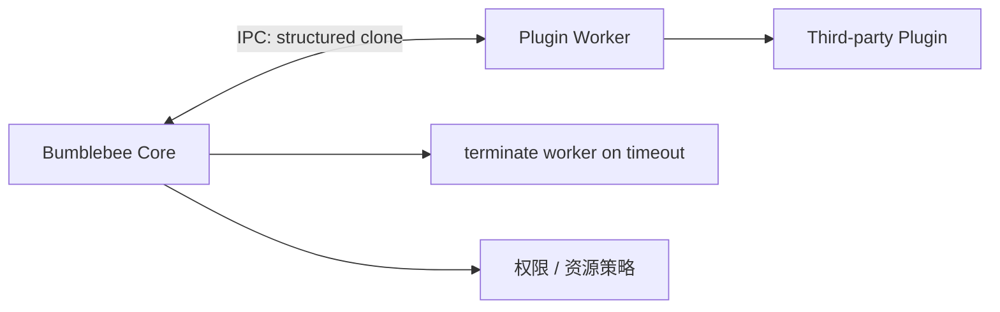

当前插件系统适合内置插件和可信社区插件，不是安全沙箱；`onInit` 和插件注册的 ChannelAdapter 也不在 Worker 隔离内。

## 10. 渠道适配设计

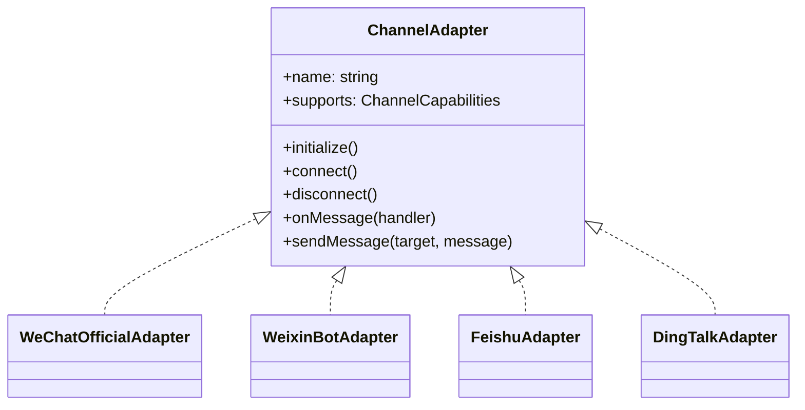

| 渠道 | 接收方式 | 发送方式 | 关键问题 |
| --- | --- | --- | --- |
| 微信公众号 | HTTP 回调 | 官方 API | 需要公网 URL 和签名校验 |
| 微信个人号 | ilink 长轮询 | ilink sendmessage | 非官方接口，群聊无可靠 @ 标记 |
| 飞书 | 官方 SDK 长连接 | 官方 SDK | SDK 日志可能干扰 TUI，事件结构需兼容 |
| 钉钉 Webhook | 不接收 | Webhook | 发送型通知通道 |
| 钉钉企业应用 | HTTP 回调 | 企业 API | access token 过期前自动刷新 |

### 为什么没有强行统一到 Wechaty

统一抽象可以减少表面代码，但不同平台的认证、回调、长连接、mention、富文本和 token 生命周期差异明显。Bumblebee 选择统一自己的 `ChannelAdapter`，底层优先使用平台官方 SDK/API；微信个人号才使用单独的 ilink 适配器。这样平台特性和错误信息不会被过度抽象丢失。

## 11. 可观测性

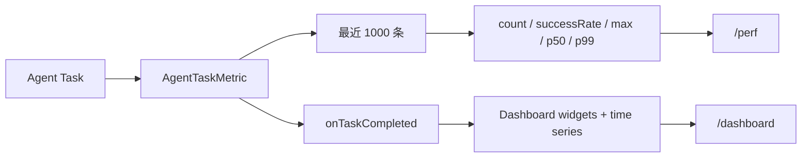

分位数实现采用排序后的 nearest-rank 方式。它适合最多 1000 条的小窗口；如果数据规模扩大，应换成 HDR Histogram、t-digest 或流式直方图，避免每次查询排序。

## 12. 典型故障与工程经验

| 问题 | 根因 | 修复 | 面试可强调的经验 |
| --- | --- | --- | --- |
| 飞书连接后 TUI 输出混乱 | SDK 直接输出日志，与 TUI 重绘竞争 | 控制日志和 UI 通知边界 | 终端 UI 不能任由依赖写 stdout |
| 飞书事件读取 `message` 报错 | SDK 回调参数形状与假设不一致 | 做事件结构兼容和防御性解析 | 第三方 SDK 边界必须验证输入 |
| 微信回复目标错误 | `groupId` 与统一模型的 `roomId` 不一致 | 统一 metadata 并保留 contextToken | 适配层必须完成语义归一化 |
| Dashboard 永远是初始值 | 数据结构存在但没有生产者 | Agent task listener 驱动指标 | “有类型和类”不等于功能闭环 |
| 工作流假装构建/发布成功 | 内置 action 返回静态对象 | 未配置外部执行器时明确失败 | 对副作用操作宁可失败，不可伪成功 |
| Library 冒烟进程提前退出 | awaited timer 使用 `unref()` | 保留关键 timer 引用 | `unref` 只适合后台维护任务 |
| Library 冒烟进程延迟退出 | Promise.race 获胜后 timeout 未清理 | `finally` 清理 timer/listener | 所有竞争 Promise 都要考虑 loser 清理 |
| 插件同步阻塞无法被 timeout 打断 | JS 单线程事件循环 | 延迟监控 + 返回后耗时检查 | timeout 不等于 CPU 隔离 |
| 长会话缓冲增长 | 无上限积累消息 | 90% 阈值规则压缩并保留尾部 | 需要同时限制条数和字符数 |

## 13. 当前边界与下一步

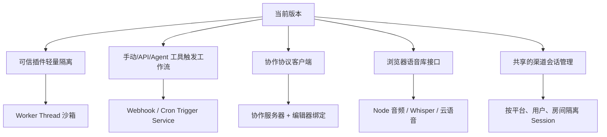

必须主动说明的边界：

- 仓库暂不提供 webhook/cron 工作流服务。
- 发布模板需要外部 `test/build/publish` action handler。
- 协作模块没有内置服务端和编辑器 UI。
- Node TUI 不支持 Web Speech API；非 browser 语音引擎未实现。
- weixinbot 群聊无法可靠识别是否 @ 机器人，推荐使用专用群。
- 插件不是安全沙箱，CPU 密集同步代码仍能阻塞主线程。
- 开发测试目录不随用户仓库提供，当前公开验证以 typecheck、build 和可复现 smoke 为主；这是测试工程仍需加强的部分。

## 14. 高频面试问题

### Q1：为什么基于 pi-coding-agent，而不是自己实现 Agent 循环

pi 已经提供模型注册、认证、会话树、compaction、TUI、工具调用和 Extension 生命周期。Bumblebee 的差异化在多渠道、角色、长期记忆、多 Agent 和工作流。复用成熟框架能减少重复实现，并降低模型供应商变化带来的维护成本。

### Q2：为什么删除 Bumblebee 自己的模型配置

双份 provider/model/API Key 配置会产生状态不一致，也增加密钥泄露风险。让 pi 的 `/model` 成为唯一来源，Bumblebee 只关心调用超时和业务上下文，职责更清晰。

### Q3：如何避免一个慢 Agent 拖垮所有任务

AgentManager 有 `maxConcurrent` 有界队列；每次 LLM 调用有 timeout；工作流步骤有独立 timeout、可中断 retry 和整体 AbortController。需要区分“限制并发”“限制等待时间”和“取消底层任务”三个问题。

### Q4：DAG 为什么按层调度，而不是递归 DFS

DFS 会把独立分支串行化。拓扑分层能一次找到所有依赖已完成的节点，使用 `Promise.allSettled` 并行执行；同时保留层间依赖边界，失败传播也更容易解释。

### Q5：为什么使用 `Promise.allSettled` 而不是 `Promise.all`

工作流需要得到同层每个步骤的结果，才能决定哪些下游跳过、是否补偿以及如何生成完整执行报告。`Promise.all` 在第一个 rejection 后丢失其他结果，不适合工作流审计。

### Q6：补偿和数据库事务有什么区别

数据库事务能原子回滚同一资源；工作流可能跨 API、文件和发布系统，只能使用 Saga 风格补偿。补偿本身也可能失败，因此要记录步骤结果、逆序执行，并将补偿错误纳入最终状态。

### Q7：插件超时为什么不能解决 CPU 死循环

因为 Promise timer 和插件代码运行在同一事件循环。同步死循环不让出执行权，timeout callback 无法运行。真正抢占需要 Worker Thread/子进程并在超时时 terminate。

### Q8：记忆系统如何控制幻觉和脏数据

当前采用规则提取、数量限制、去重和置信度；注入的是“用户画像和建议”，而不是绝对事实。下一步可增加来源、时间、确认状态和冲突合并，重要事实由用户确认后再提升权重。

### Q9：为什么渠道要有统一 Message，而不直接把 SDK 对象传入核心

统一模型隔离 SDK 变化，让核心只处理 sender、content、type 和 metadata；平台特有字段保留在 metadata。这样既有跨平台一致性，也不丢失 roomId、contextToken、mentionKeys 等能力。

### Q10：项目中最值得讲的 bug 是什么

推荐讲 timeout timer 的两个连续问题：先因 `unref()` 导致 Library Promise 未完成进程就退出；去掉 `unref()` 后又发现 Promise.race 的 loser timer 未清理导致进程延迟退出。这个案例能体现事件循环、资源生命周期和冒烟测试价值。

### Q11：Dashboard 的 p50/p99 是否适合生产环境

当前是最多 1000 条样本排序后的 nearest-rank，实现简单且适合本地 Agent。生产高吞吐场景应改成直方图或 t-digest，并将指标导出到 OpenTelemetry/Prometheus。

### Q12：你会如何测试这个项目

建议分层：

1. 纯函数测试：条件表达式、分位数、消息路由、配置迁移。
2. 组件测试：Agent semaphore、工作流拓扑层、fallback、补偿和 timeout 清理。
3. SDK contract test：飞书/钉钉/微信事件 fixture。
4. 集成测试：使用 fake model 和 fake channel 跑完整消息链路。
5. 手工验证：真实平台凭据只在本地或受控 CI secret 环境运行。

## 15. 代码导航

| 主题 | 入口文件 |
| --- | --- |
| Agent 装配与生命周期 | `src/core/agent.ts` |
| pi AgentSession 调用 | `src/core/session-factory.ts` |
| 渠道 Agent 工具 | `src/core/agent-tools.ts` |
| TUI Extension hooks | `src/tui/extension.ts` |
| 命令与工具目录 | `src/tui/catalog.ts` |
| Agent 并发与指标 | `src/agents/manager.ts` |
| Agent 编排模式 | `src/agents/orchestrator.ts` |
| 工作流调度 | `src/workflows/engine.ts` |
| 工作流模板 | `src/workflows/templates.ts` |
| 插件加载与隔离 | `src/plugins/loader.ts` |
| 微信个人号适配 | `src/channels/weixinbot.ts` |
| 飞书适配 | `src/channels/feishu.ts` |
| 钉钉适配 | `src/channels/dingtalk.ts` |
| 长会话缓冲 | `src/tui/session-buffer.ts` |
| 记忆持久化 | `src/memory/manager.ts` |
| 知识图谱 | `src/knowledge/graph.ts` |
| 学习推荐 | `src/knowledge/learner.ts` |
| Dashboard | `src/dashboard/dashboard.ts` |

## 16. 三分钟陈述模板

> Bumblebee 是一个基于 pi-coding-agent 的多渠道 Coding Agent。我没有重复实现模型和会话框架，而是通过 Extension hooks 注入角色、用户画像、项目上下文和学习建议，并通过统一 ChannelAdapter 接入微信、飞书和钉钉。核心复杂度主要在两部分：一是 Agent 与工作流的可靠调度，包括有界并发、DAG 拓扑分层、指数退避、AbortSignal、fallback 和 Saga 补偿；二是可扩展性，包括动态插件加载、工具和命令注册、执行超时以及事件循环阻塞监控。项目中我特别重视失败语义，模型降级不能算成功，测试、构建和发布也不会返回模拟成功。当前仍有明确边界，例如插件还不是 Worker 沙箱、工作流没有内置 webhook/cron 服务、协作缺少服务端、语音只支持浏览器宿主。这些边界都在 README 中明确说明，并有清晰的下一步演进路径。
