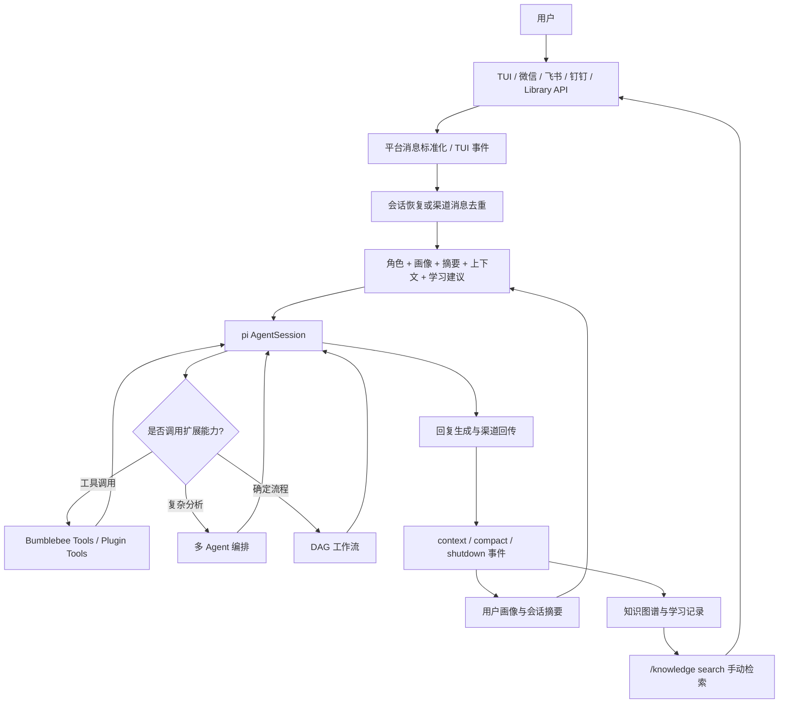
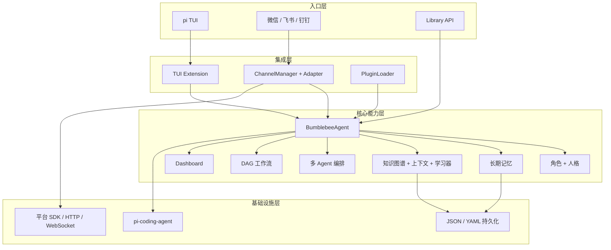
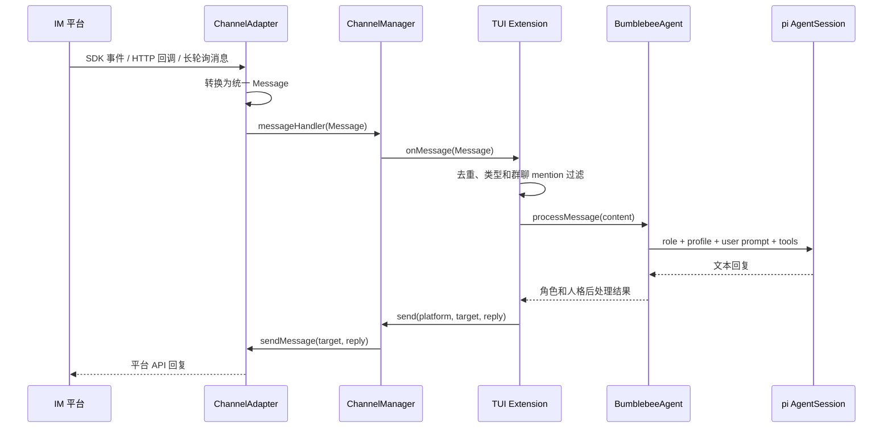
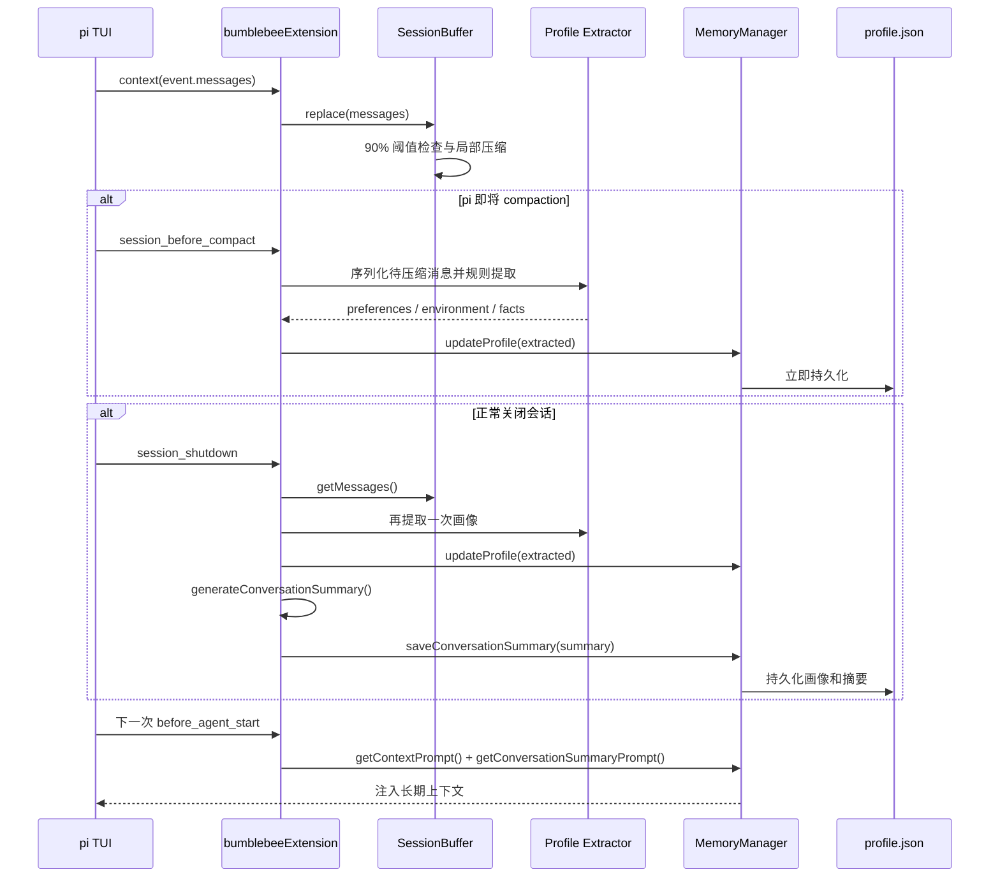
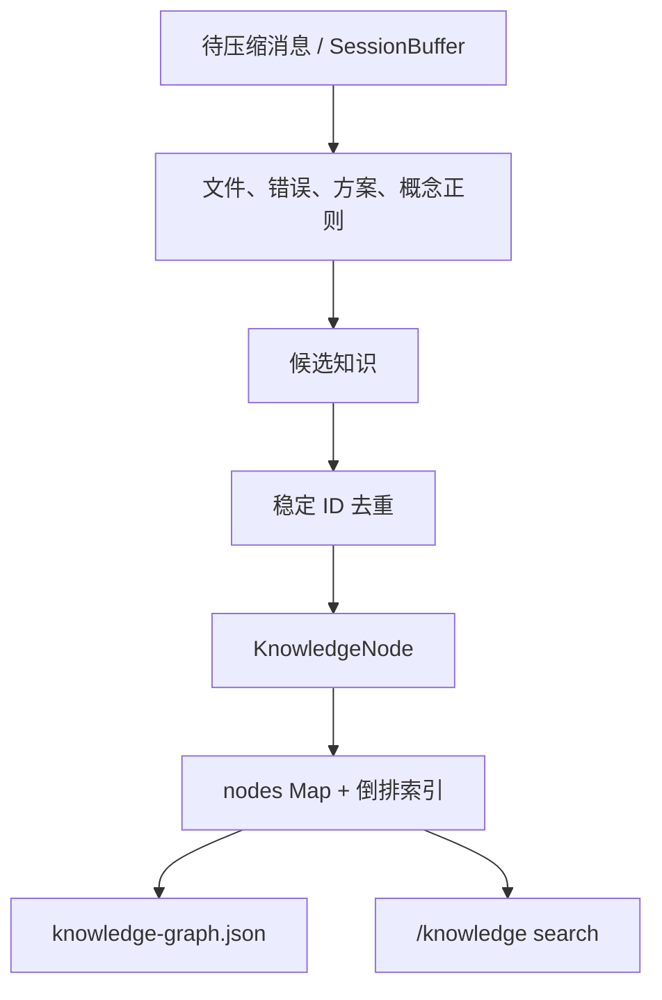
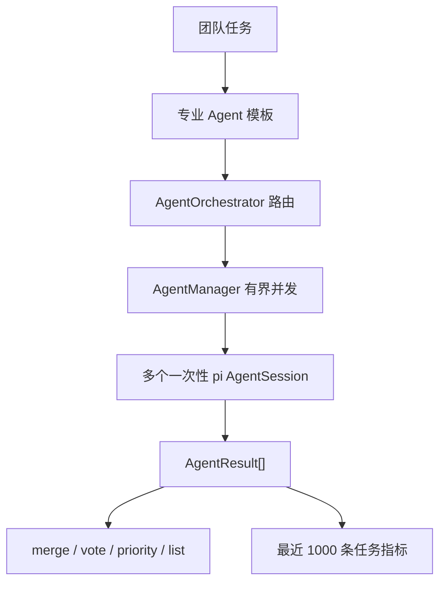
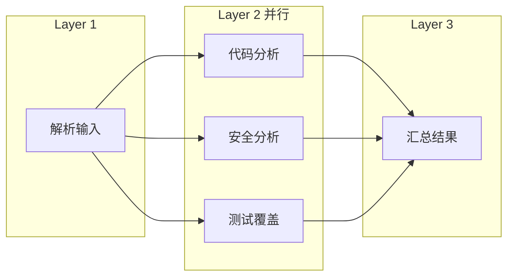
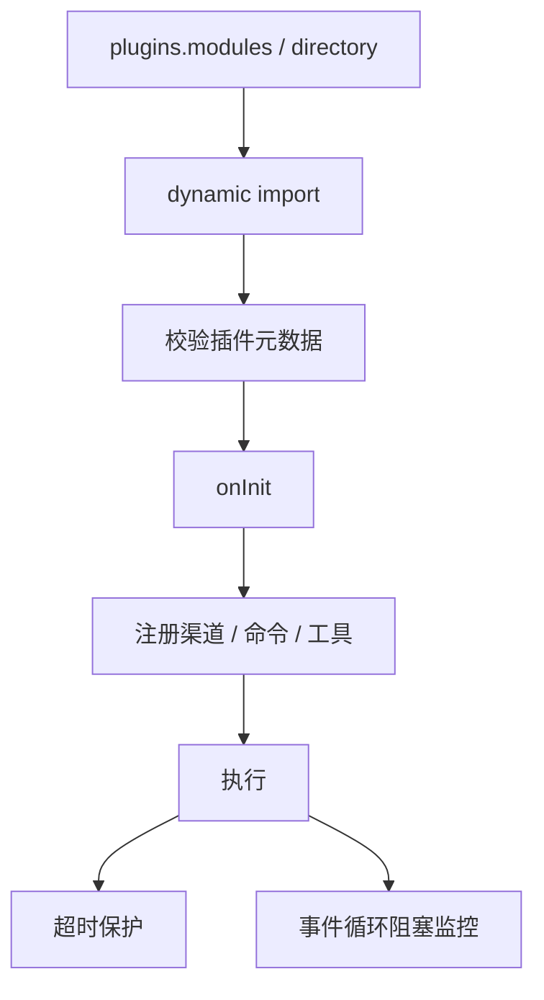
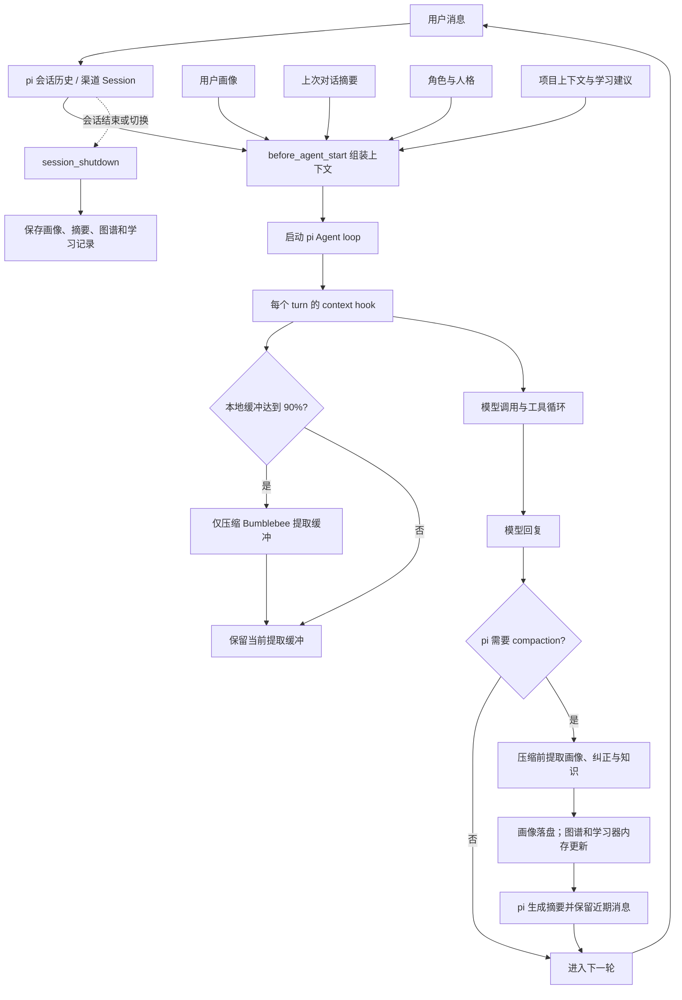

# Bumblebee 面试准备指南

本文档用于准备“用户互动 / AI 应用”方向的实习技术面试。重点不再按源码模块平铺，而是围绕 README 中对用户公开声明的功能来回答：

- 这个功能有什么用？
- 用户如何使用？
- 代码里如何实现？
- 面试官可能如何追问？
- 哪些边界需要主动说明？

核心原则：不要把 Bumblebee 讲成模型训练框架。Bumblebee 的价值在于把大模型能力接入真实用户交互入口，并把会话、上下文、RAG、工具调用、多 Agent、工作流、渠道、插件和可观测性组合成可运行的 AI 应用。

## 1. 一分钟项目介绍

Bumblebee 是一个基于 `pi-coding-agent` 的多渠道 AI Coding Agent。它复用 pi 的模型、认证、会话、TUI 和工具调用能力，在其上增加角色系统、长期记忆、知识图谱与学习系统、多 Agent 编排、DAG 工作流、插件加载，以及微信、飞书、钉钉渠道。

面试中可以这样概括：

> 我做的不是一个单轮 Chatbot，而是一个面向真实用户交互的 AI 应用运行时。终端用户可以在 TUI 里使用它，远程用户可以通过微信、飞书、钉钉发消息触发 Agent。系统会根据角色、用户画像、跨会话摘要、宿主已设置的项目上下文和学习建议构建 prompt，必要时调用工具、多 Agent 团队或 DAG 工作流，并通过超时、重试、补偿、并发控制和指标来保证长任务可控。知识图谱当前负责知识沉淀和手动检索，自动召回注入仍是下一步演进方向。

## 2. README 功能到面试讲法

| README 功能 | 用户价值 | 实现入口 | 面试重点 |
| --- | --- | --- | --- |
| 多渠道智能编程副官 | 不局限在终端，IM 里也能触发 Coding Agent | `src/channels/*`、`src/tui/channel-handler.ts` | 平台适配、消息统一、会话隔离 |
| pi Extension 集成 | 复用成熟 TUI、会话和工具系统 | `src/tui/extension.ts`、`src/core/session-factory.ts` | 为什么复用框架、不重复造轮子 |
| 角色系统 | 不同任务使用不同专家人格和提示词 | `src/roles/*`、`src/personality/*` | system prompt、角色切换、能力声明 |
| 记忆系统 | 新会话仍能记住用户偏好和上次摘要 | `src/memory/manager.ts`、`src/tui/session-buffer.ts` | 会话历史 vs 长期记忆 |
| 知识系统 | 项目知识、错误修复经验和用户纠正可沉淀 | `src/knowledge/*`、`src/tui/knowledge-extractor.ts` | 图谱检索、学习器、上下文工程与当前边界 |
| 多 Agent 编排 | 复杂任务由多个专业 Agent 协作 | `src/agents/manager.ts`、`src/agents/orchestrator.ts` | 路由策略、并发控制、失败降级 |
| DAG 工作流 | 明确流程可自动化且可审计 | `src/workflows/engine.ts` | 拓扑并行、重试、取消、Saga 补偿 |
| 状态仪表板 | 用户能看到任务成功率和响应时间 | `src/dashboard/dashboard.ts`、`/perf` | p50/p99、指标窗口、生产化演进 |
| 协作与语音 | 面向更自然的人机交互入口 | `src/collaboration/*`、`src/voice/*` | 实验性边界、浏览器宿主限制 |
| 插件系统 | 第三方可扩展命令、工具和渠道 | `src/plugins/loader.ts` | 动态加载、超时保护、非安全沙箱 |
| 快速开始与配置 | 用户能按步骤跑通并排障 | `src/cli/init.ts`、`src/core/config.ts` | 配置校验、密钥不落盘、doctor |
| 作为库使用 | 其他项目可嵌入 Bumblebee 能力 | `src/index.ts`、`src/core/agent.ts` | 生命周期、初始化、资源释放 |

## 3. 用户互动 AI 应用链路



回答用户互动 AI 应用设计题时，可以围绕这条链路展开：入口标准化、会话管理、上下文构建、工具/Agent/工作流、回复发送、学习沉淀、指标监控。需要主动说明，当前会注入画像、摘要、宿主已设置的项目上下文和学习建议；知识图谱查询尚未自动接入每轮 prompt。

## 4. 总体架构



面试回答：

- `BumblebeeAgent` 是聚合根，对外隐藏子系统构造顺序。
- pi 负责模型、认证、会话、TUI 和工具调用基础能力。
- Bumblebee 负责多渠道、角色、长期记忆、知识、编排、工作流和插件。
- 子系统通过明确 getter 和接口协作，避免散落全局单例。

## 5. 各系统源码级实现方案

本章统一按“用户问题 -> 运行链路 -> 状态与持久化 -> 当前边界 -> 关键代码引用”展开。面试时先讲用户价值，再讲数据如何流动，最后主动说明边界，不要只背类名。

### 5.1 多渠道接入系统

**用户问题**

Coding Agent 通常只能在终端或 IDE 中使用。Bumblebee 将同一套 Agent 能力接到微信、飞书和钉钉，使用户离开电脑后仍能发送任务、获取结果。

**分层方案**

| 层 | 责任 | 关键对象 |
| --- | --- | --- |
| 领域接口 | 统一生命周期、收发消息和能力声明 | `ChannelAdapter`、`Message` |
| 配置装配 | 校验凭据、解析环境变量、按需加载 SDK | `loadChannelAdapters()` |
| 运行管理 | 注册、连接、断开、广播和定向发送 | `ChannelManager` |
| 平台适配 | 将平台事件与统一消息互转 | `FeishuAdapter`、`WeChatAdapter`、`WeixinBotAdapter`、`DingTalkAdapter` |
| Agent 桥接 | 去重、过滤、选回复目标、调用 Agent、更新 TUI widget | `bumblebeeExtension()`、`channel-handler.ts` |

统一消息只保留核心必需字段：`id`、`content`、`type`、`sender`、`timestamp`。平台专有信息不强行抽象，而是放进 `metadata`，例如飞书 `chatId/chatType`、微信 `contextToken/roomId`、钉钉 `conversationId`。这是“统一主干 + 保留差异”的适配器设计。



**各平台的具体实现**

- 飞书使用官方 `@larksuiteoapi/node-sdk`。`WSClient + EventDispatcher` 订阅 `im.message.receive_v1`，REST Client 负责按 `chat_id` 或 `open_id` 发消息；SDK logger 被替换为静默 logger，避免破坏 TUI 输入区。
- 微信公众号模式使用 Node HTTP Server 接收官方回调。GET 请求验证 SHA-1 签名，POST 请求解析 XML；优先在被动回复窗口返回 XML，超时后若配置 `appId/appSecret`，则获取并缓存 `access_token` 后调用客服消息 API。
- 个人微信 `weixinbot` 模式基于 ilink API，二维码登录后把 token 缓存在 `~/.bumblebee/weixin/`，通过长轮询收消息，并在发送前移除微信不支持的 Markdown 标记。
- 钉钉 Webhook 模式主要负责向群机器人发送；企业应用模式启动 HTTP 回调服务器，发送前通过 `ensureAccessToken()` 检查过期时间并自动刷新 token。断开时会主动销毁活跃 socket，避免 `server.close()` 一直等待。

**会话与去重的真实边界**

TUI 自己的会话由 pi 主进程管理；渠道消息调用 `BumblebeeAgent.processMessage()`，使用 Agent 内部单独创建的持久化 `SessionManager`，因此渠道链路不会写入当前 TUI 对话树。但是同一个 Bumblebee 进程里的所有 IM 用户仍共享这一个渠道 SessionManager，尚未按 `platform + sender + room` 分片。事件去重只在进程内保存 5 分钟，key 为 `platform + message.id`。

**面试回答**

> 多渠道最难的不是调用三个 SDK，而是隔离平台变化、统一消息语义、保留平台差异并处理会话边界。我用 Adapter 把平台事件转换为统一 Message，用 metadata 保存平台字段，再由 ChannelManager 管生命周期。当前 TUI 与 IM 会话已经隔离，但 IM 用户级会话分片仍需要增加 SessionRegistry。

**关键代码引用**

- `src/channels/types.ts: ChannelAdapter / Message`
- `src/channels/config-loader.ts: validateChannelConfig() / loadChannelAdapters()`
- `src/channels/manager.ts: ChannelManager.register() / connectAll() / send()`
- `src/channels/feishu.ts: FeishuAdapter.connect() / handleIncomingMessage() / sendMessage()`
- `src/channels/wechat.ts: WeChatAdapter.handleOfficialRequest() / dispatchOfficialMessage() / ensureOfficialAccessToken()`
- `src/channels/weixinbot.ts: WeixinBotAdapter.connect() / pollLoop() / sendMessage()`
- `src/channels/dingtalk.ts: DingTalkAdapter.ensureAccessToken() / startMessageListener() / disconnect()`
- `src/tui/channel-handler.ts: shouldHandleChannelMessage() / getChannelReplyTarget()`
- `src/tui/extension.ts: bumblebeeExtension()`

### 5.2 pi Extension 与 AgentSession 集成

**用户问题**

如果 Bumblebee 自己实现模型认证、会话树、历史恢复、compaction、TUI 渲染和工具循环，成本高且容易与 pi 重复。项目因此把 pi 当基础运行时，只实现差异化业务能力。

**运行链路**

1. CLI 将 `bumblebeeExtension` 作为 `extensionFactories` 传给 pi 的 `main()`。
2. Extension 加载配置并创建 `BumblebeeAgent`、`ChannelManager`、`SessionBuffer` 和 `PluginLoader`，再组装成 `BumblebeeExtensionRuntime` 传给各命令/工具模块。
3. `session_start` 获取 UI 引用；`before_agent_start` 合并系统提示词；`context` 同步消息缓冲；`session_before_compact` 做阶段性提取；`session_shutdown` 保存长期状态并释放资源。
4. Library API、多 Agent 和渠道调用通过 `callLLM()` 创建 pi `AgentSession`。该函数订阅 `text_delta` 事件拼接流式文本，并从 session stats 读取 token 使用量。
5. 一次性调用默认使用 `SessionManager.inMemory()` 并在结束后 `dispose()`；渠道主 Agent 则复用 `BumblebeeAgent.initialize()` 创建的持久化 SessionManager。

`before_agent_start` 的提示词顺序是：pi 原始 system prompt -> Bumblebee 人格 -> 当前角色 -> 用户画像 -> 上次摘要 -> 项目上下文 -> 学习建议 -> Agent/工作流状态。顺序很重要，因为后面的动态上下文是在稳定角色约束上补充事实，而不是覆盖角色。

命令和工具是两种入口：`registerCommand` 面向用户显式操作，`defineTool/registerTool` 面向模型自动调用。命令按 roles、memory、knowledge、channels、agents/workflows 等功能域拆分；相同前缀挂在同一主命令下，无参数时通过 TUI 选择子命令。

**超时语义**

`callLLM()` 使用 `Promise.race` 包装 `session.prompt()`，结束后清理 timer 和事件订阅。它能限制调用方等待时间，但并不等于网络请求被底层主动取消；如果要做严格取消，需要 pi Session 支持 AbortSignal 并向 provider 继续传递。

**关键代码引用**

- `src/cli.ts: main() / bumblebeeExtension`
- `src/tui/extension.ts: bumblebeeExtension()`
- `src/tui/context.ts: BumblebeeExtensionRuntime`
- `src/core/session-factory.ts: callLLM() / createMinimalResourceLoader() / withTimeout()`
- `src/tui/catalog.ts: BUMBLEBEE_COMMANDS / BUMBLEBEE_TOOLS`
- `src/tui/tools/agents-workflows.ts: registerAgentWorkflowTools()`
- `src/tui/commands/agents-workflows.ts: registerAgentWorkflowCommands()`

### 5.3 角色与人格系统

**用户问题**

用户面对安全审计、测试生成、架构设计等任务时，不希望每次重复描述专家身份、沟通风格和输出要求。角色系统把这组上下文变成可创建、切换和持久化的配置。

**具体实现**

- `RoleConfig` 将角色拆为身份信息、人格特征、专业领域、价值观、system prompt、问候语、响应风格、能力和限制。
- `RoleStore.initialize()` 创建 `~/.bumblebee/roles/`、加载其中所有 JSON；目录为空时生成默认 `bumblebee` 角色。
- `RoleStore.validateRole()` 在保存前校验 ID、名称、system prompt、人格、响应风格和能力，角色 ID 只允许小写字母、数字和连字符。
- `RoleManager` 保存当前角色引用，提供创建、搜索、切换和删除；交互式创建由 `RoleWizard` 完成，编程式创建由 `BumblebeeAgent.createRole()` 暴露。
- TUI 的 `/roles create|switch|show|delete|dir` 是用户入口，`/switch` 和 `/role` 只是兼容快捷命令。
- TUI 路径在 `before_agent_start` 注入角色 system prompt；Library/渠道路径先用角色 prompt 调用模型，再通过 `applyRoleStyle()` 和 `BumblebeePersonality.apply()` 做响应后处理。

8 个专业模板属于多 Agent 系统的运行时模板，不会自动写入用户角色库；5 个团队模板只是这些专业模板的组合。用户自己创建的长期角色才会保存到 roles 目录。角色 JSON 会持久化，但“当前选中哪个角色”没有独立状态文件；重启时由 `.bumblebee.yaml` 的 `personality.roleId` 决定。

**面试回答**

> 角色底层确实依赖 system prompt，但工程上不只是 prompt 字符串，还包含 schema、校验、持久化、创建向导、切换命令、响应风格和与其他上下文的拼装顺序。它是用户可操作的上下文策略，不是模型参数微调。

**关键代码引用**

- `src/roles/types.ts: RoleConfig / RoleCreateInput`
- `src/roles/store.ts: RoleStore.initialize() / saveRole() / validateRole()`
- `src/roles/manager.ts: RoleManager.createRole() / switchRole() / applyRoleStyle()`
- `src/roles/wizard.ts: RoleWizard.createRole()`
- `src/tui/commands/roles.ts: registerRoleCommands()`
- `src/personality/traits.ts: BumblebeePersonality.getSystemPrompt() / apply()`
- `src/agents/specialized.ts: getSpecializedAgentConfig() / RECOMMENDED_TEAMS`

### 5.4 记忆系统：从会话到跨会话画像

#### 5.4.1 先区分四种“记忆”

| 层次 | 保存什么 | 生命周期 | 是否自动进入下一轮 prompt |
| --- | --- | --- | --- |
| pi 完整会话 | 完整消息、分支和工具调用 | 由 pi 持久化，可 `/resume` 恢复 | 恢复该会话时由 pi 提供 |
| `SessionBuffer` | 当前 TUI 上下文的受限副本 | 仅当前进程，达到阈值会局部压缩 | 不直接注入，用于退出提取和摘要 |
| 用户画像 | 偏好、环境、事实、结构化风格 | `profile.json` 跨会话保存 | 是，作为“已知用户画像”注入 |
| 上次对话摘要 | 最近一次正常退出前的对话摘要 | 与画像一起保存在 `profile.json` | 是，作为“上次对话摘要”注入 |

这四层解决不同问题。完整会话用于恢复原对话；长期画像让新会话也知道用户偏好；摘要只保存近期要点；SessionBuffer 是提取数据源和内存保护，不是新的会话数据库。

#### 5.4.2 初始化与数据模型

`BumblebeeAgent` 默认以 `~/.bumblebee/memory/` 作为统一存储目录，并在构造时创建 `MemoryManager`。`initialize()` 调用 `MemoryManager.initialize()` 读取 `profile.json`；文件不存在或解析失败时使用空画像。

`UserProfile` 包含两类数据：

- 结构化字段：`language`、`codeStyle`、`verbosity`、`theme`。
- 增量字段：`preferences[]`、`environment{}`、`facts[]`，以及 `lastConversationSummary`、`lastSessionTimestamp`、`lastUpdated`。

#### 5.4.3 什么时候触发提取



触发点有两个：

1. `session_before_compact`：将 pi 准备压缩的 `messagesToSummarize + turnPrefixMessages` 转成 LLM 文本，再提取画像。这里一旦发现新信息就立即写 `profile.json`。
2. `session_shutdown`：从 `SessionBuffer` 取当前保留消息，再提取一次画像，并生成上次对话摘要。异常退出、进程被杀或系统崩溃不会触发该 hook，因此最后摘要可能丢失。

#### 5.4.4 当前提取算法

当前提取器是确定性规则系统，不调用 LLM：

- 通过关键词识别 Windows/macOS/Linux。
- 从固定字典识别 TypeScript、Python、C++ 等语言，React、Vue、Django 等框架，以及 Git、Docker、npm 等工具。
- 遇到“简洁、详细、注释、测试”等词生成固定偏好。
- 用“项目: ...”“截止日期: ...”正则提取事实。

提取器拿到的是序列化后的整段对话，因此用户和助手文本都会参与匹配。它具有低成本、可解释、无额外模型调用的优点，但也可能把助手提到的技术误判为用户环境，且无法识别否定、冲突、时间变化和隐含偏好。

#### 5.4.5 合并、去重与持久化

`MemoryManager.updateProfile()` 对标量字段执行覆盖，对 `preferences/facts` 做字符串精确去重，对 `environment` 做 key-value 合并，然后更新时间并立即保存。序列化使用 `stringifyJsonAsync()`：估算数据小于 128 KB 时直接 `JSON.stringify`，较大时交给 Worker Thread，避免大 JSON 长时间阻塞事件循环。

摘要不是 LLM 摘要，而是可预测的截断式摘要：只取 user/assistant 消息；助手单条最多 500 字符；最多保留最近 20 条；总长度最多 3000 字符。这降低了退出成本，但“压缩”更多是裁剪而非语义归纳。

`SessionBuffer` 的默认上限为 220 条消息或 120000 字符，90% 时触发，即约 198 条或 108000 字符。触发后保留最后 60 条消息，把更早消息按单条 500 字符、最多 40 条压成不超过 8000 字符的 system summary。由于退出摘要只读取 user/assistant 消息，这段 system summary 当前不会进入 `lastConversationSummary`，这是旧上下文可能再次丢失的一处边界。

#### 5.4.6 如何注入

TUI 每次 `before_agent_start` 调用 `getContextPrompt()` 和 `getConversationSummaryPrompt()`，将画像与上次摘要拼进 system prompt。这样即使用户开启新会话而不是 `/resume`，模型仍能看到长期偏好和上次要点。

Library/IM 路径的 `BumblebeeAgent.processMessage()` 当前只拼接角色 prompt 与用户画像，不注入 `lastConversationSummary`；它依赖自身持久化 SessionManager 保留渠道历史。也就是说，TUI 与渠道的上下文策略目前并不完全一致。

#### 5.4.7 当前边界与改进方向

- `memory.enabled` 已进入配置 schema，但 `MemoryManager` 和 Extension hooks 尚未据此短路，配置为 false 仍会加载、提取和注入；这是配置语义未闭环。
- 画像只有字符串精确去重，没有来源、证据、置信度、过期时间和冲突策略；`preferences/facts` 本身也没有数量上限。
- 当前规则扫描全对话，容易把助手输出误写为用户事实。
- 正常退出才生成会话摘要，异常退出不保证保存。
- 用户不能逐条审阅、修改或拒绝记忆，只能通过 `/memory clear` 全量清空。

面试时可提出的演进方案是“规则召回候选 + LLM 结构化抽取 + Zod 校验 + 证据/置信度 + 冲突合并 + pending review”。敏感信息还应在持久化前做字段级过滤或加密。

**面试回答**

> pi Session 解决完整历史恢复，Bumblebee Memory 解决跨会话个性化，两者职责不同。当前系统在 compaction 和 shutdown 时提取偏好、环境与事实，精确去重后写入 profile.json；下一轮 before_agent_start 再注入画像和上次摘要。它已经形成基础闭环，但提取仍是规则式，缺少证据、置信度、冲突和用户审阅，所以我不会把它描述成完全可靠的长期记忆。

**关键代码引用**

- `src/core/agent.ts: BumblebeeAgent.constructor() / initialize() / processMessage()`
- `src/memory/manager.ts: UserProfile / MemoryManager.initialize() / updateProfile() / getContextPrompt()`
- `src/memory/manager.ts: MemoryManager.saveConversationSummary() / getConversationSummaryPrompt()`
- `src/memory/profile-extractor.ts: extractProfileFromConversation()`
- `src/tui/session-buffer.ts: SessionBuffer.replace() / compactIfNeeded() / summarizeMessages()`
- `src/tui/extension.ts: generateConversationSummary() / bumblebeeExtension()`
- `src/utils/async-json.ts: stringifyJsonAsync() / stringifyInWorker()`
- `src/tui/commands/memory.ts: registerMemoryCommands()`

### 5.5 知识系统：图谱、上下文、学习器与提取器

#### 5.5.1 四个组件各自负责什么

| 组件 | 输入 | 输出 | 持久化 |
| --- | --- | --- | --- |
| `knowledge-extractor` | compaction 或 shutdown 的对话消息 | 文件、错误、方案、概念节点候选 | 自身不持久化 |
| `KnowledgeGraph` | 节点、关系和查询条件 | 文本结果、邻接节点、路径、相似节点 | `knowledge-graph.json` |
| `ContextManager` | 环境、项目、用户、会话和任务状态 | 当前上下文摘要或相关上下文 | 仅内存 |
| `Learner` | correction/preference/feedback 等记录 | 模式、统计和推荐 | `learner.json` |

它们共享“知识系统”这个产品概念，但不是一个统一检索管线。尤其要注意：当前会注入宿主已设置的项目摘要和 Learner 推荐，KnowledgeGraph 本身尚未按用户问题自动召回到 prompt。

#### 5.5.2 知识何时提取、如何入图

知识提取与画像共用两个生命周期点：`session_before_compact` 和 `session_shutdown`。`extractKnowledgeFromConversation()` 依次执行四组正则：

- 文件：识别 `src/`、`lib/`、`tests/` 等目录下的常见代码文件路径。
- 错误：识别 Error、异常、失败、报错等片段。
- 方案：识别修复、解决、改为、使用、替换成等片段。
- 概念：识别“X 是指/是/means/is: Y”形式。

目前只有 assistant 消息会进入这四类提取，用户直接粘贴的报错不会自动入图。提取器还会跳过 HTML 标签过多或 Markdown 链接过多的内容，限制单轮文件、错误和方案数量，降低噪声与图谱膨胀。

`extractKnowledgeToGraph()` 用 `type + 清洗后的名称` 生成稳定 ID。已有文件节点只更新时间；新节点根据类型设置 `importance`、`confidence` 和 tags。当前提取器只创建节点，不创建节点之间的关系，因此图遍历和路径推理虽然已有引擎能力，却不会仅靠自动对话提取形成丰富边。



#### 5.5.3 KnowledgeGraph 的存储与检索

节点存储在 `Map<string, KnowledgeNode>` 中；每个节点内部保存有向 `relations[]`。索引由两部分组成：

- `index: Map<indexKey, Set<nodeId>>`：按类型、标签、名称词建立倒排索引。
- `nodeIndexKeys: Map<nodeId, Set<indexKey>>`：记录节点占用了哪些索引 key，使更新和删除不必扫描整个索引。

文本查询先按 type、tags、importance、confidence 过滤，再用倒排索引缩小候选集。相关性分数由名称命中 0.5、内容命中 0.3、标签命中 0.2 组成，最后乘以节点 importance 和 confidence。没有文本查询时，基础分数综合 importance、confidence 和 accessCount。

图推理提供三类能力：`getRelatedNodes()` 按深度遍历有向关系；`findPath()` 用 BFS 在最大深度内寻找最短路径；`findSimilar()` 用类型相同、标签重叠和共同关系目标做启发式相似度。它们不是 embedding 语义检索，也没有图神经网络。

图谱在 Agent 初始化时加载，在正常 shutdown 或 `/knowledge cleanup` 后保存。`session_before_compact` 虽会新增节点，但不会立即 `save()`，所以 compaction 后异常退出仍可能丢失新知识。保存时 `JSON.stringify` 仍在主线程执行，大图谱可能短暂阻塞事件循环。

现有评分还有两个实现细节：`getNode()` 已经是无副作用 getter，但系统没有其他地方递增 accessCount，因此基础分中的访问热度当前恒为零；`removeNode()` 也没有全图扫描所有入边，复杂关系图中可能留下指向已删除节点的悬空关系。这些都应在真正启用图推理前补齐。

#### 5.5.4 ContextManager 如何工作

`ContextManager` 用 `type:key` 作为 Map key，统一管理 project、user、session、task、environment 五类上下文，并支持 TTL 清理和 24 小时时间衰减评分。

初始化时 `detectEnvironment()` 自动采集 `platform`、Node 版本、cwd、Git branch/status 和包管理器，并保存为 `environment:detected`。它还可以通过 `setMemoryManager()` 读取长期用户画像，通过 `updateUserPreferences()` 将偏好同步回 MemoryManager。

当前主链路只调用了 `detectEnvironment()`。`setProjectContext()`、`setUserContext()`、`setTaskContext()` 和 `getRelevantContext()` 已提供 API，但没有被现有 TUI/Agent 流程调用；`before_agent_start` 只读取 `getContextSummary().project`，所以没有外部调用 `setProjectContext()` 时不会出现 README 所说的语言、框架和依赖摘要。环境检测结果本身也没有自动格式化进 prompt。

此外，`getRelevantContext()` 会计算关键词命中、importance 和 24 小时时间衰减，但没有过滤 score 为 0 的项；query 不命中时仍可能返回若干零分上下文。它目前未接入主链路，因此尚未影响用户回答，但接入前需要修正。

#### 5.5.5 Learner 如何从纠正生成建议

`Learner.record()` 创建带时间戳的记录，并将记录数限制在 `knowledge.maxRecords`。不同记录类型会被归一化成 pattern：代码模式替换字符串、数字和赋值变量；纠正模式从“不要/别/不需要/不用”后的文本提取关键词；偏好、反馈和观察从结构化 input 中提取 action/type。

新 pattern 的置信度从 0.1 开始，每次重复增加 0.01，示例最多保留 10 条。`patternIndex` 按 Unicode 字母/数字 token 建倒排索引，供 `findMatchingPatterns()` 减少全量扫描。

自动记录目前只发生在 `session_before_compact`，且只识别用户消息中的四个否定关键词。shutdown 不会补录纠正。下一次 `before_agent_start` 会调用 `recommend()`，最多注入 3 条建议，但当前 `recommend()` 主要遍历全局高频 pattern，并没有使用 request.context 做相关性匹配；已实现的 `findMatchingPatterns()` 没接入推荐流程。因此推荐可能与当前问题无关。

另一个细节是，Extension 记录的 correction input 是字符串，而 `recordsToRecommendations()` 只有找到 `{ wrong, correct }` 结构时才生成“避免 X / 建议 Y”的 fix 推荐。字符串记录仍能形成 pattern，但在置信度达到 0.3 前不会注入。这一类型检查避免了 `undefined` 文案，也暴露出采集 schema 尚未统一。

`maxRecords` 只限制原始 records 数量，不限制 patterns Map；如果持续出现不同模式，pattern 仍可能长期增长。`knowledge.enabled` 也尚未阻止图谱、上下文和学习器的初始化及 hook 执行，和 memory 开关一样需要补齐配置语义。

#### 5.5.6 当前到底算不算知识图谱 RAG

严格来说，当前实现是“知识图谱存储与检索基础 + 手动搜索 + 学习建议注入”，还不是完整闭环的知识图谱 RAG。完整 RAG 至少还需要：

1. 根据当前用户问题构造检索 query。
2. 关键词/向量召回候选节点。
3. 沿关系扩展邻居并重排。
4. 控制 token 预算，将带来源的结果注入 prompt。
5. 记录命中、引用和用户反馈，评估检索收益。

面试时如实说明这一点反而更专业。可以说现有代码已经具备节点模型、倒排索引、图遍历、持久化和生命周期采集，但“自动检索 -> 注入 -> 引用 -> 反馈”的 RAG orchestration 仍需补齐。后续可接入 `pi-code-graph` 负责代码 AST 图谱，保留现有图谱负责会话经验和用户知识，再做混合召回。

**面试回答**

> 我把知识系统拆成四层：提取器把对话转成候选知识，KnowledgeGraph 负责节点关系和检索，ContextManager 管短期运行上下文，Learner 管用户纠正模式。当前图谱支持倒排搜索、关系遍历、BFS 路径和启发式相似度，也能跨会话落盘；但图谱检索尚未自动注入每轮 prompt，所以我会把它定义为 RAG 基础设施，而不是已经完成的闭环 Graph RAG。

**关键代码引用**

- `src/tui/knowledge-extractor.ts: extractKnowledgeFromConversation() / extractKnowledgeToGraph()`
- `src/knowledge/types.ts: KnowledgeNode / Relation / KnowledgeQuery / Context / LearningRecord`
- `src/knowledge/graph.ts: KnowledgeGraph.addNode() / addRelation() / query()`
- `src/knowledge/graph.ts: KnowledgeGraph.getRelatedNodes() / findPath() / findSimilar()`
- `src/knowledge/graph.ts: KnowledgeGraph.save() / load()`
- `src/knowledge/context.ts: ContextManager.detectEnvironment() / getRelevantContext() / getContextSummary()`
- `src/knowledge/context.ts: ContextManager.setProjectContext() / updateUserPreferences()`
- `src/knowledge/learner.ts: Learner.record() / learnFromRecord() / findMatchingPatterns() / recommend()`
- `src/knowledge/learner.ts: Learner.recordsToRecommendations() / save() / load()`
- `src/tui/commands/knowledge.ts: registerKnowledgeCommands()`
- `src/tui/extension.ts: bumblebeeExtension()`

### 5.6 多 Agent 协作编排

**用户问题**

复杂任务常需要不同专业视角，例如代码质量、安全和测试覆盖。多 Agent 系统把角色模板、任务执行、路由策略和结果聚合分开，使调用方可以按任务结构选择协作方式。

**实现分工**

- `specialized.ts` 定义 8 个专业 Agent 模板和 5 个推荐团队。模板内直接携带 `RoleConfig`，因此不依赖用户 roles 目录中存在同名角色。
- `AgentManager.registerAgent()` 把配置解析成运行时 `AgentInstance`。角色解析顺序是已存在的 roleId -> 直接传入的 roleConfig -> 当前角色回退。
- `executeTask()` 先通过 FIFO waiter 队列获取并发槽，再将状态改为 busy，调用 `processTask()`，最后记录结果、耗时并释放槽。`maxConcurrent` 默认 5。
- `processTask()` 将角色 system prompt、任务类型、描述和 input 交给 `callLLM()`。每个专业 Agent 任务使用一次性 in-memory pi Session，并共享 pi 当前选中的模型。
- LLM 调用失败时返回 discriminated union 中的 `mode: degraded`，并被上层视为失败而不是伪装成成功。
- `AgentOrchestrator` 将“如何路由”和“如何聚合”都做成 Map 注册表，除内置模式外还能通过 `registerRouteStrategy()`、`registerAggregator()` 扩展。



**四种模式的实际语义**

- `independent`：任务之间不共享上下文，但当前实现用 for-loop 顺序执行；“独立”不等于并行。
- `parallel`：`Promise.all` 同时提交任务，真正并发数仍受 AgentManager 的有界队列限制。
- `sequential`：编排器把前序结果写入下一任务的 `task.context.previousResults`。但 `AgentManager.processTask()` 当前没有把 `task.context` 拼入 user prompt，因此数据传递尚未真正影响模型，这是实现缺口。
- `hierarchical`：主 Agent 先分析原始任务，随后所有子任务并行执行，最后主 Agent 汇总。当前分析结果不参与动态改写或筛选子任务，所以它是固定三阶段编排，不是自主规划器。

任务指标只保留最近 1000 条，`getPerformanceStats()` 对耗时排序后用 nearest-rank 计算 p50/p99。监听器通过 `onTaskCompleted()` 将指标推给 Dashboard。

**面试回答**

> 多 Agent 不是越多越好。我把专业身份、执行器、路由和聚合解耦，并用有界并发控制成本。parallel 适合独立分析，hierarchical 适合先规划再汇总。当前 sequential 的 context 还没有进入 prompt，hierarchical 也还是固定流程，所以我会把它定义为可扩展编排框架，而不是完全自治的 Agent 社会。

**关键代码引用**

- `src/agents/types.ts: AgentTask / AgentTaskOutput / OrchestrationConfig`
- `src/agents/specialized.ts: getSpecializedAgentConfig() / createAgentTeam() / RECOMMENDED_TEAMS`
- `src/agents/manager.ts: AgentManager.registerAgent() / executeTask() / processTask()`
- `src/agents/manager.ts: AgentManager.acquireTaskSlot() / releaseTaskSlot() / getPerformanceStats()`
- `src/agents/orchestrator.ts: AgentOrchestrator.orchestrate() / registerRouteStrategy()`
- `src/agents/orchestrator.ts: AgentOrchestrator.executeSequential() / executeParallel() / executeHierarchical()`
- `src/core/session-factory.ts: callLLM()`

### 5.7 DAG 工作流引擎

**用户问题**

Agent 擅长开放式推理，但很多用户任务是确定流程，例如 PR 审查、Issue 分流、质量检查、发布流程。DAG 工作流把这些流程声明出来，使执行顺序、失败语义和结果更可审计。

**注册与触发**

`BumblebeeAgent.initialize()` 创建 `WorkflowEngine` 后注册 4 个模板。`register()` 先检查工作流 ID、名称、步骤、重复 step ID、缺失依赖和 fallback 目标，再调用 `getExecutionLayers()` 提前发现循环依赖或不可达步骤。

`trigger()` 检查工作流是否存在和全局运行数是否达到 `maxConcurrentWorkflows`，创建 executionId、WorkflowContext 与 AbortController，并用 workflow timeout 触发 abort。当前触发器类型虽然声明了 manual/schedule/event/webhook，但仓库只提供命令、工具和 API 手动调用，没有 scheduler 或 webhook server。

**拓扑分层执行**

`getExecutionLayers()` 反复选出“所有依赖都已进入前层”的步骤，形成二维 layers。执行时逐层推进，同层用 `Promise.allSettled`；这样单个步骤失败后仍能收集该层其他结果。下游只有在所有依赖状态为 completed 时才运行，否则标记 skipped。



**步骤执行与数据传递**

1. `evaluateCondition()` 处理结构化比较，或用受限表达式解析器计算简单路径比较，没有使用 `eval/new Function`。
2. `prepareInput()` 合并 static、context path、前序 step output 和 `{{context.xxx}}` 模板。
3. 带 agentId/agentType 的步骤转换成 AgentTask；没有 Agent 的步骤查找 `actionHandlers`。
4. step timeout 用 Promise.race 限制等待，retry 支持 fixed/exponential、`maxDelayMs` 和默认 jitter。
5. `interruptibleSleep()` 监听 AbortSignal，使工作流超时后不必等待退避 timer 结束。
6. 声明 output key 的步骤由 `collectOutput()` 汇总到 WorkflowResult。

**失败与 Saga 补偿**

- `skip-downstream`：保留已完成结果，依赖失败的下游标记 skipped。
- `abort-workflow`：触发 AbortController，后续层不再启动。
- `compensate`：已完成步骤按栈逆序查找 `compensateAction` 并执行，然后终止工作流。
- `onError: fallback`：原步骤失败后执行指定 fallback；fallback 成功时用其输出替代原结果。

内置 `fetch/generate/report` 是本地 handler；`test/build/publish` 默认抛出明确错误，必须由宿主通过 `registerAction()` 注入真实副作用。这避免 demo 模板返回“模拟发布成功”。

**当前边界**

- AbortSignal 能中断工作流调度和 retry sleep，但 AgentManager 没有接收 signal，已进入 LLM 的调用不能被真正取消。
- step timeout 的 Promise.race 只停止等待，底层 action 若忽略 signal 仍可能继续运行。
- 没有公开的 `cancel(executionId)` API，当前取消主要来自 timeout 或失败策略。
- `Workflow.config.maxConcurrency` 已定义但执行器未使用；同层并发最终受 AgentManager 的 `maxConcurrent` 约束。
- 补偿是业务级逆操作，不具备数据库事务的原子性，补偿本身也可能失败。

**面试回答**

> 我先把 DAG 做拓扑分层，同层用 Promise.allSettled 并行，因为工作流需要保留每个步骤的状态来决定跳过、fallback 或补偿。重试采用带上限和 jitter 的指数退避，等待过程可被 AbortSignal 中断。跨系统副作用无法做原子事务，所以用 Saga 思路记录完成栈并逆序补偿，同时明确补偿也可能失败。

**关键代码引用**

- `src/workflows/types.ts: Workflow / WorkflowStep / RetryConfig / StepFailureStrategy`
- `src/workflows/engine.ts: WorkflowEngine.register() / trigger() / executeWorkflow()`
- `src/workflows/engine.ts: WorkflowEngine.getExecutionLayers() / executeStep()`
- `src/workflows/engine.ts: WorkflowEngine.prepareInput() / evaluateCondition() / evaluateExpression()`
- `src/workflows/engine.ts: WorkflowEngine.calculateRetryDelay() / interruptibleSleep() / withTimeout()`
- `src/workflows/engine.ts: WorkflowEngine.compensate() / getFailureStrategy()`
- `src/workflows/engine.ts: WorkflowEngine.registerBuiltInActions()`
- `src/workflows/templates.ts: PR_REVIEW_WORKFLOW / RELEASE_WORKFLOW / WORKFLOW_TEMPLATES`

### 5.8 状态仪表板

**用户问题**

用户和开发者需要知道 Agent 是否稳定：任务数量、成功率、响应时间分布。如果只看平均值，长尾问题会被掩盖，所以 README 强调 p50/p99。

**具体实现**

- `AgentManager.recordTaskMetric()` 保存 taskId、agentId、success、duration、timestamp，滑动窗口上限 1000。
- `BumblebeeAgent.initialize()` 在 dashboard enabled 时创建 `DashboardImpl`，订阅 `onTaskCompleted()`，同步 agent count、task count、successRate、p50、p99，并追加时序数据。
- `DashboardImpl` 用三个 Map/数组分别保存 widgets、metrics、timeSeries；时序点也限制为 1000。
- `updateMetric()` 更新指标并将值写入绑定该 metricName 的 widget；`updateWidgetData()` 同时更新 widget.data 和 metric config，解决 UI 配置与实时值不同步的问题。
- refresh timer 支持 static、API 和 function 数据源；`destroy()` 清 timer 并释放内存。
- `/perf` 和 `/dashboard` 当前输出文本指标；Widget 是供未来前端渲染的元数据，不是现成 Web 图表。

**生产边界**

当前指标只在单进程内存中，重启即丢失，也没有 trace、模型首 token 延迟、tool latency 或渠道发送延迟。生产环境应接 OpenTelemetry/Prometheus，分位数可改为 HDR Histogram 或 t-digest，避免每次查询全量排序。

**关键代码引用**

- `src/agents/manager.ts: AgentManager.recordTaskMetric() / getPerformanceStats() / onTaskCompleted()`
- `src/core/agent.ts: BumblebeeAgent.syncDashboardMetrics()`
- `src/dashboard/dashboard.ts: DashboardImpl.updateMetric() / addTimeSeries() / updateWidgetData()`
- `src/dashboard/dashboard.ts: DashboardImpl.refresh() / destroy() / export()`
- `src/dashboard/dashboard.ts: createDefaultDashboard()`

### 5.9 协作与语音

**用户问题与实现**

协作模块面向多人编辑宿主，语音模块面向浏览器交互宿主。它们都是 Library 能力探索，不是 Node TUI 的完整用户功能。

- `CollaborationRoomImpl` 维护本地用户、远程用户、房间、WebSocket、事件处理器、心跳和重连 timer。协议消息包括 join/leave、content-change、cursor-move、chat-message 和 room-state。
- 手动 disconnect 会设置标记并清理心跳/重连 timer，非手动断线且 `autoReconnect` 开启时每 3 秒尝试重连。
- `VoiceEngineImpl` 只实现 browser engine，包装 Web Speech API 的 SpeechRecognition 与 speechSynthesis，向外暴露状态事件、识别结果和 speak/listen 生命周期。
- `whisper/azure/google` 只存在类型和配置枚举，initialize 时会明确报“尚未实现”；Node 环境没有 window，也会明确失败。

**当前边界**

仓库没有协作服务端、OT/CRDT 冲突合并或编辑器绑定；语音也没有 Node 端音频采集与云端识别。因此它们应被描述为协议客户端和浏览器适配器，而不是可独立运行的协作/语音产品。

**关键代码引用**

- `src/collaboration/room.ts: CollaborationRoomImpl.connect() / handleMessage() / scheduleReconnect()`
- `src/collaboration/room.ts: CollaborationRoomImpl.sendChange() / sendCursor() / sendMessage()`
- `src/voice/engine.ts: VoiceEngineImpl.initialize() / startListening() / speak() / destroy()`
- `src/tui/commands/collaboration-voice.ts: registerCollaborationVoiceCommands()`
- `src/tui/tools/collaboration-voice.ts: registerCollaborationVoiceTools()`

### 5.10 TUI 命令和工具

**设计目的**

TUI 命令让用户用明确动作管理角色、记忆、知识、Agent、工作流、渠道和 Dashboard。工具调用让模型在对话中主动使用 Bumblebee 能力。

**具体实现**

- pi 提供 `registerCommand` 和 `defineTool`。
- Bumblebee 只保留业务命令，会话恢复、分支和模型切换复用 pi 的 `/resume`、`/tree`、`/fork`、`/model`，避免重复状态源。
- 命令按 system、roles、memory、knowledge、channels、agents/workflows、collaboration/voice 模块注册；`catalog.ts` 提供公开目录，`getCommands()/getTools()` 返回真实清单。
- 前缀相同的操作挂在主命令下，例如 `/roles create|switch|show|delete`。无参数时调用 `ctx.ui.select/input` 完成多轮选择。
- 11 个模型工具覆盖角色、Agent、工作流、协作和语音。工具统一返回 `content/details/isError`，便于 pi 渲染和模型判断错误。
- 渠道调用的 `callLLM()` 只注入 `createBumblebeeAgentTools()` 中的三个工具：列工作流、触发工作流、编排 Agent；它与 TUI 的 11 个工具集合不同。

**关键代码引用**

- `src/tui/extension.ts: getCommands() / getTools() / bumblebeeExtension()`
- `src/tui/catalog.ts: BUMBLEBEE_COMMANDS / BUMBLEBEE_TOOLS`
- `src/tui/commands/roles.ts: registerRoleCommands()`
- `src/tui/commands/memory.ts: registerMemoryCommands()`
- `src/tui/commands/knowledge.ts: registerKnowledgeCommands()`
- `src/tui/tools/roles.ts: registerRoleTools()`
- `src/tui/tools/agents-workflows.ts: registerAgentWorkflowTools()`
- `src/core/agent-tools.ts: createBumblebeeAgentTools()`

### 5.11 插件系统

**用户问题**

用户或社区可以在不修改核心代码的情况下扩展工具、命令和渠道。

**加载与注册流程**

1. `loadFromConfig()` 读取显式 modules，并扫描 directory 下的 `.js/.mjs` 文件。
2. `toImportSpecifier()` 将相对路径、绝对路径和 file URL 统一成动态 import 可用的 specifier；npm 包名保持不变。
3. `normalizePlugin()` 接受 default、plugin 命名导出或模块对象，并强制要求 name/version。
4. 先执行 `onInit(agent, context)`，再将 channels 注册到 ChannelManager，将 commands/tools 注册到 pi。
5. 普通返回值由 `normalizeToolOutput()` 转成 pi tool result，插件也可以直接返回标准结构。



**隔离策略与边界**

命令和工具都通过 `Promise.resolve().then(fn)` 建立 async 边界，再用 Promise.race 做 10 秒默认超时。每次执行前后使用 `monitorEventLoopDelay()` 采样，超过 `eventLoopWarningMs` 会记录 warning。

这不是安全沙箱：同步死循环会冻结主线程，timer 也无法及时触发；插件仍与主进程共享文件、网络和环境变量权限。真正支持不可信插件需要 Worker Thread/子进程、IPC schema、权限清单和可强制 terminate 的执行单元。

**关键代码引用**

- `src/plugins/types.ts: BumblebeePlugin / BumblebeePluginContext / BumblebeeToolDefinition`
- `src/plugins/loader.ts: PluginLoader.loadFromConfig() / load() / discoverDirectory()`
- `src/plugins/loader.ts: PluginLoader.registerCommands() / registerTools() / runWithIsolation()`
- `src/plugins/loader.ts: withPluginTimeout() / normalizePlugin() / normalizeToolOutput()`
- `src/tui/extension.ts: bumblebeeExtension()`

### 5.12 快速开始、配置和 doctor

**用户问题**

AI 应用如果安装和配置复杂，用户体验会很差。README 提供 `init`、`doctor`、配置示例和环境变量说明，降低首次使用成本。

**配置加载流程**

`loadConfig()` 按固定优先级查找 6 个 YAML/JSON 文件，找到第一个非空配置后停止。配置中的 `${ENV_NAME}` 会递归替换，用户值与 DEFAULT_CONFIG 深合并，旧 `ai.timeoutMs` 迁移到 `llm.timeoutMs`，最后由 Zod 补默认值并验证范围。YAML/JSON 解析错误会附带文件名重新抛出，Extension 再转换为可操作的中文提示。

模型 provider、model 和 API Key 完全交给 pi 与环境变量，Bumblebee 只保存业务开关和内部 LLM timeout，避免两套模型状态。`init` 提供 mini/dev/full preset，只写 `.bumblebee.yaml`；`doctor` 检查 Node >= 22、npm、可选 Git、模型环境变量、配置文件和 node_modules。

**安全与边界**

环境变量替换后，渠道凭据会存在进程内存中，但不会由 init 写入明文模型密钥。`doctor` 只检查 key 名是否存在，不输出 secret 值。当前 doctor 仍是静态环境检查，不会真的调用模型或各平台 API 做端到端连通性探测。

**关键代码引用**

- `src/core/config.ts: BumblebeeConfigSchema / loadConfig() / loadConfigFile()`
- `src/core/config.ts: resolveEnvValues() / migrateLegacyConfig() / deepMerge()`
- `src/cli/init.ts: runInit() / generateYaml() / runDoctor()`
- `src/cli.ts: main()`

### 5.13 作为库使用和生命周期

**聚合根设计**

README 不只提供 CLI，也展示 `import { BumblebeeAgent, loadConfig } from 'bumblebee'`。这说明 Bumblebee 可以嵌入其他应用。

`BumblebeeAgent` 是聚合根：构造函数只创建 RoleManager、Personality、MemoryManager、KnowledgeGraph、ContextManager、Learner 和可选 AgentManager；需要 I/O 或动态 import 的工作放进 `initialize()`。

初始化顺序体现依赖关系：

1. 先加载角色、画像、图谱和学习记录。
2. 将 MemoryManager 注入 ContextManager 并检测环境。
3. 初始化 AgentManager，再基于它创建 WorkflowEngine。
4. 可选创建 Dashboard 并订阅 Agent 指标。
5. 懒加载协作和语音模块，避免在不支持环境中影响基础功能。
6. 最后创建持久化 SessionManager，并应用配置角色。

`dispose()` 取消指标订阅，释放 Dashboard timer、语音与协作连接，并清空运行时引用。渠道资源由 Extension 的 shutdown hook 通过 ChannelManager 释放。需要注意，Agent.dispose() 本身不保存 Memory/Knowledge/Learner；TUI Extension 在之后单独执行保存，而纯 Library 调用者若修改知识状态，需要自行调用相应 save API。

**面试回答**

> 我把 BumblebeeAgent 当聚合根，构造函数只建立对象关系，异步 I/O 放在 initialize，资源释放放在 dispose。这样 CLI、TUI 和其他宿主可以共用相同生命周期，也能明确初始化顺序和失败边界。当前还可以继续改进为显式状态机，防止重复 initialize 或未初始化调用。

**关键代码引用**

- `src/core/agent.ts: BumblebeeAgent.constructor() / initialize() / dispose()`
- `src/core/agent.ts: BumblebeeAgent.processMessage() / generateResponse()`
- `src/core/session-factory.ts: callLLM()`
- `src/index.ts: BumblebeeAgent / MemoryManager / loadConfig`

### 5.14 一整轮对话中的上下文、知识与记忆闭环

这一部分适合回答面试官最常见的横向问题：“用户发送一条消息后，系统到底如何组织上下文；对话变长以后又怎样保证连续性？”

#### 5.14.1 当前 Bumblebee 的完整对话链路



一轮对话可以概括成六步：

1. **定位会话**：TUI 使用 pi 当前 Session；渠道使用 BumblebeeAgent 内部 Session。完整原始历史由 pi 管理。
2. **组装上下文**：模型调用前合并稳定约束和动态信息，包括角色、人格、画像、上次摘要、已设置的项目上下文与学习建议。
3. **执行 Agent loop**：pi 负责模型调用、流式事件和工具调用；Bumblebee 工具可以继续触发多 Agent 或工作流。
4. **更新短期状态**：pi 每次构建模型上下文时触发 `context` hook，Bumblebee 用事件中的最新消息替换 SessionBuffer，供后续摘要和提取使用。它通常发生在模型调用前，不是回复后的持久化事件。
5. **阶段性沉淀**：pi 准备 compaction 时，Bumblebee 先从即将被压缩的消息中提取画像、纠正和知识；画像立即落盘，图谱与学习器先更新内存，再让 pi 执行默认压缩。
6. **会话收尾**：正常 shutdown 时再次提取画像，生成跨会话摘要，并保存图谱与学习记录。

当前链路已经有“压缩前提取 + 退出时保存 + 下一轮重新注入”的基础闭环。图谱和学习器在 compaction 后异常退出仍可能丢失，因为它们主要在 shutdown 时保存。工程化完善时，还应把知识自动检索、可靠检查点和用户级 profile namespace 接入这条主链路。

**关键代码引用**

- `src/tui/extension.ts: bumblebeeExtension()`
- `src/tui/extension.ts: generateConversationSummary()`
- `src/tui/session-buffer.ts: SessionBuffer.replace() / compactIfNeeded()`
- `src/memory/manager.ts: MemoryManager.getContextPrompt() / getConversationSummaryPrompt()`
- `src/tui/knowledge-extractor.ts: extractKnowledgeToGraph()`
- `src/knowledge/learner.ts: Learner.record() / recommend()`

#### 5.14.2 上下文如何分层和控制预算

工程上不应把所有信息简单拼接到 prompt，而应按稳定性和相关性分层：

| 层 | 内容 | 管理策略 |
| --- | --- | --- |
| 稳定约束 | pi system prompt、角色、人格、安全规则 | 优先级最高，通常不参与压缩 |
| 长期记忆 | 用户画像、明确偏好、跨会话摘要 | 只注入与当前用户和任务相关的部分 |
| 检索知识 | 项目事实、历史方案、图谱邻居 | 每轮检索、重排并限制 token 数量 |
| 当前任务 | 用户输入、任务状态、关键工具结果 | 当前轮必须保留 |
| 最近对话 | 最近若干轮原始消息 | 保留自然语言细节和指代关系 |
| 历史摘要 | 更早对话的结构化压缩结果 | 替代较老原始消息 |

上下文预算应预留模型输出和工具结果空间，再把剩余预算按层分配。稳定约束和当前任务属于 hard budget；画像、知识和历史摘要属于 soft budget，可根据相关性裁剪。这样能避免 prompt 被历史信息占满，也能防止角色约束被低价值知识挤出。

#### 5.14.3 压缩后如何避免重要信息丢失

先区分项目中的三种摘要/压缩：

| 机制 | 影响范围 | 当前行为 |
| --- | --- | --- |
| pi compaction | 模型真正使用的会话上下文 | 用 LLM 生成结构化摘要，迭代传入上一版摘要，保留近期完整消息，并把 CompactionEntry 追加到 Session |
| `SessionBuffer` 本地压缩 | Bumblebee 用于退出提取的内存副本 | 达到 90% 阈值后用截断式摘要替换较早消息，不修改 pi Session |
| `lastConversationSummary` | 新会话要注入的上次对话要点 | 正常 shutdown 时从 SessionBuffer 生成并写入 profile.json |

pi 明确将 compaction 定义为对“当前模型上下文”的有损压缩，但完整历史仍保留在 Session JSONL 中，可以通过 `/tree` 回看。它会把上一版摘要作为下一次总结输入，并累计跟踪读写文件，因此连续多次压缩不会每次从零开始。

可靠方案不是只依赖一段自由文本摘要，而是保留三层保障：

1. **原始会话层**：完整历史继续由 pi 持久化，用户仍可通过 `/resume` 回到原会话；compaction 只影响模型当前上下文，不应等同于删除原始审计记录。
2. **结构化检查点层**：压缩前提取必须长期保留的信息，例如用户约束、明确决策、未完成任务、关键文件/符号、报错与已尝试方案、重要工具结果和来源消息 ID。
3. **近期消息尾部**：摘要之外保留最近若干轮原文，维持“这个文件”“刚才的方案”等局部指代关系。

推荐使用可合并的结构化摘要，而不是每次重新总结全部历史：

```text
ConversationCheckpoint
- goals: 当前目标
- user_constraints: 用户明确约束
- decisions: 已确认决策及原因
- unresolved_tasks: 未完成事项
- artifacts: 文件、符号、命令和外部资源
- errors_and_attempts: 报错、失败尝试与有效方案
- profile_candidates: 待更新的画像候选
- source_message_ids: 证据来源
```

每次 compaction 将“上一版检查点 + 本次新增消息”合并成新版本，先可靠落盘，再允许旧消息退出模型上下文。对不能丢的字段做完整性检查，例如未完成任务数量不能无故减少、用户明确约束不能被低置信度推断覆盖。

当前 pi compaction 已经提供结构化迭代摘要、近期尾部和原始 JSONL 兜底；Bumblebee 自己额外保存的 SessionBuffer/跨会话摘要仍是截断式摘要和规则提取，尚未实现独立的结构化 checkpoint、来源追踪和完整性校验。因此面试时要分别描述框架已有能力与 Bumblebee 的工程化演进方案。

#### 5.14.4 用户画像如何去重、更新和处理冲突

画像管理的核心不是数组去重，而是判断“这是不是同一个事实，以及新信息能不能覆盖旧信息”。推荐流程如下：

1. **规范化**：将语言别名、大小写、路径格式和同义表达转换为统一值，例如 `win11 -> Windows`、`ts -> TypeScript`。
2. **生成稳定键**：按 `用户范围 + 类别 + 属性` 生成 key，例如 `user-123:preference:verbosity`，自由文本事实可使用规范化文本指纹。
3. **合并证据**：值相同则不新增重复记录，只更新 `lastSeen`、confidence 和 evidence。
4. **解决冲突**：用户明确声明高于模型推断；高置信度高于低置信度；同级信息通常以较新值为准，同时保留旧值和变更历史。
5. **处理撤销**：用户说“以后不要这样”时写入删除/失效标记，而不是简单追加一条相反偏好。
6. **控制增长**：按类别设置上限、TTL 或时间衰减，长期未命中且低置信度的信息进入归档。

建议为每条画像记录至少保存：`key`、`value`、`source`、`evidence`、`confidence`、`firstSeen`、`lastSeen`、`status`。这样才能解释“为什么系统认为用户喜欢简洁回答”，也能支持用户修正。

当前 `MemoryManager` 对 `preferences/facts` 做字符串精确去重，对 environment 按 key 合并，标量偏好直接覆盖。这个方案简单但无法处理同义表达、冲突和撤销；面试时可以先说明现状，再给出稳定键与证据合并方案。

#### 5.14.5 偏好持久化文件如何可靠管理

用户画像文件应被当作小型状态数据库管理，而不是随意覆盖的 JSON：

- **按用户隔离**：TUI 本地用户可以使用默认 profile；IM 应按 `platform + sender + room` 映射到独立 profile，避免不同用户互相污染。
- **Schema 版本**：文件带 `schemaVersion`，启动时执行迁移，避免字段升级后旧画像无法读取。
- **单写者模型**：同一 profile 的更新进入串行队列；多进程场景使用文件锁、revision/CAS 或迁移到 SQLite。
- **原子写入**：先写同目录临时文件并 `fsync`，再 rename 替换正式文件，防止进程中断留下半个 JSON。
- **备份恢复**：保留最近一个有效版本；主文件解析失败时回退备份并记录 warning，不能静默丢失全部画像。
- **合并写与异步序列化**：短时间内的多次更新 debounce 后批量落盘，大对象序列化放到 Worker Thread，降低事件循环阻塞。
- **隐私控制**：写入前过滤密钥、token、密码和敏感路径；提供查看、修改、删除和禁用长期记忆的入口。

推荐的状态边界是：pi Session 保存原始历史，`profiles/<scope>.json` 保存用户画像，`conversation-checkpoints/<session>.json` 保存结构化摘要，`knowledge-graph.json` 保存可复用知识。不同生命周期的数据不要混在一个文件中。

#### 5.14.6 知识系统在每轮对话中如何参与

工程化的知识闭环分为“写入”和“读取”两条链路：

- **写入链路**：一轮结束或 compaction 前生成候选知识，经过 schema 校验、稳定 ID 去重、置信度过滤和关系合并后异步持久化。只有可跨任务复用的事实、决策、错误与方案才进入图谱。
- **读取链路**：下一轮开始前根据当前问题构造 query，执行关键词/向量召回，再沿图关系扩展邻居，按相关性、置信度、时效性和 token 成本重排，最后把少量带来源的结果注入 prompt。
- **反馈链路**：记录知识是否被引用、是否帮助任务完成以及用户是否纠正，用于降低错误节点权重或提升有效知识置信度。

当前 Bumblebee 已完成规则写入、图谱持久化和 `/knowledge search`，但读取链路仍是手动的。面试时可以把“混合召回 + 图扩展 + 重排 + 来源引用”作为下一步完整方案。

#### 5.14.7 异常退出和一致性如何处理

一个可靠的对话系统不能把所有保存动作都放在 shutdown：

- 画像发生明确变化时立即写入轻量 journal，并异步合并到主 profile。
- compaction 前先提交 checkpoint；落盘失败则不丢弃旧上下文，或者至少发出可观测错误。
- 图谱和学习记录采用 debounce/checkpoint，而不是只在正常退出时保存。
- 每次写入携带 revision，恢复时选择最后一个校验通过的版本。
- shutdown 只负责最终 flush，不承担唯一的持久化责任。

这套方案同时解决进程崩溃、机器断电、并发写入和 JSON 损坏问题。规模继续增长后，应把 profile、checkpoint 和图谱迁移到 SQLite/嵌入式数据库，利用事务和索引替代多个松散 JSON 文件。

**一段可直接用于面试的回答**

> 一轮对话开始时，我会把上下文分成稳定约束、长期画像、相关知识、当前任务、最近原文和历史摘要六层，并按 token 预算组装。对话变长触发 compaction 前，先把用户约束、决策、未完成任务、关键文件和错误方案写成带来源的结构化 checkpoint，再保留最近消息尾部，完整原始会话仍由 pi 持久化，所以不是只靠一段摘要兜底。用户画像使用规范化稳定键去重，同值合并证据，冲突按“用户明确声明优先、置信度优先、同级取较新值”处理。持久化采用按用户隔离、schema version、串行更新、临时文件加原子 rename 和备份恢复；shutdown 只是最终 flush，而不是唯一保存时机。

## 6. README 中容易被追问的边界

面试时主动说明这些边界，会显得更可信：

- IM 用户会话完全隔离仍需按 `platform + sender + room` 细化。
- `memory.enabled` 和 `knowledge.enabled` 尚未完整控制初始化、提取与注入路径，配置开关语义需要闭环。
- 知识图谱当前支持持久化和手动搜索，但没有自动完成“按当前问题召回 -> 重排 -> 注入 -> 引用”的 RAG 闭环。
- ContextManager 的项目上下文采集和相关上下文检索 API 尚未接入主链路。
- Learner 的自动采集只在 compaction 识别少量否定关键词，推荐也尚未使用当前 query 做相关性匹配。
- sequential 多 Agent 虽写入 previousResults，但 AgentManager 尚未将 task.context 发送给模型；hierarchical 也是固定三阶段而非动态规划。
- 工作流当前通过命令、API 或 Agent 工具触发，没有内置 webhook/cron 服务。
- 工作流没有公开的手动 cancel API，且已经进入 LLM/provider 的调用不能靠当前 AbortSignal 真正取消。
- `release` 模板里的 `test/build/publish` 需要外部 `registerAction()`，不会默认真实执行。
- 协作模块是协议客户端，没有内置协作服务器和编辑器绑定。
- 语音只支持浏览器宿主的 Web Speech API，Node TUI 不可用。
- 插件系统不是安全沙箱，CPU 密集同步代码仍可能阻塞主线程。
- 开发测试目录不作为用户入口随仓库提供，公开验证以 typecheck、build 和 smoke 为主。

## 7. 简历技术栈如何落到项目

| 简历技术栈 | 面试转化方式 | 建议回答重点 |
| --- | --- | --- |
| Python / PyTorch / NumPy / Pandas | 不是 Bumblebee 主体语言，但可用于模型评估、数据处理、后训练实验 | 区分应用工程和训练工程 |
| C++ 基础 | 可关联推理框架、性能和系统理解 | 不夸大，只说具备基础阅读和性能意识 |
| Transformer / Attention / RoPE | 解释上下文窗口、长文本成本、位置编码和模型选型 | 支撑上下文工程判断 |
| Qwen3 / DeepSeek | 说明模型能力、代码能力、中文能力、推理能力和部署成本评估 | 不能只看榜单，要看实际任务指标 |
| SFT / LoRA / QLoRA | 回答“什么时候微调，什么时候 RAG” | 知识更新用 RAG，格式风格可微调 |
| RLHF / PPO / DPO | 回答偏好对齐和用户体验优化 | DPO 更简单，PPO 成本更高 |
| 混合精度 / DeepSpeed | 回答训练显存和吞吐优化 | 说明 BF16/FP16、ZeRO、梯度累积 |
| vLLM | 回答推理吞吐、首 token 延迟、并发服务 | PagedAttention、连续批处理、KV cache |
| Linux / Git | 回答部署、排障和版本管理 | 能独立构建、验证、提交、回滚 |

## 8. 高频问答：按 README 功能准备

### Q1：Bumblebee 到底解决什么用户问题？

它解决的是 AI Coding Agent 只停留在 IDE/终端的问题。Bumblebee 把 Agent 接到 TUI、微信、飞书、钉钉和 Library API，让用户可以在不同工作入口触发同一个核心能力，同时保留角色、记忆、知识、工具、工作流和可观测性。

### Q2：这个项目为什么适合用户互动 AI 应用岗位？

因为它覆盖了用户互动 AI 应用的关键工程问题：多入口消息接入、会话管理、上下文工程、知识检索基础、工具调用、多 Agent、长任务工作流、错误恢复、配置诊断和指标监控。它不是只调用一次模型，而是把模型放进真实用户交互链路；同时我能清楚说明哪些能力已经闭环，哪些仍是演进方向。

### Q3：README 里说“多渠道”，核心难点是什么？

核心难点不是调用 SDK，而是统一消息语义和保留平台差异。飞书、钉钉、微信的认证、回调、群聊、mention、发送目标和 token 生命周期都不同。Bumblebee 用 `ChannelAdapter` 统一核心接口，用 metadata 保留平台特有字段。

### Q4：为什么渠道链路不直接复用 TUI Session？

IM 消息可能在 TUI 当前会话流式响应时到达，不能依赖 TUI 编辑器状态，所以渠道使用 BumblebeeAgent 内部的 SessionManager，不写入当前 TUI 对话树。它隔离了 TUI 与渠道，但所有 IM 用户仍共享同一个渠道 SessionManager，下一步要按 `platform + sender + room` 分片。

### Q5：README 的角色系统有什么实际价值？

角色系统让用户不用反复说明“你现在是安全专家”或“帮我写测试”。角色把专业领域、沟通风格、system prompt 和能力声明持久化，用户通过 `/roles create` 创建长期角色，通过 `/roles switch <id>` 或 `/switch <id>` 切换即可改变 Agent 行为。

### Q6：角色系统和多 Agent 模板有什么区别？

用户角色是可持久化、可切换的单 Agent 配置；专业 Agent 模板是运行时内置的角色配置；团队模板则组合多个专业 Agent。比如 `security-auditor` 是专业模板，`code-review` 团队组合代码审查与安全审计 Agent，但模板不会自动写入用户角色库。

### Q7：README 的记忆系统和 pi 的会话恢复有什么区别？

pi 会话恢复保存完整历史，可以回到之前对话分支；Bumblebee 记忆保存用户画像、偏好和摘要，新会话也能注入。简单说，会话是完整历史，记忆是长期提炼后的用户上下文。

### Q8：记忆系统会不会导致模型更容易幻觉？

会有风险，所以记忆不能当绝对事实。当前 Bumblebee 用确定性规则、精确去重和 JSON 持久化，画像与摘要会作为上下文注入，但还没有来源、证据、置信度、冲突解决和逐条审阅。更可靠的方案是混合提取、结构校验、敏感信息过滤和 pending review。

### Q9：知识图谱 RAG 相比传统 RAG 有什么优势？

传统 RAG 常以向量相似度召回为主。知识图谱能表达文件、错误、方案和模块之间的显式关系，并支持邻居扩展和路径查询，适合关系密集的代码场景。Bumblebee 当前已实现节点、关系 API、倒排检索和图遍历，但自动提取暂时只建节点、不建边，且没有自动注入；完整方案应做向量/关键词召回、图扩展和重排。

### Q10：知识系统如何从对话里学习？

compaction 前，规则提取器从 assistant 消息识别文件、错误、方案和概念并写入图谱；同一 hook 从用户的否定表达记录 correction pattern。下一轮会注入 Learner 生成的最多 3 条建议，但图谱只支持 `/knowledge search` 手动查询，ContextManager 的相关检索也未接入主 prompt，所以现在还不能说“自动注入了相关图谱知识”。

### Q11：多 Agent 编排为什么需要 4 种模式？

不同任务结构需要不同路由。independent 表示任务不共享上下文但当前顺序执行；parallel 真正并发提交；sequential 设计上携带前序结果，不过 context 尚未进入模型 prompt；hierarchical 是“主 Agent 分析 -> 子任务并行 -> 主 Agent 汇总”的固定流程。面试时既讲设计意图，也要说明当前实现边界。

### Q12：多 Agent 如何控制成本和延迟？

通过 `maxConcurrent` 有界并发、团队模板限制范围、任务指标观察收益。不能让模型无限拆任务。面试时可以强调“多 Agent 是工程取舍，不是越多越好”。

### Q13：工作流和多 Agent 都能做任务，为什么都需要？

多 Agent 适合开放式分析，工作流适合确定流程。比如“分析这个模块有什么问题”适合多 Agent；“PR 审查按代码分析、安全检查、测试覆盖、汇总执行”适合 DAG 工作流。

### Q14：DAG 工作流为什么按拓扑层执行？

因为独立分支可以并行。拓扑层能找出所有依赖已完成的步骤，同层用 `Promise.allSettled` 执行，下层根据结果决定是否继续、跳过或补偿。

### Q15：Saga 补偿和数据库事务有什么区别？

数据库事务可以原子回滚同一资源；工作流可能跨 API、文件、发布系统，只能记录已完成步骤并按逆序执行业务补偿。补偿也可能失败。当前引擎会执行补偿 handler，但还没有把每个补偿结果结构化写入最终报告，这是生产化时需要补的审计信息。

### Q16：为什么发布模板不会默认执行真实发布？

测试、构建、发布是外部副作用，仓库无法假设用户环境。未配置执行器时明确失败，比返回模拟成功更安全。真实执行必须由调用方通过 `registerAction()` 注入。

### Q17：状态仪表板有什么用？

它让开发者看到系统是否健康，例如任务量、成功率、p50/p99 响应时间。对用户互动 AI 应用来说，平均响应时间不够，p99 才能暴露长尾卡顿。

### Q18：为什么 README 里强调插件系统？

因为 AI 应用经常需要接新工具、新命令、新渠道。插件系统让能力扩展不必修改核心代码。当前实现适合可信插件，增加了超时和事件循环阻塞监控，但不是安全沙箱。

### Q19：插件系统下一步怎么做更安全？

使用 Worker Thread 或子进程，把插件和主进程隔离，通过 IPC 传递结构化消息。超时时 terminate worker，并增加权限声明、资源限制和文件/网络访问策略。

### Q20：TUI 命令里为什么保留 `/resume` 而不自己实现历史命令？

会话历史是 pi 的核心能力，Bumblebee 不应该重复实现。Bumblebee 的命令聚焦角色、记忆、知识、Agent、工作流和渠道，把通用会话能力交给 pi。

### Q21：为什么模型配置交给 pi `/model`？

同一个项目中存在两套模型配置会导致状态不一致，也容易泄露密钥。让 pi 管 provider、model 和 API Key，Bumblebee 只管业务能力和 timeout，职责更清晰。

### Q22：快速开始里的 `doctor` 有什么意义？

它是用户体验的一部分。很多 AI 应用失败不是模型问题，而是 Node 版本、npm、API Key、配置文件或依赖安装问题。当前 `doctor` 可以前置检查这些静态条件，但还没有校验渠道凭据完整性或执行真实模型/平台连通性测试。

### Q23：作为库使用时，最重要的生命周期是什么？

调用者应该 `loadConfig()`、创建 `BumblebeeAgent`、`initialize()`、使用能力，最后 `dispose()`。异步初始化和显式释放能清理 WebSocket、Dashboard timer 与订阅。需要注意，`dispose()` 不会自动保存图谱和学习器，纯 Library 调用者修改这些状态后要显式调用 `save()`。

### Q24：协作与语音为什么还放在 README？

因为它们代表用户互动入口的扩展方向，但 README 已经明确标注实验性和边界。面试中可以说这体现了产品方向探索，但不会把未完成能力包装成完整能力。

### Q25：如果用户说 AI 回复慢，你怎么排查？

先拆链路：入口去重/排队、上下文拼装、模型首 token、工具调用、工作流步骤和渠道发送。当前图谱没有自动检索，所以不能把 RAG 延迟当成既有瓶颈。优化可以从真正向用户透传流式输出、减少重复上下文、工具 timeout、有界并发、provider/vLLM 推理和分阶段指标入手。

### Q26：vLLM 对这个项目有什么意义？

Bumblebee 本身不内置推理服务，但如果部署自有模型，vLLM 可以提升吞吐和并发，降低用户等待。应用层要关注首 token 延迟、流式输出、工具调用格式兼容和部署成本。

### Q27：什么时候该微调，什么时候该 RAG？

项目知识、实时资料和私有文档优先 RAG；稳定输出格式、角色风格和工具调用习惯可以考虑 SFT/LoRA；偏好排序和人类选择可以考虑 DPO/RLHF。Bumblebee 当前重点是上下文、知识存储/检索基础和工具编排，不是模型训练，完整自动 RAG 仍需补齐。

### Q28：Transformer、Attention、RoPE 和这个应用有什么关系？

它们影响上下文窗口、长文本成本和模型对位置信息的理解。理解这些基础能帮助做上下文裁剪、摘要、检索增强和模型选型，而不是盲目把所有信息塞进 prompt。

### Q29：如何评估 Bumblebee 这类 AI 应用？

可以分层评估：模型回答质量、工具调用成功率、任务完成率、长任务失败率、响应时间 p50/p99、用户满意度和真实渠道消息成功率。记忆要评估提取 precision/recall、冲突率和用户撤销率；未来接入自动 RAG 后再评估 Recall@K、MRR、引用正确率和最终任务增益。

### Q30：这个项目中最值得讲的 bug 是什么？

推荐讲 timer 生命周期问题。先因 awaited timer 使用 `unref()` 导致 Library Promise 未完成进程就退出；修复后又发现 `Promise.race` 的 loser timeout 没清理导致进程延迟退出。这个案例能体现事件循环、资源释放和 smoke test 价值。

### Q31：如果面试官质疑“没有测试目录”，怎么回答？

可以如实说明用户仓库不提供测试目录，开发验证主要通过 typecheck、build 和 smoke。复杂逻辑未来应补 fake model、fake channel、workflow DAG、timeout、compensation、plugin contract 等测试。这是当前工程边界，不应回避。

### Q32：如果继续做一个月，你会优先做什么？

优先做三件事：第一，把记忆改成规则候选 + LLM 结构化抽取 + 证据/置信度/审阅；第二，补齐知识图谱的自动召回、图扩展、重排、注入和评估闭环；第三，按平台/用户/房间隔离 IM Session。之后再做插件 Worker Thread、工作流触发服务、OpenTelemetry 和系统化测试。

### Q33：一轮对话开始时，哪些上下文会进入模型？

按层组装：稳定的 system/role/personality，跨会话画像与摘要，和当前任务相关的项目知识与学习建议，最近对话原文，最后是当前用户输入和工具状态。先为输出及工具结果预留 token，再按优先级裁剪动态层。

### Q34：为什么不保留全部历史，非要做 compaction？

完整历史会增加 token 成本、首 token 延迟和无关噪声，最终还会超过上下文窗口。工程上保留 pi 原始会话用于恢复，同时用结构化 checkpoint 代替旧消息进入模型上下文，并保留近期原文维持指代关系。

### Q35：压缩之后怎样证明重要信息没有丢？

不能只相信摘要模型。压缩前定义 must-keep schema，覆盖用户约束、决策、未完成任务、关键 artifact、报错与尝试；新旧 checkpoint 合并后做字段完整性检查并记录来源消息 ID，成功落盘后才允许旧上下文退出。离线评估再用事实召回率和任务连续完成率验证。

### Q36：用户画像如何去重和更新？

先把同义表达规范化，再按用户、类别和属性生成稳定键。相同值只更新 evidence、confidence 和 lastSeen；冲突时用户明确声明高于推断，高置信度高于低置信度，同级信息通常取较新值，同时保留变更历史和撤销标记。

### Q37：多个渠道或多个进程同时写画像怎么办？

先按 `platform + sender + room` 隔离 profile；单进程内使用每个 profile 的串行写队列，多进程使用文件锁与 revision/CAS，数据规模上升后迁移 SQLite。写入采用临时文件、fsync 和原子 rename，避免半写文件。

### Q38：画像文件损坏或版本升级怎么办？

文件应携带 schemaVersion，启动时按版本迁移；每次替换前保留最近有效备份，并对 JSON 结构做校验。主文件损坏时回退备份、记录告警并保留损坏样本用于排查，不能静默当成空画像。

### Q39：怎样防止错误记忆长期污染回答？

只将高价值候选送入长期记忆，每条记录保存来源、证据、置信度和有效期。低置信度内容进入 pending，冲突内容不直接覆盖；用户应能查看、修正、撤销和删除记忆。检索时也要把置信度和时效性纳入重排，而不是把画像当绝对事实。

### Q40：如何评估上下文、记忆和知识系统？

上下文压缩看关键事实召回率、未完成任务保持率和 token 降幅；画像提取看 precision/recall、冲突率和用户撤销率；知识检索看 Recall@K、MRR、引用正确率以及最终任务完成率。最终指标必须观察系统是否减少用户重复说明，而不只是离线检索分数。

## 9. 面试回答模板

### 9.1 项目和岗位匹配

> 我理解用户互动 AI 应用不是简单封装一次模型 API，而是把模型放进真实用户链路。Bumblebee 里我处理了入口接入、会话管理、上下文工程、工具调用、知识图谱检索基础、多 Agent 编排、DAG 工作流、错误恢复和指标监控。README 里每个功能都对应一个实际用户问题，例如 IM 渠道解决入口问题，记忆和知识解决连续使用问题，工作流解决长任务可控问题，Dashboard 解决可观测性问题。我也会明确说明图谱自动 RAG、用户级会话隔离等尚未闭环的部分。

### 9.2 技术栈和项目结合

> 简历里的 Agent 与 RAG 技术栈在 Bumblebee 中落到了会话管理、工具调用、上下文工程、图谱数据模型与检索、多 Agent 编排和 DAG 工作流。当前图谱已经有倒排索引、关系遍历和持久化，但自动召回注入仍是下一步。大模型基础和后训练技术让我能判断什么时候该用 RAG、什么时候该微调，理解长上下文成本和模型选型；vLLM、Linux、Git 则对应部署、性能和排障。

### 9.3 三分钟完整陈述

> Bumblebee 是一个基于 pi-coding-agent 的多渠道 AI Coding Agent。我没有重复实现模型和 TUI，而是复用 pi 的模型配置、AgentSession、会话恢复、compaction 和工具调用，然后在上面实现面向用户互动的能力。核心可以分三类：第一是入口层，TUI 加微信、飞书、钉钉，通过 ChannelAdapter 把平台事件转成统一 Message；第二是智能层，角色、跨会话画像、摘要、图谱知识、工具和多 Agent 共同提供个性化与任务执行能力；第三是工程可靠性，DAG 工作流支持拓扑并行、超时、重试、fallback 和 Saga 补偿，插件有超时和事件循环阻塞监控，Dashboard 能看 successRate、p50、p99。我会明确区分已闭环能力与演进项：模型配置交给 pi，图谱目前以沉淀和手动检索为主，IM 用户级 Session 隔离、自动 Graph RAG、插件强隔离和协作服务端仍需继续完成。

## 10. 代码导航

| README 功能 | 关键文件 |
| --- | --- |
| Agent 聚合根 | `src/core/agent.ts` |
| LLM 调用与 pi Session | `src/core/session-factory.ts` |
| 配置加载和迁移 | `src/core/config.ts` |
| 渠道 Agent 工具 | `src/core/agent-tools.ts` |
| TUI Extension | `src/tui/extension.ts` |
| 命令和工具目录 | `src/tui/catalog.ts` |
| 角色系统 | `src/roles/manager.ts` |
| 人格系统 | `src/personality/*` |
| 长期记忆 | `src/memory/manager.ts` |
| 画像规则提取 | `src/memory/profile-extractor.ts` |
| 长会话缓冲 | `src/tui/session-buffer.ts` |
| 对话知识提取 | `src/tui/knowledge-extractor.ts` |
| 知识图谱 | `src/knowledge/graph.ts` |
| 上下文管理 | `src/knowledge/context.ts` |
| 学习器 | `src/knowledge/learner.ts` |
| 多 Agent 管理 | `src/agents/manager.ts` |
| Agent 编排 | `src/agents/orchestrator.ts` |
| 工作流引擎 | `src/workflows/engine.ts` |
| 工作流模板 | `src/workflows/templates.ts` |
| 插件加载 | `src/plugins/loader.ts` |
| 渠道管理 | `src/channels/manager.ts` |
| 微信适配 | `src/channels/wechat.ts`、`src/channels/weixinbot.ts` |
| 飞书适配 | `src/channels/feishu.ts` |
| 钉钉适配 | `src/channels/dingtalk.ts` |
| Dashboard | `src/dashboard/dashboard.ts` |
| 协作协议客户端 | `src/collaboration/room.ts` |
| 语音接口 | `src/voice/engine.ts` |

## 11. 最后提醒

面试时优先讲 README 中用户能看到的功能，再落到实现。不要一开始就陷入文件名和类名；每个功能都按“用户为什么需要、我怎么实现、有什么边界、下一步怎么演进”来回答。

最应该主动强调的三点：

1. Bumblebee 复用 pi 的模型和会话能力，自己聚焦多渠道、记忆、知识系统、Agent 编排和工作流。
2. 项目中很多设计是为了真实用户体验，例如配置诊断、渠道错误处理、长会话压缩、工具超时和可观测指标。
3. 对未完成能力不夸大，主动说明自动 Graph RAG、记忆可信度、IM 用户会话隔离、webhook/cron、协作服务端、Node 语音和插件沙箱等边界。
