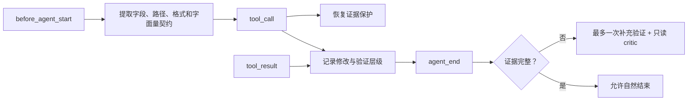

# Task Assurance

Task Assurance 解决四类真实评测中反复出现的问题：遗漏外部契约、较弱 smoke test
覆盖较强失败、恢复前破坏原始证据，以及产物格式漏检。

它在每轮开始时提取有限的显式契约，在工具执行期间维护验证证据账本，并在 Agent
准备结束但证据仍不足时最多触发一次补充轮次。它不会针对 Cython、SQLite、gRPC 或
编辑器题目提供答案。

## 事件流程

仓库测试、用户指定命令和构建检查属于强验证。失败项按“验证族 + 规范化完整命令”
记录，只有同一范围的命令成功重跑才能清除；手工 smoke test 或更窄的测试不能覆盖
较强失败。复杂外部契约或恢复任务需要一次带
`[BUMBLEBEE_ASSURANCE_CRITIC]` 标记的只读 `delegate_task`，其 token 和成本继续
保存在原有 Sub-Agent tool result 中。成功 critic 在会话内幂等，第二次同标记调用
会被拒绝；执行失败不会占用该额度。

恢复保护只在提示明确包含恢复/取证语义和数据库、WAL、镜像或二进制证据路径时
启用。若提示只给目录而未给文件名，成功的只读列表/元数据工具输出会动态登记其中的
数据库、WAL、镜像、dump 和二进制文件。原件必须先通过成功的工具调用完成逐项复制
和 SHA-256 记录，之后才允许 SQLite、脚本、移动、删除或写入类操作；同名前缀文件
不会互相冒充，`copy && delete` 复合命令也不属于纯保护操作。证据不足时要求报告
不确定性，禁止编造恢复值。

该模块是进程内证据管理，不是形式化证明。只读 critic 由 `delegate_task` 的工具
白名单保证只能使用 `read/grep/find/ls`，运行次数和 `costUsd` 进入证据快照。最多
一次补充轮次避免无限自检；第二轮仍失败时，模型必须如实报告未解决项。
