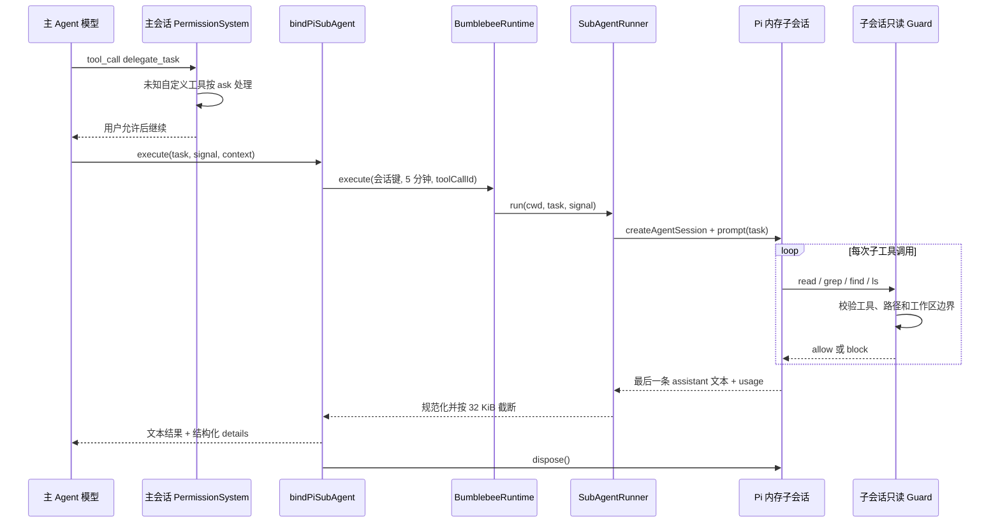

# 只读 Sub-Agent

Sub-Agent 用于把相对独立的代码库调查从主对话中分离。例如“找出权限规则的持久化
入口并总结调用链”可以委派出去，主 Agent 只接收整理后的调查结果，不接收每一次
搜索和文件读取。

## 用户与模型入口

当前只提供一个由模型按需调用的 Pi 工具，不增加斜杠命令：

```text
delegate_task({ task: "需要独立调查的单一只读任务" })
```

任务必须是 `1..8000` 个字符的非空字符串，不能包含额外字段。Bumblebee 不保存
自己的模型配置；子 Agent 继承当前 Pi 会话通过 `/model` 选择的模型、模型注册表和
thinking level。

## 模块边界

| 模块 | 职责 |
| --- | --- |
| `SubAgentRunner` | 校验输入、调用执行端口、规范化用量并限制输出 |
| `SubAgentExecutor` | Pi 无关端口，使 Agent 层不依赖具体 SDK |
| `PiSubAgentExecutor` | 创建、运行、中止和释放 Pi 内存子会话 |
| `createReadOnlyWorkspaceGuard()` | 复用 PermissionSystem 限制子会话工具和路径 |
| `bindPiSubAgent()` | 注册 `delegate_task` 并映射 Pi 上下文和结果 |

依赖方向固定为 `Pi binding -> Agent port <- Pi executor`。Agent 领域层只依赖
Node.js 和 Foundation。

## 完整流程



| 时机 | 行为 |
| --- | --- |
| 扩展加载 | 注册参数模式和执行函数，不创建模型会话 |
| 主模型调用工具 | 先经过主会话权限确认 |
| 用户允许 | 进入运行时；同一主会话串行，不同会话共享并发上限 |
| 子任务开始 | 创建新 Pi 内存会话，只传 cwd、任务、模型和 thinking level |
| 子 Agent 调用工具 | 每次都经过只读 Guard，只允许工作区内读取 |
| 主任务取消或超时 | signal 向下传播并调用子会话 `abort()` |
| 子任务完成 | 返回最后一条非空 assistant 文本和用量元数据 |
| 执行失败 | 用户只看到稳定文案，内部错误经过统一归一化 |

## 隔离策略

子会话使用 `SessionManager.inMemory(cwd)`，不会生成可 `/resume` 的历史。它不继承主
对话消息，也不会把中间检索过程写回主上下文；只将最终文本作为一次工具结果返回。
Pi 的项目上下文文件仍会按工作目录加载。

`DefaultResourceLoader` 关闭外部 extensions、Skills、prompt templates 和 themes，
只加载 Bumblebee 内联只读 Guard。创建后还会检查工具集合必须恰好为
`read/grep/find/ls`，缺少或多出工具都在执行前失败。

这是进程内能力收缩，不是操作系统沙箱。子 Agent 与主进程共享 Node.js 事件循环，
不能隔离同步 CPU 阻塞或 SDK 进程权限。

工作区外读取会得到 `ask`，但子会话没有 UI，因此转换为 `block`。写入、编辑、
Shell、自定义工具和递归委派都没有注册；符号链接真实化也会阻止工作区逃逸。

## 超时与结果边界

默认截止时间为 5 分钟，不复用短请求的 60 秒。Pi 工具取消、运行时关闭和截止时间
汇合成一个 `AbortSignal`；执行器收到后调用 `session.abort()`，等待中止并始终
`dispose()`。

最终结果最多保留 32 KiB，并按 UTF-8 字节边界截断。`details` 使用
`completed / failed / timed_out / cancelled` 判别联合类型；成功还包含模型、
token、成本、原始输出字节数和省略字节数。日志不记录任务正文或子 Agent 输出。

## 当前边界

- 没有角色配置、团队模板、并行 fan-out、链式委派或子任务 DAG；
- 没有持久化子会话；
- 不流式回传中间进度；
- 不适合运行不可信插件或 CPU 密集任务；
- 真实需求出现后再评估 Worker 或子进程隔离。
