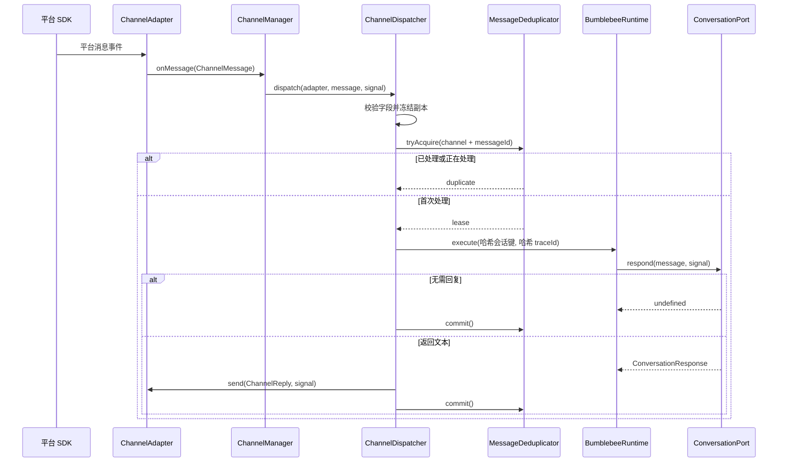

# Channel Core

Channel Core 统一不同 IM 平台的消息字段、回调方式和生命周期。平台适配器只负责把
SDK 事件转换成统一消息，并把统一回复转换回平台 API；去重、会话调度、取消和关闭
由平台无关内核处理。

## 核心契约

| 契约 | 职责 |
| --- | --- |
| `ChannelMessage` | 统一渠道、消息、会话、发送者、文本、时间戳和有限 metadata |
| `ConversationPort` | 接收规范化消息并返回文本响应 |
| `ChannelReply` | 统一回复目标、原消息关联、正文和有限 metadata |
| `ChannelAdapter` | 平台 SDK 边界，只实现 `start/send/stop` |
| `ChannelDispatcher` | 校验、去重、生成会话键、调用对话端口并发送回复 |
| `ChannelManager` | 启动适配器、跟踪在途消息、失败回滚和逆序关闭 |

```typescript
interface ChannelAdapter {
  readonly id: string;
  start(context: ChannelAdapterStartContext): PromiseLike<void> | void;
  send(reply: ChannelReply, signal: AbortSignal): PromiseLike<void> | void;
  stop(): PromiseLike<void> | void;
}

interface ConversationPort {
  respond(
    message: ChannelMessage,
    signal: AbortSignal,
  ): PromiseLike<ConversationResponse | undefined>
    | ConversationResponse
    | undefined;
}
```

Channel Core 只依赖 Node.js、Foundation 和 Runtime 公共出口，不依赖 Pi、飞书 SDK
或其他平台包。

## 消息处理流程



`channel + conversationId` 的 SHA-256 指纹作为稳定 `sessionKey`，因此同一渠道会话
严格串行，不同会话仍可并行。`channel + messageId` 同样生成哈希 traceId。日志只
记录渠道和状态，不记录发送者、消息正文、回复正文或 metadata。

## 输入边界

- 适配器 ID 最多 64 个字符，只允许小写字母、数字、`.`、`_` 和 `-`；
- 消息、会话和发送者 ID 最多 256 个字符，不能含控制字符；
- 消息与回复文本不能为空，最长 32 Ki 个 JavaScript 字符；
- 时间戳必须是非负安全整数；
- metadata 最多 32 项；
- metadata 值只能是 `null`、有限数字、布尔值或最长 2048 字符的字符串。

核心层会把 metadata 复制到冻结的无原型对象，防止 SDK 后续修改和 `__proto__`
污染。图片、文件、富文本和平台原始 payload 需要以显式类型扩展，不能直接透传。

## 去重语义

`MessageDeduplicator` 默认最多保留 1024 个消息 ID，成功记录保留 10 分钟。它采用
租约而不是简单 Set：

| 状态 | 重复消息行为 | 最终处理 |
| --- | --- | --- |
| `processing` | 返回 `duplicate`，不并发执行 | 成功 `commit`，失败 `release` |
| `completed` 且 TTL 未过期 | 返回 `duplicate` | TTL 后允许重试 |
| 处理或发送失败 | 删除租约 | 平台重投可重新执行 |

容量不足时优先淘汰最早完成记录，不淘汰在途消息；如果容量全被在途消息占用，则
返回可重试 `UNAVAILABLE`。进行中的租约不按 TTL 强制过期，避免旧任务仍执行时放行
重复副作用。

去重状态只在当前进程。回复发送失败会释放租约，平台重投可能重复一次模型计算。
等真实平台语义验证后，再决定是否增加持久回复缓存或平台幂等键。

## 生命周期与取消

`ChannelManager.initialize()` 按配置顺序启动适配器，并在每次 `start()` 前登记
`stop()`。SDK 启动到一半失败时，当前和此前适配器都会逆序关闭。适配器的 `stop()`
必须幂等，并能清理由失败 `start()` 留下的部分资源。

关闭流程：

1. 取消共享 signal，使在途分发停止；
2. 逆序停止适配器，阻止新事件进入；
3. 等待已登记消息回调退出。

消息级、Manager 生命周期和运行时关闭 signal 最终传播到 `ConversationPort` 与
`adapter.send()`。Channel Core 没有统一默认超时，由 Dispatcher 按平台场景配置。

## 依赖的积木

| 积木 | 作用 |
| --- | --- |
| 错误模型 | 区分非法输入、容量不足、发送失败和取消 |
| 结构化日志 | 使用哈希 traceId，不记录用户正文 |
| 取消与超时 | 把平台和运行时 signal 传播到处理与发送 |
| 并发控制 | 同一渠道会话串行，不同会话共享全局配额 |
| 生命周期 | 部分启动失败回滚，关闭时逆序释放 |
| 扩展运行时 | 提供 trace、会话队列、限流和退出追踪 |

当前组合根只在飞书显式启用时创建 ChannelManager。远程写授权和富媒体不属于
Channel Core。
