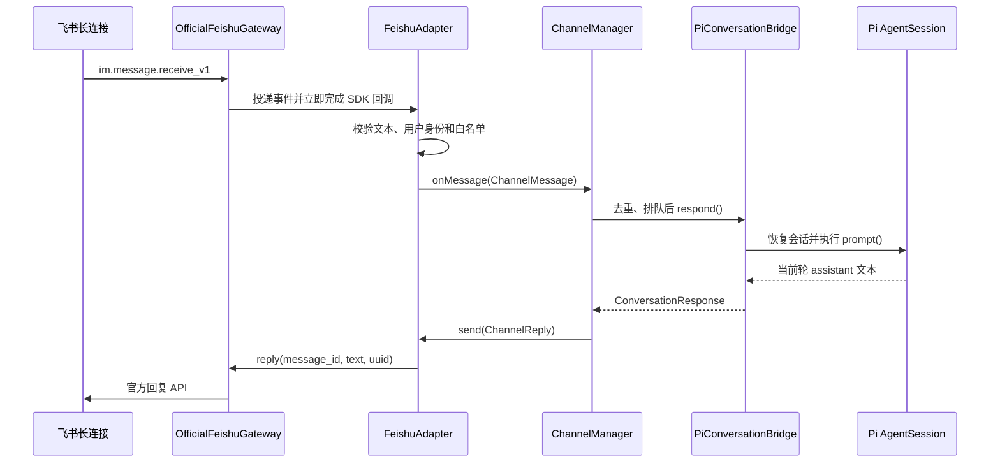

# FeishuAdapter

FeishuAdapter 使用官方 `@larksuiteoapi/node-sdk` 建立长连接，只负责飞书协议边界。
消息去重、会话串行、Agent 调用和生命周期分别复用 Channel Core、Pi Conversation
Bridge 与 Foundation。

## 启用步骤

1. 在[飞书开放平台](https://open.feishu.cn/)创建企业自建应用并启用机器人。
2. 在凭证页面取得 App ID 和 App Secret。
3. 开通接收单聊、接收群聊中提及机器人以及发送消息所需权限。
4. 在事件订阅中选择“使用长连接接收事件”，订阅
   `im.message.receive_v1`，发布并安装应用。
5. 在启动 pi 的同一个 PowerShell 窗口设置环境变量：

```powershell
$env:BUMBLEBEE_FEISHU_ENABLED = "true"
$env:FEISHU_APP_ID = "cli_0123456789abcdef"
$env:FEISHU_APP_SECRET = "replace-with-your-app-secret"
$env:FEISHU_ALLOWED_OPEN_IDS = "ou_owner,ou_teammate"
pi -e ./src/extension.ts
```

`FEISHU_ALLOWED_OPEN_IDS` 是允许驱动本地 Agent 的用户 `open_id`，多个 ID 用英文逗号
分隔。可以从事件的 `sender.sender_id.open_id` 或飞书 API 调试工具获取。只有完全
隔离的测试环境才应设置为 `*`；日常与生产环境应使用最小白名单。

配置只从当前进程环境读取。不要把 App Secret 写入 README、源码或 Git 配置。
`BUMBLEBEE_FEISHU_ENABLED` 未设置或为 `false` 时，不读取其他飞书变量，也不创建
SDK 长连接。

## 消息流程



飞书长连接事件处理器需要尽快返回。Gateway 只做事件交接，Adapter 使用微任务异步
驱动 Agent，模型耗时不会占用 SDK 事件确认窗口。平台重投由消息租约去重，回复还会
根据原消息 ID 生成稳定 UUID。

事件解析只接受 `sender_type=user` 的文本消息。适配器会解析文本 JSON、移除开头
连续的机器人提及占位符，并优先用 `thread_id` 隔离话题，否则使用 `chat_id`。
不支持的类型会被忽略，非法事件进入可注入诊断日志，不会让长连接回调崩溃。

Agent 失败时只回复错误模型允许暴露的 `userMessage`。启动等待有独立 30 秒超时；
关闭时先取消共享 signal，再关闭飞书连接，随后等待在途 Agent 调用退出。SDK 日志
由空日志器接管，避免破坏 pi TUI。

## 当前边界

- 只接收文本并回复纯文本；
- 不支持图片、文件、卡片、流式进度或主动推送；
- 远程会话只有 `read/grep/find/ls`，不能写文件或执行 Shell；
- 去重状态只在当前进程，多实例和跨重启幂等尚未实现；
- 官方回复 API 不接收 `AbortSignal`，当前在请求前后检查取消并使用稳定 UUID；
- CI 使用 SDK 替身，没有使用真实飞书凭据；应用权限仍需按启用步骤人工验收。
