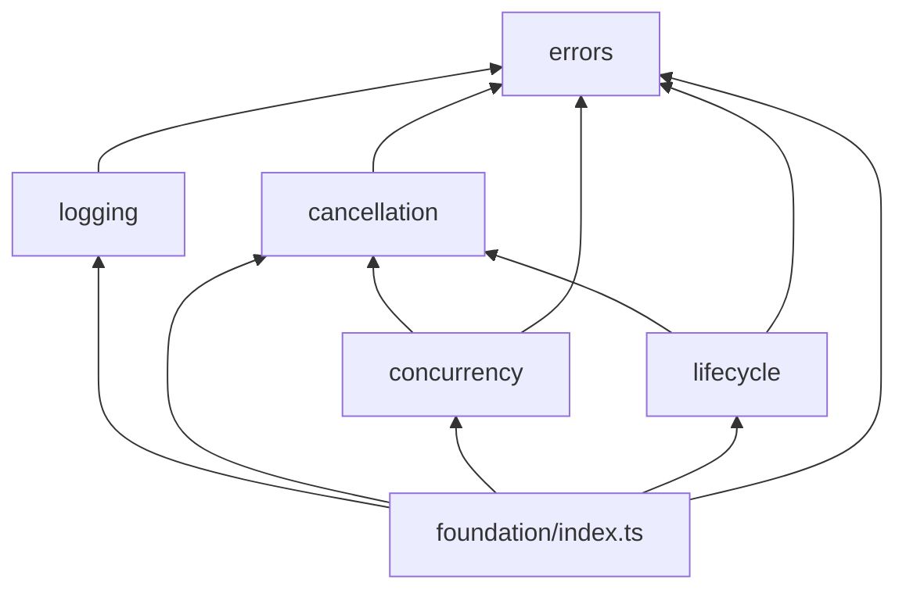
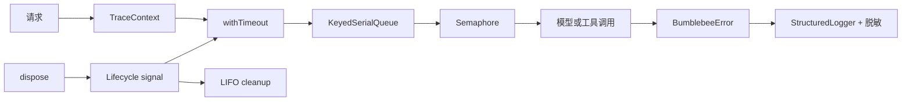

# Foundation

Foundation 是 Bumblebee 的无业务基础层，不依赖 pi、渠道 SDK 或上层 Agent 模块。
上层代码统一从 `src/foundation/index.ts` 导入能力，各子模块通过自己的 `index.ts`
暴露公共契约。

## 积木索引

| 积木 | 解决的问题 | 文档 |
| --- | --- | --- |
| 错误模型 | 统一错误代码、cause 保留和边界归一化 | [errors](./errors/README.md) |
| 结构化日志 | 安全序列化、敏感信息脱敏和 traceId | [logging](./logging/README.md) |
| 取消与超时 | AbortSignal 传播、超时区分和可中断等待 | [cancellation](./cancellation/README.md) |
| 并发控制 | 公平 Semaphore、会话串行队列和等待取消 | [concurrency](./concurrency/README.md) |
| 生命周期 | 初始化失败回滚、LIFO 清理和幂等 dispose | [lifecycle](./lifecycle/README.md) |

## 依赖方向

架构测试会阻止反向依赖、跨功能目录绕过公共出口，以及基础层引入第三方或业务
模块。基础层源码会进入 npm 发布包，开发测试不会被发布。

## 标准组合

一条请求进入业务层后的标准组合顺序如下：

队列在 `enqueue()` 时捕获提交者的异步上下文，因此同一会话中后一任务由前一任务
唤醒时，仍保留自己的 traceId。集成测试还会注入初始化超时，确认 `TIMEOUT`
能够原样进入回滚和结构化日志。

## 有意保留的边界

- 取消是协作式的，不能中断同步 CPU 阻塞；
- 并发控制只在当前 Node.js 进程内生效，等待队列暂未设置容量上限；
- 日志 sink 是同步注入边界，不应抛错或执行长时间阻塞 I/O；
- Lifecycle 是一次性状态机，不负责重试、健康检查或依赖注入。

这些能力只在出现明确业务需求时向上层扩展，不提前塞入通用基础层。
