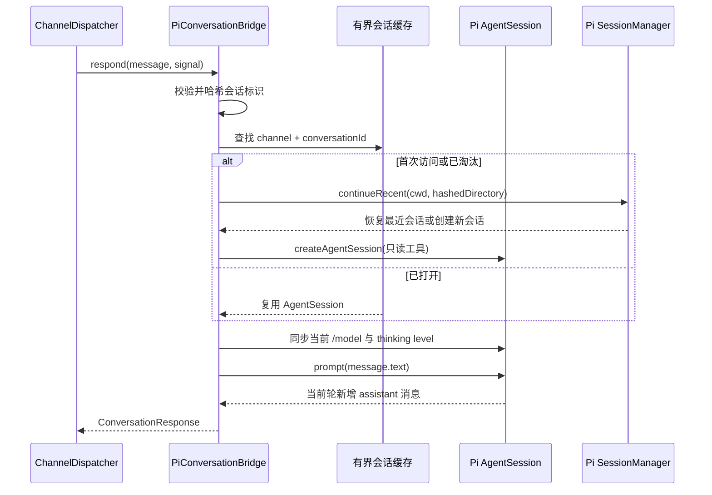

# Pi 集成层

Pi 集成层把 Bumblebee 的领域积木映射到 pi Extension API。业务决策留在对应模块，
这里负责事件、工具 schema、会话和模型状态的适配。

当前完整 profile 注册 `session_start`、`session_shutdown`、`session_tree`、
`model_select`、`before_agent_start`、`tool_call`、`tool_result` 和 `agent_end`
事件，以及 `delegate_task`、
`bumblebee_memory` 两个工具。没有注册自定义斜杠命令；模型、会话恢复和 Skills
继续使用 pi 官方能力。

## 绑定清单

| 文件 | 作用 |
| --- | --- |
| `application-binding.ts` | 组合运行时、记忆和可选飞书渠道 |
| `lifecycle-binding.ts` | 映射 `session_start/session_shutdown` |
| `permission-binding.ts` | 在 `tool_call` 阶段执行权限拦截 |
| `assurance-binding.ts` | 注入外部契约策略、维护工具证据并触发一次有界复核 |
| `subagent-binding.ts` | 注册 `delegate_task` |
| `pi-subagent-executor.ts` | 创建隔离的 Pi 子会话 |
| `read-only-workspace-guard.ts` | 限制远程和子 Agent 会话为工作区内只读 |
| `memory-binding.ts` | 注册 `bumblebee_memory` 和主会话上下文注入 |
| `memory-context-extension.ts` | 为渠道 Pi 会话注入只读项目记忆 |
| `pi-conversation-bridge.ts` | 把外部渠道会话映射成持久 Pi 会话 |

具体绑定由 `BUMBLEBEE_FEATURE_PROFILE` 控制：`pi-baseline` 不注册事件或工具，
`permission-only` 只保留运行时、Task Assurance 和 PermissionSystem，`full`
再启用记忆、Sub-Agent 和渠道。生产默认值仍为 `full`。

## Pi Conversation Bridge

Bridge 实现 Channel Core 的 `ConversationPort`。每个
`channel + conversationId` 拥有独立 `AgentSession`，不会复用当前 TUI 的全局会话，
也不会监听全局 `agent_end` 猜测回复归属。



Bridge 构造时不创建模型会话。第一条消息到达时才惰性创建；同一会话的并发创建共享
一个 Promise。正常入口由 Dispatcher 和 Runtime 保证同一会话串行，绕过它们直接
并发调用时，重叠请求会得到可重试 `CONFLICT`。

## 持久化与缓存

默认会话目录：

```text
<pi agent dir>/bumblebee/channel-sessions/<channel>/<sha256(channel + conversationId)>
```

原始平台会话 ID 不进入路径或日志。`SessionManager.continueRecent()` 会在进程重启
或缓存淘汰后恢复最近会话；不额外实现与 pi `/resume` 重复的命令。

内存最多保持 16 个已打开会话。达到上限时只淘汰最近最少使用且空闲的会话，释放
监听器和内存但保留磁盘历史；所有槽位都忙时返回可重试 `UNAVAILABLE`。

当前只限制内存数量，不自动删除磁盘历史。清理历史应先关闭 Bumblebee，再删除对应
`channel-sessions` 目录。

## 回复归属和模型同步

每轮 `prompt()` 前记录现有消息对象，结束后只在本轮新增消息中反向查找最后一条
非空 assistant 文本，不会误发上一轮结果。超过 Channel Core 32 Ki 字符上限时在
UTF-16 代理项边界前截断，并附带 `truncated: true`。

Bridge 不保存 Bumblebee 模型配置。创建和复用会话前都读取 pi 当前模型与 thinking
level；用户通过 `/model` 切换后，下一条渠道消息会同步到已有会话。

## 安全、取消与关闭

渠道会话只注册 `read/grep/find/ls`，关闭外部扩展、Skills、模板和主题，并复用
PermissionSystem 的路径真实化检查。工作区外读取、写入、Shell 和自定义工具都会
被阻止。

消息取消时调用对应会话 `abort()` 并保留会话供下一轮继续。Bridge `dispose()` 会
拒绝新消息、取消活跃生成、等待在途响应退出，再幂等释放全部缓存会话。实际超时由
ChannelDispatcher 按渠道场景配置，不固定为 60 秒。

Bridge 当前只处理白名单用户的文本消息，不负责平台凭据、富媒体、流式进度或主动
消息。
