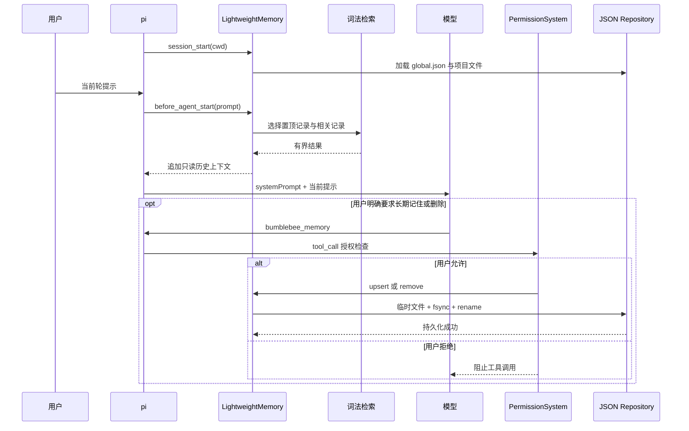

# Lightweight Memory

Lightweight Memory 保存用户明确要求长期记住的偏好、已确认事实和项目约定。它借鉴
社区扩展 [pi-hermes-memory](https://pi.dev/packages/pi-hermes-memory) 的全局/项目
分层与上下文安全边界，以及 [pi-memory](https://pi.dev/packages/pi-memory) 的显式
记忆工具，但不引入向量数据库、SQLite、会话全文索引或后台 LLM 提取。

本模块让少量、稳定、可复用的信息跨会话保留，并在相关对话中按需返回上下文。它
不是知识库、聊天记录备份或自动用户画像系统。

## 触发时机

读取和写入是两条独立链路：

1. `session_start` 加载全局 JSON 和当前工作区项目 JSON；
2. 每轮 `before_agent_start` 根据用户提示检索相关记录，追加到本轮 system prompt；
3. 用户明确要求记住、确认长期偏好或纠正旧信息时，模型调用
   `bumblebee_memory`；
4. 工具调用先经过 PermissionSystem，拒绝时不修改任何记录；
5. `session_shutdown` 阻止新操作，等待在途写入结束，再释放资源。



记忆上下文不会追加到 Pi 会话历史。`/resume` 或上下文压缩后，下一轮仍从持久文件
检索并注入，因此关键偏好不依赖旧消息是否还在上下文窗口中。

## 记录模型与去重

| 字段 | 含义 |
| --- | --- |
| `scope` | `global` 跨项目；`project` 只属于当前工作区 |
| `category` | `preference`、`fact`、`decision`、`convention`、`lesson` |
| `key` | 稳定业务键，也是去重和更新入口 |
| `content` | 已确认内容，最多 2000 字符 |
| `keywords` | 最多 12 个辅助检索词 |
| `pinned` | 是否每轮优先注入 |
| `id` | 由 `scope + 规范化 key` 生成的稳定 ID |
| `revision` | 内容变化时递增 |
| `createdAt/updatedAt` | 创建和最近更新时间 |

```json
{
  "category": "decision",
  "content": "当前项目统一使用 pnpm。",
  "id": "mem_0123456789abcdef01234567",
  "key": "package-manager",
  "keywords": ["依赖", "包管理器"],
  "pinned": true,
  "revision": 2,
  "scope": "project"
}
```

`key` 经过 NFKC、首尾空白、连续空白和大小写归一化。同一 scope 再次写入相同 key：

- 内容相同返回 `unchanged`，不写磁盘；
- 内容变化保留原 ID 和创建时间，递增 revision；
- 不同 scope 可以使用相同 key；
- 同 scope 并发写入由 `KeyedSerialQueue` 串行化。

## 工具动作

`bumblebee_memory` 使用判别动作，不增加斜杠命令：

| action | 用途 | 必要输入 |
| --- | --- | --- |
| `upsert` | 新建或按稳定 key 更新 | `scope/category/key/content` |
| `search` | 按问题检索 | `query`，可选 `scope/limit` |
| `list` | 查看记录和 ID | 可选 `scope/limit` |
| `remove` | 删除一条记录 | `scope/id` |

自然语言示例：

```text
请记住：这个项目使用 pnpm，范围仅限当前项目。
把我的回答偏好更新为“先给结论，再给必要步骤”，所有项目都适用。
列出当前项目已经保存的长期记忆。
忘记项目记忆 mem_0123456789abcdef01234567。
```

是否调用工具由模型根据明确请求决定。Bumblebee 不在后台扫描对话，也不使用规则
猜测用户画像，避免把玩笑、临时要求、模型推测或恶意仓库文本静默写成长期事实。

## 检索与上下文控制

检索使用 Node.js `Intl.Segmenter` 对中文和英文分词，再进行 BM25 风格打分。
`key`、`keywords` 和 `content` 使用不同权重，完整 key、关键词或正文匹配会得到额外
分数。检索是纯读取，不修改访问次数或文件。

每轮最多优先选择 4 条置顶记录和 6 条相关记录，去重后受默认 4096 字符总预算限制。
记录以 JSON Lines 放入 `<memory-context>`，并标为“不可信历史参考数据”。当前用户
请求和已验证仓库事实始终优先；标签字符会转义，防止记录闭合上下文边界。

没有任何已保存记录，或本轮没有完整记录能放进预算时，返回空字符串，不注入
memory policy 或空标签。这样未使用记忆的编码任务不承担固定 prompt 成本。

| 入口 | 可见 scope | 自动读取 | 直接写入 |
| --- | --- | --- | --- |
| 主 TUI | `global + project` | 每轮选择性注入 | 可调用工具，先确认权限 |
| 飞书渠道 | 仅 `project` | 每轮只读注入 | 不注册记忆工具 |

飞书用户看不到全局个人偏好，也不能远程修改记忆。项目记忆由该工作区所有允许的
飞书用户共享，不应保存个人隐私。

## 文件与持久化

```text
<pi agent dir>/bumblebee/memory/
├── global.json
└── projects/
    └── <sha256(canonical workspace path)>.json
```

项目文件名来自规范化工作区路径的 SHA-256，不暴露原始路径。同一工作区的新会话和
`/resume` 读取同一文件；移动工作区会得到新的项目文件。

可通过环境变量覆盖根目录：

```powershell
$env:BUMBLEBEE_MEMORY_DIR = "$HOME\.bumblebee-memory"
pi -e ./src/extension.ts
```

每次更新先在同目录创建独占临时文件，完整写入后 `fsync`，关闭后原子重命名；只有
持久化成功才替换内存快照。失败写入不会形成“进程记住、重启丢失”的半成功状态。

单文件最多 1 MiB，每个 scope 最多 256 条记录和 8 条置顶记录，限制
`JSON.parse/stringify` 的最坏影响。POSIX 临时文件使用 `0600`；Windows 依赖当前
用户目录 ACL，自定义目录应只允许当前账户访问。

## 安全边界

- 写入和加载时扫描私钥头、常见 Token、JWT、凭据赋值和带密码 URI；
- 命中高置信度凭据时拒绝持久化，日志不记录 key、正文或查询；
- 词法检索不理解同义词和深层语义；
- 没有后台提取、用户画像推断、向量数据库、知识图谱或会话全文索引；
- 没有跨进程文件锁，不能让两个进程同时写同一记忆目录；
- 没有回收站、历史 revision 内容或自动冲突合并；
- 没有按远程发送者划分用户记忆；
- JSON 损坏、scope 不一致、记录超限或文件含凭据时拒绝启动；
- 运行期间不监听手工文件修改，需要重启后重新加载。
