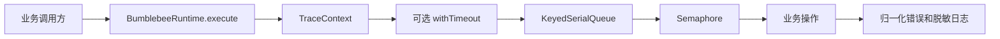
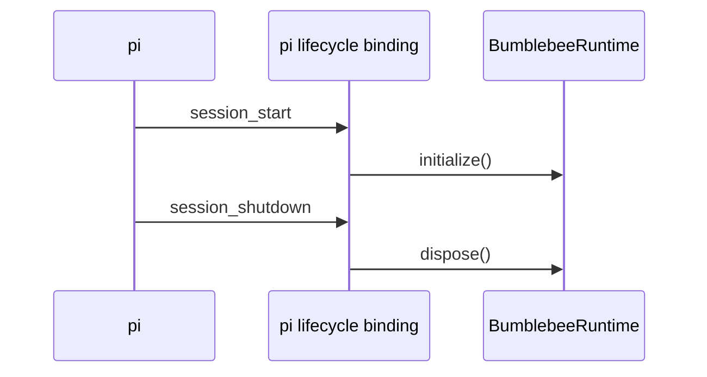

# 扩展运行时

运行时把基础积木组合成统一任务入口，同时保持领域代码与 pi 解耦。
`BumblebeeRuntime` 是资源组合根，不是业务 Agent。

## TaskExecutor

所有业务请求通过 `TaskExecutor` 执行。调用方提供任务名称和 `sessionKey`，并按场景
选择超时、traceId 和上层 `AbortSignal`：

```typescript
const result = await runtime.execute(
  {
    operationName: "channel message",
    sessionKey: "feishu:conversation-id",
    signal: requestSignal,
    timeoutMs: 120_000,
  },
  async ({ logger, signal, traceId }) => {
    logger.info("handling request", { fields: { traceId } });
    return await handleRequest({ signal });
  },
);
```

请求按固定顺序经过 trace 上下文、可选超时、会话串行队列和全局信号量：



相同 `sessionKey` 的请求严格保持顺序，不同会话可以并行，但总量不会超过运行时
并发上限。运行时没有统一任务超时：短请求、外部 SDK 调用和模型长任务分别决定
截止时间；不传 `timeoutMs` 时只响应上层取消和运行时关闭。

## 生命周期

`initialize()` 创建 trace、logger 和任务执行器。`dispose()` 依次：

1. 停止接收新任务；
2. 取消在途任务；
3. 等待底层操作真正退出；
4. 逆序释放资源。

即使调用方已经因超时返回，只要底层操作仍在运行，运行时仍会追踪它，避免退出时
遗留未管理的副作用。

## Pi 绑定



pi 适配器只完成事件映射，不包含业务判断。运行时类不依赖 pi，架构测试会阻止 pi
或上层业务模块进入运行时。默认扩展也不直接向 stdout 写日志，避免破坏 pi TUI。

取消仍是协作式的。如果业务操作忽略 `AbortSignal` 或永久阻塞，`dispose()` 会等待
它真正结束；同步 CPU 密集任务应在所属功能中使用 Worker 或进程隔离。
