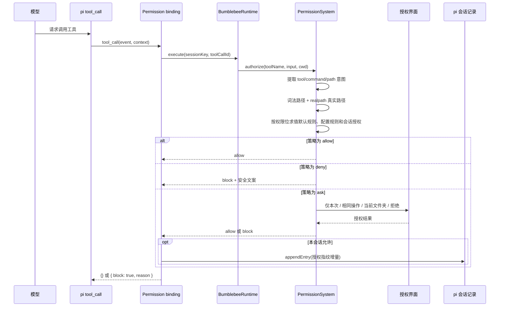

# PermissionSystem

PermissionSystem 决定模型提出的工具调用能否真正执行。权限内核只认识访问意图、
规则和授权结果，不依赖 pi、TUI 或运行时；pi 适配位于
`src/integrations/pi/permission-binding.ts`。

## 完整流程

## 触发时机

| 时机 | 行为 |
| --- | --- |
| 扩展加载 | 创建 PermissionSystem 并注册 `tool_call`，不弹窗 |
| `session_start` | 初始化运行时，清空缓存并恢复同一 `sessionId` 当前分支的授权 |
| 模型发起 `tool_call` | 在工具执行前提取意图并求值，是实际安全拦截点 |
| 结果为 `ask` | 有 UI 时显示选择器；60 秒无选择、Esc 或取消都按拒绝 |
| 本会话允许相同操作 | 合并精确资源缺失权限位，并写入 pi 会话 |
| 对此文件夹下均允许 | 合并工具、目录本身和 `目录/**` 路径权限，并写入会话 |
| `session_tree` | 按新活动分支重建授权，导航到授权之前会自动撤销 |
| `session_shutdown` | 清空内存缓存，保留会话记录并释放运行时 |

用户直接在 pi 中执行的 shell 操作不经过模型 `tool_call`，不属于本模块拦截范围。

## 默认策略

| 操作 | 默认结果 | 原因 |
| --- | --- | --- |
| 工作区内 `read/grep/find/ls` | `allow` | 无副作用读取保持流畅 |
| `write/edit` | `ask` | 文件修改需要用户知情确认 |
| `bash` | `ask` | 展示完整命令后再决定，不猜测 shell 语义 |
| 工作区外读取或写入 | `ask` | 防止路径越界静默执行 |
| 未知自定义工具 | `ask` | 无法验证参数语义时不默认信任 |
| 显式 `deny` 规则 | `deny` | 直接阻止，不再弹窗 |

无 UI 的 print/headless 模式无法询问用户，所有 `ask` 都转换为 `block`。路径解析、
输入校验、运行时或授权界面只要异常，pi 边界都会返回固定安全文案并阻止工具调用。

## 权限模型

权限值使用三位能力掩码：

| 能力 | 数值 |
| --- | ---: |
| 读取 `r--` | 4 |
| 写入 `-w-` | 2 |
| 执行 `--x` | 1 |

组合权限按位 OR，例如读写为 `rw- = 6`。检查公式为
`(granted & required) === required`。这不是完整 Linux `0755` 模型，也不会修改
文件系统权限，只描述 Agent 对逻辑资源拥有的能力。

| 工具意图 | 资源意图 |
| --- | --- |
| `read/grep/find/ls` 需要工具执行 `--x` | 目标路径需要读取 `r--` |
| `write` 需要工具执行 `--x` | 目标路径需要写入 `-w-` |
| `edit` 需要工具执行 `--x` | 目标路径需要读写 `rw-` |
| `bash` 需要工具执行 `--x` | 完整命令资源需要执行 `--x` |

工具和资源分别授权，因此允许 `write` 工具不等于允许它写任意路径。规则按声明顺序
和权限位独立求值，每一位由最后一个匹配规则决定；一次调用的最终动作仍按
`deny > ask > allow`。

## 路径与文件夹授权

路径判断同时保留词法绝对路径和 `realpath` 真实路径。工作区内符号链接指向外部时
仍按外部访问处理；不存在的写入目标从最近的已存在父目录开始真实化。Windows 路径
匹配不区分大小写，并统一使用 `/`。

| 选择 | 生效范围 |
| --- | --- |
| 仅允许本次 | 当前工具调用，不写入会话规则 |
| 本会话允许相同操作 | 完全相同的工具、命令或词法/真实路径 |
| 对此文件夹下均允许该操作 | 当前文件工具、目录本身和所有后代路径 |
| 拒绝 | 阻止当前工具调用 |

Bash 和未知工具没有可验证文件夹意图，因此不显示文件夹选项。对
`read/write/edit`，范围取目标文件父目录；对 `ls/grep/find`，范围取目标目录本身。
真实目录名包含 `*`、`?` 或控制字符时不提供文件夹选项，防止通配符扩大范围。

## 合并、查询与持久化

精确值按对应大小写规则计算 SHA-256 指纹，会话记录不重复保存完整命令或目标文件
原文。文件夹授权保存规范化绝对目录的 `目录/**` 模式，目录本身另存精确指纹。

同一资源由 `surface + scope + case mode + match + fingerprint/pattern` 唯一标识，
权限值不参与资源键。再次授权执行 `current | added`：同一文件夹先有 `r--`、后有
`-w-` 时，只保留一条有效 `rw-` 记录。

领域 API `exportSessionGrants()` 可查询当前有效记录，
`formatPermissionMode(grant.mode)` 可把数值显示为 `rwx`；当前没有额外斜杠命令。

授权增量使用 `bumblebee.permission-grant.v1` custom entry 写入 pi 会话 JSONL。
每个 entry 只保存新增权限位，恢复时按活动分支顺序 OR 重放。Pi 不会把 custom entry
放入 LLM 上下文。

| 会话操作 | 授权结果 |
| --- | --- |
| `/resume`、进程重启、扩展 reload | 相同 `sessionId` 且 entry 在活动分支时恢复 |
| `new` | 没有旧授权 |
| `fork` | 新 `sessionId`，不继承旧授权 |
| 树导航 | 根据当前活动分支重新计算 |

内存最多保留 256 个授权资源，超出后淘汰最早资源，最坏结果只是再次询问。写入失败
会回滚内存状态并阻止当前调用。版本、会话 ID、权限掩码或规则结构无效时，整批按
无授权处理。

## 与其他积木的关系

| 积木 | 作用 |
| --- | --- |
| 错误模型 | 输入和路径错误转换为稳定错误 |
| 结构化日志 | 记录规则与动作，不记录原始命令和完整输入 |
| 取消与超时 | signal 贯穿排队、求值和 60 秒授权弹窗 |
| 并发控制 | 同一会话授权串行，不同会话共享运行时配额 |
| 生命周期 | 会话切换时重建缓存，关闭时取消等待任务 |
| TraceContext | 使用 `toolCallId` 关联权限求值与日志 |

## 当前边界

- 不解析 Bash AST，用户确认完整原始命令；
- 授权指纹用于减少原文暴露，不是加密签名；
- 自定义规则只能通过构造参数注入；
- 远程渠道没有交互式 `PermissionAuthority`，因此只开放只读工具；
- 其他扩展若修改 `tool_call.input`，必须确保参数转换发生在权限检查之前；
- 当前没有主动撤销授权的 UI，可通过树导航或新会话清除作用范围。
